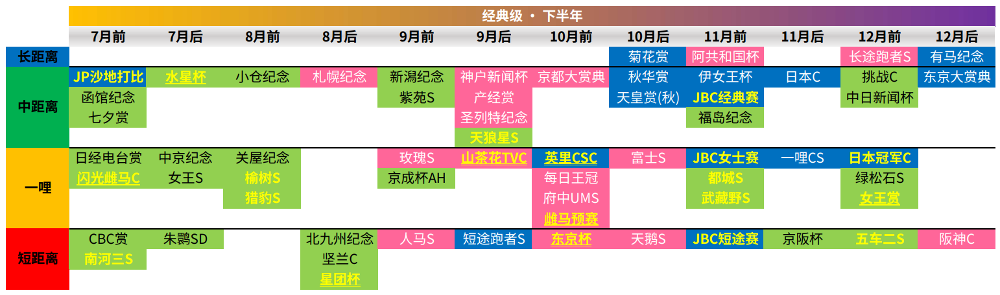

# HTML 与 CSS 笔记

> *未经授权，禁止转载！[Penyo](https://github.com/penyoofficial)对本文档保留所有权利。*

本课程主要学习桌面端网站布局。只有精通网页布局，才能在后续的JS的学习中大展拳脚。

---

## HTML5 基础

> 自行查阅H5相关知识学习，推荐[W3School](https://www.w3school.com.cn/)和[MDN Web Doc](https://developer.mozilla.org/zh-CN/)，它们在业界中较有权威。

### 网页

**网站**是指在因特网上根据一定的规则，使用HTML等语言制作的用于展示特定内容相关的网页==集合==。

**网页**是网站中的==一页==，它==需要通过浏览器来阅读==。网页是构成网站的基本元素，它通常由声音、图片、视频、文字、链接等**元素**组成。我们看到的网页，常以 `.htm` 或 `.html` 为后缀名，因此将其俗称为**HTML文件**。

### HTML

HTML（Hyper Text Markup Language），即**超文本标记语言**，它是用来描述网页的一种语言。注意，**标记语言**不同于**编程语言**，==标记语言大多数行为是被动的==，而编程语言是有主动逻辑的。还有一种语言叫**脚本语言**，如JS，它的特性介于标记语言和编程语言之间。

超文本的含义是指多媒体的存在，它超越了纯文本的限制；一说指它可以从一个文件跳转到另一个文件，即**超级链接文本**。标记语言的本质是一套**标记标签**（Markup Tag）。

而网页就是由若干个HTML标签描述、由浏览器解析出来的。

### 浏览器与内核

**浏览器**是网页显示、运行的平台。常用的浏览器有Chrome、Safari、Edge、Firefox和Opera（按编写时市占率从高到低排序）。

**浏览器内核**（渲染引擎）负责读取网页内容，整理讯息，计算网页的显示方式并显示页面。下列一些著名的浏览器所使用的内核：

|浏览器|内核|备注|
|-|-|-|
|IE|Trident|很多==早年的==国产浏览器都是基于Trident开发。|
|Firefox|Gecko|开源、免费、无商用化。|
|Safari|Webkit|苹果基于KHTML开发，是现代浏览器的基石。|
|Chrome/Edge/Opera|Blink|谷歌基于Webkit开发，功能最强大。|

> 你知道吗：Chromium是怎么一回事？
> Chromium是Google Inc.的一个项目，是Chrome的开源版本。Chrome的内核早前是Webkit，现在是Blink。说*Chromium是内核*是不专业、不正确的。

### Web 标准

由于不同的浏览器解析出网页的效果可能不一致，开发者常常需要为兼容性而艰苦工作。如果有一个统一的标准约束，能够节省很多时间和精力。因此有了 Web 标准。

**Web 标准**是由W3C（万维网联盟）和其他标准化组织制定的==一系列标准的集合==，它有三方面：**结构**（Structure）、**表现**（Presentation）和**行为**（Behavior），且这三方面要尽可能分离（用不同的文件存储相关代码）。

|标准|说明|
|-|-|
|结构|结构用于对**网页元素**进行整理和分类，一般用HTML完成|
|表现|标线用于设置网页元素的版式、颜色、大小等**外观样式**，一般用CSS完成|
|行为|行为是指网页模型的定义以及**交互**的编写，一般用JS完成|

俗话说皮之不存，毛将焉附。没有结构做基础，表现和行为都是无意义的，所以结构也是最重要的。

### HTML 语法规范和基本结构

HTML文件中，所有的元素均以标签的形式显现。绝大多数的标签都是成对存在的。如：

```HTML
<html></html>
```

其中 `<>` 为标签标识符，`html` 为标签名，`/` 表示结束。`<html>` 为开始标签，`</html>` 为结束标签，两者合称**双标签**。不成对存在的标签，如 `<br />`，为**单标签**。

> 你知道吗：单标签如何写才规范？
> 以换行符为例。在HTML中，单标签是没有结束标签的，即直接使用 `<br>`，但老旧的浏览器可能不支持这种写法。但在XHTML中，单标签必须被正确地关闭，即 `<br />`。详情查看网友的[论证](https://blog.csdn.net/update7/article/details/87017671)。

有的标签比较复杂，它包含了除标签名外的内容，比如：

```HTML
<html lang="zh-CN"></html>
```

这个*lang="zh-CN"*就是 `html` 的属性，属性的值用半角双引号包围标识。一个标签名可以有任意非负数量的不同属性，放在标签中标签名的后面。如果一个标签名有多个属性并列，则用空格隔开；如果一个属性有多个值并列，则用半角逗号隔开。

双标签间存在两种逻辑关系：**包含关系**和**并列关系**：

```HTML
<html>
    <head>
        <title>田所浩二的Blog</title>
    </head>
    <body>
        逸一时，误一世，逸久逸久罢一龄！
    </body>
</html>
```

`<html>`、`<head>`、`<title>` 和 `<body>` 分别表示**根标签**、HTML文档**头部**标签、文档**标题**标签和文档**主体**标签。其中，==头部里必须包含标题==。页面的主要内容一般都放在主体里。

> 技巧：在VS Code中新建HTML文档，输入 `!` 后按<kbd>tab</kbd>即可快捷生成基础标签框架。这基于[Emmet语法](#Emmet 语法)。

### HTML 常用简单标签

|标签名|含义|应用例|含义|注释|
|-|-|-|-|-|
|DOCTYPE|文档类型声明|\<!DOCTYPE html>|当前页面采取的是HTML5版本|1. 它==不是一个HTML标签==，只是形式和HTML标签比较像罢了。<br>2. 它必须位于文档起始处。|
|html|根标签|\<html lang="ja">\</html>|当前页面主要语言是日语|这只是用于告知浏览器，不会影响到用户浏览。|
|meta|元信息|\<meta charset="UTF-8">|当前页面字符编码集为UTF-8|`<meta>` 是单标签。|
|h|正文标题|\<h1>好消息！\</h1>|一级标题“好消息！”|1. 标题是加粗、加大、独占一行的。<br>2. 标题可以分六级，`<h1>` 是最高级的。|
|p|分段|\<p>野兽牌红茶受到市场热烈欢迎\</p>|“野兽牌红茶受到市场热烈欢迎”自成一段|分段的尾部在效果上相当于另起两行。|
|br|换行|非常的新鲜\<br />非常的美味|“非常的新鲜”之后另起一行有“非常的美味”|`<br>` 是单标签。|
|strong<br>或<br>b|粗体|净含量\<strong>1919mL\</strong><br>或<br>净含量\<b>1919mL\</b>|“1919mL”被加粗了|1. `<strong>` 表示强调，可以传入样式属性，是逻辑标签；`<b>` 表示加粗，不可传入属性，是实体标签。<br>2. `<strong>` 只是默认样式与 `<b>` 的效果相同。|
|em<br>或<br>i|斜体|固体物\<em>810g\</em><br>或<br>固体物\<i>810g\</i>|“810g”被变斜了|类似上例。|
|del<br>或<br>s|删除线|\<del>没有通过QS认证\</del><br>或<br>\<s>没有通过QS认证\</s>|“没有通过QS认证”被划线表示删除|类似上例。|
|ins<br>或<br>u|下划线|\<ins>使用人体加工\</ins><br>或<br>\<u>使用人体加工\</u>|“使用人体加工”被打下划线|类似上例。|
|div<br>或<br>span|容器|\<div>下北泽株式会社\</div><br>或<br>\<span>下北泽株式会社\</span>|“下北泽株式会社”被封装了|`<div>` 必须独占一行，而一行可以有多个 `<span>`。|
|img|图像|\|显示当前路径下名为“senpai.gif”的图像|1. `` 是单标签。<br>2. 其可配置的属性除了*src*，还有*alt*（图像不能显示时显示的文字）、*title*（焦点移到图像上时显示的文字）、*width*（宽）、*height*（高）和*border*（边框尺寸，==已废弃==）。|
|a|超链接|\<a href="https://acceed.jp/" target="\_self">A社\</a>|跳转到名为“A社”的指定地址|`<a>` 可配置的属性有*href*和*target*。前者表示要跳转的地址，后者表示跳转的方式：值为*\_self*时在当前窗口打开，为*\_blank*时在新窗口中打开。|

如果需要索引不同目录中的资源，在相对路径中，向父目录方向使用 `../`，向子目录方向使用 `/`。如果截止到开发时还没有决定资源的地址，可以先用*#*代替。

#### 案例：网页目录

对信息量很大的网页来说，如果能有一个目录，使用户快速到达需求地址，那么用户体验将显著被提高。请设计一个基于HTML超链接标签的静态目录系统。

```HTML
<!DOCTYPE html>
<html lang="zh">

<head>
    <meta charset="UTF-8">
    <title>一个有着非常多文字的网页</title>
</head>

<body>
    <p align="right"><em>在这里一键到达<a href="#sw">特别周</a>/<a href="#ss">无声铃鹿</a>/<a href="#tt">东海帝王</a>的故事！</em><br /></p>
    <h1 id="sw">特别周的故事（部分）</h1>
    <p>1995年5月2日，特别周出生于北海道门别町的日高大洋牧场。马名含义就如字面，特别的一周的意思。也有说法称名称来源于对于赛马迷来说，日本德比举办时就是最特殊的一周，该名字就是以德比为目标取的。也许正是这个名字让小特在1998年日本德比上大胜吧。
    </p>
    <p>其父亲是无需多言的超级大种马<strong>周日宁静</strong>，母亲<strong>キャンペンガール</strong>虽因在马房洗澡时大发脾气导致受伤、从而未能出赛，但在自己父亲丸善斯基和所在的牝系<strong>シラオキ系</strong>的血统加持下，仍被寄予了相当高的期待。
    </p>
    <p>在出生前一年的12月，怀胎中的キャンペンガール疝气的次数突然暴增、间隔时间也逐渐变短，兽医诊断为一部分肠坏死，生命进入了极为危险的状态。5月2日早上9点，キャンペンガール再次突发疝气，牧场员工和兽医不得不进行催生，特别周就此诞生。5天后，被移动至其它马房的キャンペンガール去世，而特别周的哺乳任务则交给了一匹暴脾气的挽马；牧场员工为了让挽马能正常产奶、特别周能乖乖喝奶，甚至在树上搭起瞭望台一样的结构，从而在远离暴脾气挽马的同时让其习惯于随时给特别周产奶。
    </p>
    <p>受到挽马产奶量是普通马2至3倍的影响，特别周在9月初便成功断奶，比其它马早了约一个月。也许是因牧场员工长期陪伴的影响，1996年9月中旬的驯服过程进行得相当顺利，和其他抗拒驯服的小马不同，特别周似乎非常愿意听人话。随后，按照马主臼田浩义的意见，1997年5月时特别周被送到了北方牧场空港分牧场（ノーザンファーム空港牧場），并在之后进入了栗东训练中心白井寿昭练马师的马房。
    </p>
    <p>1997年11月29日，特别周在武丰的策骑下，参加了阪神赛马场草地1600m的3岁新马战，采取前领策略后以2马身轻松取胜。赛后，武丰给出了“是个将来可能性相当高的马，对骑手指令的反应、进入直线的策略也十分优秀”的评价。
    </p>
    <p>进入1998年，开年1月6日的京都赛马场迎来了特别周第一场条件赛事：草地1600m的白梅赏（500万下）。第1人气特别周在武丰策骑下采取了保持在中间、结尾冲刺的策略，却在最后被武丰亲弟弟武幸四郎策骑的第14人气地方马アサヒクリーク超越，以鼻差惜败。在被自己弟弟骂了一顿后，武丰又策骑着条件赛落选却抽中2月6日的GⅢ如月赏的特别周以3又1/2马身大胜。3月8日，休息一个月后的特别周迎来了皋月赏前哨战：草地2000m的GⅡ弥生赏。拿到第2人气的特别周以后上策略，击败了第1人气的超良血马圣王光环和第3人气、至今2战无败的大逃马青云天空。
    </p>
    <p>4月19日，经典三冠赛第一战——皋月赏中，武丰策骑的第1人气特别周被不幸分配到了18号最外档。这一次的特别周开闸后便落在倒数位置，并在越过最后弯道时奋起直追，但全场最快的3F36.1s的冲刺速度也未能挽救相对奔跑距离过长的特别周，以第3名败于冠军青云天空和亚军圣王光环。
    </p>
    <p>两个月后的6月7日，日本德比在东京赛马场开赛。武丰至此已经有12年骑手经历，然而经典三冠中却始终不能赢下德比；而这一次，特别周再次拿下第1人气，而武丰也决意打破自己身上的这个诅咒。抽到3号好位置的特别周与武丰，开闸后先是保持在中后方，在越过弯道后成功发力，进入最终直线时已经冲出马群、一马当先，最终以5马身大胜，也为武丰摘得了第一个德比冠军；赛后的武丰甚至一度兴奋到把鞭子落在了赛马场里。
    </p>
    
    <p>夏天大部分赛马都会进行休养，特别周也不例外。休养4个月后，10月18日的菊花赏前哨战、GⅡ京都新闻杯中，特别周再再再次拿下第1人气，并不负众望地以颈差战胜了第2人气圣王光环，顺利入选菊花赏。在11月8日的菊花赏中，第1人气的特别周一如既往地用后上策略，但却始终未能超过一路领放的青云天空，最终以3又1/2马身告负于创造世界纪录的青云天空，取得亚军。至此，青云天空获封国内生产马世代最强，特别周则成了承受着“再难赢下比赛”诅咒的德比马。
    </p>
    <p>接下来，和许多经典路线的赛马不同，特别周没有选择年末的有马纪念，而是在休整21天后直接参加11月29日的日本杯。此时武丰因在新马赛中骑乘爱慕织姬犯规从而被禁赛一段时间，特别周更换为冈部幸雄策骑。比赛中特别周一改往日的后上策略，紧跟前方马群，然而在最后冲刺时未能完全发力，败给了同龄的神鹰和6岁的老母马气槽。之后神鹰远征欧洲，特别周自此失去了一雪前耻的机会，更背负了“不如神鹰”的贬低。
    </p>
    <p>1999年，进入古马战线的特别周首战选择了1月24日的GⅡ美国赛马会杯。赛前，骑手柏兆雷对训练状态不佳的特别周发出了“这真的是德比马吗？”的怀疑；然而最终3马身取胜的结果也打消了柏兆雷和周围他人的疑虑。两个月后的GⅡ阪神大赏典，换回了武丰的特别周虽然在人气上败给了去年的阪神大赏典+天皇赏（春）的冠军目白光明，拿到了第2人气；但比赛中特别周始终保持在目白光明前方，最后以3/4马身取胜，证明了自己在3000m长距离上的实力。
    </p>
    <p>5月2日——也是自己的生日当日——特别周迎来了天皇赏（春）。3200m的超长距离，特别周、菊花赏马青云天空和去年冠军目白光明分别包揽了人气前三。这一次的对决，前领的特别周始终保持在前方马群，并在最后100m超越了领放的青云天空、再次抑制住了目白光明越过自己的趋势，以1/2马身拿下冠军。至此许多人都以为：特别周的时代到来了！
    </p>
    <p>此时，阵营方也宣布特别周将在年内退役。一开始，他们计划让特别周参加凯旋门赏，并选择了宝冢纪念为其“送行”。当年粉丝投票，特别周位列第一，而去年有马纪念、前年朝日杯3岁锦标双冠军草上飞则位列第二。先前海外生产马草上飞因规则原因无法参加经典三冠赛事，这是同岁的两匹马第一次正面对决。此前，草上飞安田纪念刚刚败给空中圣战（エアジハード），而其早熟的传言和不太好的身体让许多人倾向于特别周能取胜，开赛前特别周也被推到了第1人气。
    </p>
    <p>闸门打开，特别周保持在4至5名的位置，草上飞则稍稍靠后，在第6名前后紧贴马群。进入最后弯道时，特别周率先发力，一度拉开了与草上飞的距离，但草上飞随后以全场第一的3F35.1s的冲刺[5]在最后200m处反超，并以3马身取胜——第三名黄金旅程则落后特别周整整7马身。尘埃落定，这场对决以草上飞的胜利结束第一季动画里草上飞“今天的小特，不是我的对手”的来源就是本场比赛，而此时日本马迷间也有了“神鹰>草上飞>特别周”的“排行榜”，国内生产马不如海外生产马的传言也甚嚣尘上。至此，特别周的凯旋门计划也彻底泡汤。
    </p>
    <h1 id="ss">无声铃鹿的故事</h1>
    <p>1994年5月1日出生于北海道。由于生日较晚且成长缓慢，无声铃鹿2岁（国际年龄，日本旧时计算方法为3岁）时未能出赛。3岁甫一出道，就在新马战大胜7个马身，成为关注焦点之一，但随后陷入沉寂，全年重赏6连败，未能在大赛上有任何斩获。年末远征海外香港国际杯（二级赛/G2）其中文译名也是来自于此战，虽然仅得第五名，但首次策骑无声铃鹿的骑手武丰认为此马十分不凡，资深调教师境胜太郎也豪言其“来年能够胜出G1”。
    </p>
    <p>果不其然，4岁进入古马战线的无声铃鹿，不仅马匹本身成力已足，从出道开始培养的“大逃げ”战术也彻底成型。在与天才骑手武丰的配合下，无声铃鹿脱胎换骨，连战连捷，先是在2000m的G2比赛金赏以破纪录的1分57.8秒领先第二名11马身获胜，又于宝冢纪念力压黄金旅程和“女帝”气槽，拿下自己第一个G1冠军（此战骑手为南井克巳），随后在舆论压力下临时决定参战每日王冠（G2），与强敌草上飞和神鹰——两匹未尝败绩的外国产马同场竞技，终结二者连胜纪录的同时，也彻底证明了自己的实力。
    </p>
    <p>无声铃鹿惯用领跑战术，每战必争先，且在中途常常以巨大优势领先其他马。逃马很多，大逃马也很多，但无声铃鹿凭借前半程惊人的速度与直路阶段出众的肌肉耐力，取得了一系列辉煌的战绩，收获了巨大的人气，成为大逃马的代表之一。在所谓“最强世代”尚未完全立威的1998年，无声铃鹿无疑是日本赛马界最耀眼的明星。
    </p>
    <p>1998年11月1日，东京赛马场第11场比赛秋季天皇赏，1档1号闸门起跑的无声铃鹿，毫无争议地成为了比赛的第1大热门。自1987年日本帝王之后，秋季天皇赏的大热门从来没有成功获胜过，但尽管存在这样的魔咒，几乎所有人却相信，只要不出意外，身心都处在最佳状态的无声铃鹿会是最后的冠军。比赛开始，无声铃鹿依旧一马当先，与后方马群逐渐拉开了距离，然而就在观众期待他再次带来一场酣畅淋漓的大胜之时，无声铃鹿却于第三个弯道前突然失速，踉跄着跛行到了场边，竞走中止。
    </p>
    <p>一时间场内哗然，让人分不清是欢呼还是悲鸣。虽然在赛道上坚持着没有倒下，赛后诊断却提示，无声铃鹿左前脚根骨粉碎性骨折，且无法治愈，为了减少其不必要的痛苦，当日即被处以安乐死。解说员盐原恒夫那句“沉默的星期日”，是名台词，更是无数马迷心中永远的痛。
    </p>
    <video title="沉默的星期日" src="https://upos-sz-mirrorali.bilivideo.com/upgcxcode/02/27/800062702/800062702-1-16.mp4?e=ig8euxZM2rNcNbRVhwdVhwdlhWdVhwdVhoNvNC8BqJIzNbfq9rVEuxTEnE8L5F6VnEsSTx0vkX8fqJeYTj_lta53NCM=&uipk=5&nbs=1&deadline=1667325371&gen=playurlv2&os=alibv&oi=1881164875&trid=4f95a00f9b5740c5b95bfd714600ccd0T&mid=92465406&platform=html5&upsig=bda2d536caf60cbc6db31294e7593319&uparams=e,uipk,nbs,deadline,gen,os,oi,trid,mid,platform&bvc=vod&nettype=0&bw=53489&orderid=0,1&logo=80000000" controls="controls">无声铃鹿</video>
    <h1 id="tt">东海帝王的故事</h1>
    <p>1988年4月20日出生于北海道。<strong>トウカイ</strong>（Tokai）是马主内村正則的冠名，源于其任职董事长的东海packing工业株式会社；而起名为テイオー（Teio）则是因为父亲鲁道夫象征的外号叫“皇帝”。<strong>テイオー</strong>的汉字除了帝王以外也可以写作帝皇，香港赛马会的译名即为東海帝皇。
    </p>
    <p>作为传奇赛马“皇帝”鲁道夫象征最有名的子嗣，东海帝王从出生开始就被所有人期待着。值得注意的是，东海帝王的母亲东海自然当年因为脚上的疾病无法出道而直接转为繁殖母马；而父亲鲁道夫象征虽然荣誉满身，却也也经历过韧带炎、跛行、扭伤，腹泻等疾病——父母的伤病经历，也许正是帝王未来坎坷而多舛的竞赛生涯的预示。
    </p>
    <p>东海帝王小时候因为腿长而身形纤细并没有得到很高的评价，但是在开始运动后展现出十分具有灵活性的动作，柔软性极好，开始收到相关人士的期待。曾被发现还是幼驹的时候就跳出过一米多高的栅栏，玩够了又自己跳回来。后来东海帝王来到训练中心，装蹄师也惊讶于其柔软性，直接对厩务员说：“来了个德比马啊！”这个柔软性日后成为了它的最大武器与最大弱点。同时帝王也具有突出的斜坡表现，为后来的有马纪念埋下了伏笔。
    </p>
    <p>东海帝王于1990年12月1日的新马战出道，作为七冠马王“皇帝”鲁道夫象征的初年度产驹，出道战的东海帝王就获得了第一人气，在1800m的不良场地上以四马位的优势轻松取胜，随后也都在骑师不需要挥鞭的情况下轻取接下来三场OP级比赛的胜利。
    </p>
    
    <p>不久后的1991年4月14日，东海帝王迎来了自己的第一场GⅠ比赛皋月赏，虽然此时的帝王还未取得重赏胜利却以单胜2.1赔率力压2岁GⅠ马<strong>伊吹舞神乐</strong>（イブキマイカグラ）取得第一人气，而东海帝王也不负人们的期待，被分到最外道的18号依然采用先行跑法在直线上快速取得领先，最终以2:01.8的成绩领先一马位的优势夺冠。而就在7年前的皐月赏上，鲁道夫象征跑出了2:01.1的成绩，也是一马位夺冠。赛后的纪念摄影，安田骑师模仿着鲁道夫象征的主战骑师岡部，竖起了一根食指，表示第一冠到手，同时宣告着：我们会拿下三冠。巧合的是，本场比赛的第二名<strong>シャコーグレイド</strong>是惨遭鲁道夫迫害的Mr.CB的儿子，这也是动画第二季开始千明代表前来观战皋月赏的原因。
    </p>
    <p>接下来的5月26日日本德比，帝王被分到了从未有马赢过的8枠最外道，号码为20号，即便如此还是以单胜1.6倍第一人气拿下了三冠的第二冠，豪取六连胜，赛后安田骑师高举起两根手指。同场第二名的冈部也评价道：“即使安田失误个三四次都赢不了。”
    </p>
    <p>至此，帝王已经以无败之姿豪取二冠，距离无败三冠仅剩一场菊花赏，人们也都开始期待着能够见证史上首对父子无败三冠（鲁道夫象征&东海帝王）的诞生。然而在赛后3天，帝王被检查出左后肢第三足跟骨骨折——由于帝王的身体很柔软，抬腿幅度会比一般马高一些，导致了奔跑时落地造成的压力过重，进而引发骨折。要想治愈需要花费六个月的时间，但距离菊花赏开赛却只剩五个月。最终，帝王未能踏入菊花赏的赛场，三冠之路也就此终结，而倍受期待的父子无败三冠也就此迟到了<ins title="2020年，随着铁鸟翱天（コントレイル）无败拿下三冠，它和父亲——2005年的无败三冠马大震撼（ディープインパクト）成为首对父子无败三冠马。">29年</ins>。
    </p>
    <p>1992年4月5日，久病初愈的东海帝王在骑师换为父亲鲁道夫象征的主战骑师冈部幸雄复出后，以单胜1.3倍第一人气，让冈部未挥一鞭就取了GⅡ产经大阪杯的冠军。
    </p>
    <p>4月26日的春季天皇赏，东海帝王迎来了与包括2项GⅠ赛事和3项GⅡ赛事在内共计16战8胜的目白麦昆的首次也是唯一一次对决。一方是备受瞩目的“皇帝”之子、以无败之姿豪取二冠、希望将春季天皇赏纳入无败征途的东海帝王；一方是大器晚成的目白家干将、刚刚连霸阪神大赏典、渴望在春季天皇赏也实现连霸的目白麦昆。双方都有着不俗的实力，也都有着拿下本次比赛的强烈意愿，因此电视台也给这次的对决冠以“世纪对决”。在比赛开始前对两边阵营的采访中，冈部撂下狠话：<strong>“我不认为中距离就是帝王的极限，我和这匹马会跑到地球的尽头”</strong>，而面对帝王阵营的豪言，麦昆的主战骑师武丰也做出了回击：<strong>“如果那边是地球的尽头的话，那我们就翱翔于天空之上”</strong>。到了正式比赛，在最终直线的冲刺阶段，帝王突然步调不稳失速停滞疑似骨折，最后仅得第五，而目白麦昆则以三个马位的优势达成史上首次春季天皇赏连霸。
    </p>
    <p>赛后10天帝王被发现右前肢剥离性骨折，再度进入长期修养。而麦昆也在备战宝塚纪念时被发现左前脚第一趾骨骨折，不得不放弃比赛进入长期修养。
    </p>
    <p>同年11月1日复出参加秋季天皇赏，在9月刚刚患上感冒而状态不全的情况下依旧获得了单胜2.4倍第一人气。比赛开始后，爆领的目白善信和大拓太阳神带起了前1000米通过时间57.5秒的高速节奏，采用先行跑法紧跟其后的东海帝王也因此被带乱节奏，在最后阶段失速仅获得第7，而领放的善信只有第17，太阳神则是第8，冠军由<strong>大君起驾</strong>（レッツゴーターキン）拿下。
    </p>
    <p>在这之后的11月29日，帝王迎来了1992年日本杯——证明了其不输父亲鲁道夫象征的一战。那一年的日本杯由于荣升为国际GⅠ赛事吸引了很多海外强马参赛。面对有史以来最强的外国马军团，和利于力量更强的外国马发挥的重场，而原计划是让同为无败二冠马美浦波旁为总大将参加这次比赛，但在参赛前夕出现肌肉僵硬症状，最终以东海帝王作为日本总大将参赛，获得了史上最低的10.0倍第五人气，而且又双叒不幸地被分配到了最外道，不过这次好点了，只有14号。然而就是在这种不利情况下，东海帝王以历史最快的日本杯重场成绩—2分24.6秒—豪夺第一，这个成绩目前依旧没有马能打破。帝王的胜利，一举洗刷了日本杯在鲁道夫象征退役以后重新被外国马统治、日本马只能沦为背景板的尴尬处境。至此一役，帝王接过了父亲的旗帜，证明了自己鲁道夫象征最强子嗣的威光，捍卫了日本马的尊严。
    </p>
    <p>而在12月27日的有马纪念，帝王理所当然的获得了第一人气，但误食杀虫药拉肚子状态不佳，而又在起跑时屁股蹭到了栅门导致肌肉拉伤，刚出闸后就落到了最后一名，忍受着身体的疼痛全程都没有冲起来，沉没于马群之中，以第11名惨败。
    </p>
    <p>1993年6月宝冢纪念赛前10天，东海帝王被发现左前腿桡骨骨折，不得不再次休养，也就此永远错过了向目白麦昆复仇雪耻的机会。而到了年底12月26日的GⅠ级别的有马纪念赛，面对包括当年的菊花赏得主琵琶晨光，德比马胜利奖券，去年有马纪念冠军目白善信和同年日本杯冠军<strong>昔日世界</strong>（レガシーワールド）在内的8匹GⅠ马以及没拿过GⅠ冠军的铜牌收藏家优秀素质，在经过足足一年的超长修养期后复出的东海帝王，在最后的弯道精彩过弯后，华丽地拿下了有马纪念冠军，同时也创造了最长修养期GⅠ胜利的纪录，至今未被打破。骑师在其鞍上抹掉眼泪的一幕也成为了日本赛马史上的经典一幕。而解说在帝王冲线时的经典解说也流传至今：
    </p>
    <p align="center"><small><small>トウカイテイオー、奇跡の復活！</small></small><br /><strong>东海帝王，奇迹的复活！</strong></p>
    <p align="right"><a href="#">返回顶部</a></p>
</body>

</html>
```

> 亮点：
>
> - 跳转、回顶（跳转空地址）
> - 字号调整
> - 焦点注释
> - 图片和视频
>
> 缺点：
>
> - 靠左、居中、靠右布局在H5中已被全面弃用，而转交给CSS处理，本例使用了过时的语法

### 注释和特殊字符

当我们需要在HTML文档中留下注释的时候，使用 `<!--` 和 `-->` 包围要注释的文字即可。

```HTML
<p>欢迎来到ACCEED株式会社！</p><!-- 兄啊，不会真的有人会想来这里罢（恼 -->
```

> 技巧：在VS Code中，使用<kbd>Ctrl</kbd>+<kbd>/</kbd>可直接对当前段落注释。

在HTML页面中，有些符号是不方便使用的（比如会与HTML语法撞车），因而我们要使用转义写法：
|特殊字符|描述|字符的代码|
|-|-|-|
| |空格符|\&nbsp;|
|<|小于号|\&lt;|
|>|大于号|\&gt;|
|&|和|\&amp;|
|￥|人民币符|\&yen;|
|©|版权符|\&copy;|
|®|注册商标符|\&reg;|
|°|度|\&deg;|
|±|正负号|\&plusmn;|
|×|乘号|\&times;|
|÷|除号|\&divide;|
|²|平方号|\&sup2;|
|³|立方号|\&sup3;|

这样我们就可以输出指定数量的空格，或者HTML标签了：

```HTML
<!-- 如何集中输出多个空格呢？ -->
H T M L 太 嚎 丸 辣——&nbsp;&nbsp;&nbsp;—&nbsp;&nbsp;！<br />
<!-- 如何输出 <p> 这三个字符呢？ -->
输出个&lt;p&gt;还不是简简单单~
```

### 表格

==表格主要用于展示数据，它可以让数据显示的非常的规整，可读性非常好。==特别是后台展示数据的时候，能够熟练运用表格就显得很重要。一个清爽简约的表格能够把复杂的表格表现得很有条理。

定义一个表格使用 `<table></table>`，定义其中的一行使用 `<tr></tr>`，定义一行中的一个单元格使用 `<td></td>`。对于担当表头（居中、加粗）的单元格，使用 `<th></th>` 标记。它们之间的嵌套关系必须满足：

```HTML
<table>
    <!-- 这是一个三行三列（含实体表头）的纵向表格 -->
    <tr><th>Name</th><th>Gender</th><th>Age</th></tr>
    <tr><td>Duan</td><td>Female</td><td>20</td></tr>
    <tr><td>Lee</td><td>Male</td><td>19</td></tr>
</table>
<table>
    <!-- 这是一个三行三列（含实体表头）的横向表格 -->
    <tr><th>Name</th><td>Duan</td><td>Lee</td></tr>
    <tr><th>Gender</th><td>Female</td><td>Male</td></tr>
    <tr><th>Age</th><td>20</td><td>19</td></tr>
</table>
```

> 你知道吗：为了后期维护方便，我们还需要使用 `<thead></thead>` 包围真正的表头行，用 `<tbody></tbody>` 包围表主体，用 `<tfoot></tfoot>` 包围表尾。这些标签是不影响呈现样式的，但是如果错误地使用它们，可能会产生一些意想不到的结果。

在无CSS的情况下，表格的样式是十分简陋的。虽然==在实际开发中我们一般不会在HTML部分中设计样式==，但是这里仍然列出部分表格系标签可接收的样式属性：

|属性名|属性值|描述|
|-|-|-|
|align|left，center，right|规定表格/行/单元格相对周围元素的对齐方式|
|border|1，（什么也不填）|规定表格/行/单元格是否拥有边框，默认什么都不填|
|cellpadding|全体自然数|规定表格/行/单元格边与内容间的空白，默认1像素|
|cellspacing|全体自然数|规定表格/行/单元格之间的空白，默认2像素|
|width或height|全体自然数或百分比|规定表格/行/单元格的宽/高度|

如果需要展示复杂数据，就会用到**合并单元格**功能。跨行（向下）合并涉及属性*rowspan*，跨列（向右）涉及*colspan*，它们的值等于要在当前方向上合并单元格的个数。==虽说其名为“合并”，但效果上的实质是“扩大”，会把你想“合并掉”的单元格挤开。==

#### 案例：复杂表格（侧重 HTML）

复刻下图中展示的表格（由于尚未学习CSS相关知识，故对颜色不做要求）。



```HTML
<!DOCTYPE html>
<html lang="ja">

<head>
    <meta charset="UTF-8">
    <title>赛马娘 重赏赛事日程表</title>
</head>

<body>
    <div align="center">
        <span style="float:left">
            <a href="https://wiki.biligame.com/umamusume/%E6%AF%94%E8%B5%9B" target="_blank">
                </a>
        </span>
        <span style="float:right"><audio src="http://music.163.com/song/media/outer/url?id=1307379555.mp3" controls
                loop></audio></span>
    </div>
    <br /><br /><br />
    <table align="center" border="" cellspacing="0">
        <thead>
            <tr>
                <td width="66" rowspan="2"></td>
                <th colspan="12">经典级 · 下半年</th>
            </tr>
            <tr>
                <th width="88">7月前</th>
                <th width="88">7月后</th>
                <th width="88">8月前</th>
                <th width="88">8月后</th>
                <th width="88">9月前</th>
                <th width="88">9月后</th>
                <th width="88">10月前</th>
                <th width="88">10月后</th>
                <th width="88">11月前</th>
                <th width="88">11月后</th>
                <th width="88">12月前</th>
                <th width="88">12月后</th>
            </tr>
        </thead>
        <tbody>
            <tr>
                <th rowspan="1">长距离</th>
                <td></td>
                <td></td>
                <td></td>
                <td></td>
                <td></td>
                <td></td>
                <td></td>
                <td>菊花赏</td>
                <td>阿共和国杯</td>
                <td></td>
                <td>长途跑者S</td>
                <td>有马纪念</td>
            </tr>
            <tr>
                <th rowspan="4">中距离</th>
                <td><strong>JP沙地打比</strong></td>
                <td><strong><ins title="繁中服尚未跟进">水星杯</ins></strong></td>
                <td>小仓纪念</td>
                <td>札幌纪念</td>
                <td>新潟纪念</td>
                <td>神户新闻杯</td>
                <td>京都大赏典</td>
                <td>秋华赏</td>
                <td>伊女王杯</td>
                <td>日本C</td>
                <td>挑战C</td>
                <td>东京大赏典</td>
            </tr>
            <tr>
                <td>函馆纪念</td>
                <td></td>
                <td></td>
                <td></td>
                <td>紫苑S</td>
                <td>产经赏</td>
                <td></td>
                <td>天皇赏(秋)</td>
                <td><strong>JBC经典赛</strong></td>
                <td></td>
                <td>中日新闻杯</td>
                <td></td>
            </tr>
            <tr>
                <td>七夕赏</td>
                <td></td>
                <td></td>
                <td></td>
                <td></td>
                <td>圣列特纪念</td>
                <td></td>
                <td></td>
                <td>福岛纪念</td>
                <td></td>
                <td></td>
                <td></td>
            </tr>
            <tr>
                <td></td>
                <td></td>
                <td></td>
                <td></td>
                <td></td>
                <td><strong>天狼星S</strong></td>
                <td></td>
                <td></td>
                <td></td>
                <td></td>
                <td></td>
                <td></td>
            </tr>
            <tr>
                <th rowspan="4">一哩</th>
                <td>日经电台赏</td>
                <td>中京纪念</td>
                <td>关屋纪念</td>
                <td></td>
                <td>玫瑰S</td>
                <td><strong><ins title="繁中服尚未跟进">山茶花TVC</ins></strong></td>
                <td><strong><ins title="繁中服尚未跟进">英里CSC</ins></strong></td>
                <td>富士S</td>
                <td><strong>JBC女士赛</strong></td>
                <td>一哩CS</td>
                <td><strong>日本冠军C</strong></td>
                <td></td>
            </tr>
            <tr>
                <td><strong><ins title="繁中服尚未跟进">闪光雌马C</ins></strong></td>
                <td>女王S</td>
                <td><strong>榆树S</strong></td>
                <td></td>
                <td>京成杯AH</td>
                <td></td>
                <td>每日王冠</td>
                <td></td>
                <td><strong>都城S</strong></td>
                <td></td>
                <td>绿松石S</td>
                <td></td>
            </tr>
            <tr>
                <td></td>
                <td></td>
                <td><strong>猎豹S</strong></td>
                <td></td>
                <td></td>
                <td></td>
                <td>府中UMS</td>
                <td></td>
                <td><strong>武藏野S</strong></td>
                <td></td>
                <td><strong><ins title="繁中服尚未跟进">女王赏</ins></strong></td>
                <td></td>
            </tr>
            <tr>
                <td></td>
                <td></td>
                <td></td>
                <td></td>
                <td></td>
                <td></td>
                <td><strong><ins title="繁中服尚未跟进">雌马预赛</ins></strong></td>
                <td></td>
                <td></td>
                <td></td>
                <td></td>
                <td></td>
            </tr>
            <tr>
                <th rowspan="3">短距离</th>
                <td>CBC赏</td>
                <td>朱鹮SD</td>
                <td></td>
                <td>北九州纪念</td>
                <td>人马S</td>
                <td>短途跑者S</td>
                <td><strong><ins title="繁中服尚未跟进">东京杯</ins></strong></td>
                <td>天鹅S</td>
                <td><strong>JBC短途赛</strong></td>
                <td>京阪杯</td>
                <td><strong>五车二S</strong></td>
                <td>阪神C</td>
            </tr>
            <tr>
                <td><strong>南河三S</strong></td>
                <td></td>
                <td></td>
                <td>坚兰C</td>
                <td></td>
                <td></td>
                <td></td>
                <td></td>
                <td></td>
                <td></td>
                <td></td>
                <td></td>
            </tr>
            <tr>
                <td></td>
                <td></td>
                <td></td>
                <td><strong><ins title="繁中服尚未跟进">星团杯</ins></strong></td>
                <td></td>
                <td></td>
                <td></td>
                <td></td>
                <td></td>
                <td></td>
                <td></td>
                <td></td>
            </tr>
        </tbody>
    </table>
</body>

</html>
```

> 亮点：
>
> - 花样合并单元格
> - 图片超链接
> - 音乐标签的使用
> - CSS的简单使用

### 列表

==列表常用于布局页面，其最大的特点就是整齐、整洁、有序。==

列表分为三类，**无序列表**（特点是有项目符号）、**有序列表**（特点是有序号）和**自定义列表**（特点是列表项可分权重）。无序列表是最常用的一种，用 `<ul></ul>` 标记；有序列表用 `<ol></ol>` 标记；它们的列表项用 `<li></li>` （与容器等效，`<dt>` 和 `<dd>` 同）标记。自定义列表一般用于对术语或名词进行描述，用 `<dl></dl>` 标记，其中列表标题项用 `<dt></dt>` 标记，列表数据项用 `<dd></dd>` 标记。

### 表单·上

==表单常用于收集用户信息。==

在HTML中，一个完整的表单通常由**表单域、表单控件（表单元素）和提示信息**三个部分组成。表单控件一般是一些输入框、选择框，用标记；提示信息一般是其一旁的文字或图片；表单域是容纳上两者的容器，用 `<form></form>` 标记。

`<form>` 需要配置的基本属性：

|属性名|属性值|描述|
|-|-|-|
|action|地址|用于指定接收并处理表单数据的服务器程序地址|
|method|get, post|用于设置表单数据的提交方式|
|name|名称|用于指定表单的名称，以区分同一个页面的多个表单域|

> 你知道吗：method可选值get与post有什么区别？
>
> 答：关于 GET：
>
> - 将表单数据以名称/值对的形式附加到 URL 中
> - URL 的长度是有限的（大约 3000 字符）
> - 绝不要使用 GET 来发送敏感数据！（在 URL 中是可见的）
> - 对于用户希望加入书签的表单提交很有用
> - GET 更适用于非安全数据，比如在 Google 中查询字符串
>
> 关于 POST：
>
> - 将表单数据附加到 HTTP 请求的 body 内（数据不显示在 URL 中）
> - 没有长度限制
> - 通过 POST 提交的表单不能加入书签

表单元素用 `<input>`（单标签）标记，其属性*type*的值决定了元素种类：

|属性值|描述|
|-|-|
|button|定义可点击按钮（多数情况下，用于通过JS启动脚本）|
|checkbox|定义复选框|
|file|定义输入字段和“浏览”按钮|
|hidden|定义隐藏的输入字段|
|image|定义图像形式的提交按钮|
|password|定义密码字段，该字段中的字符将被掩码|
|radio|定义单选按钮|
|reset|定义重置按钮，清除表单中所有数据|
|submit|定义提交按钮，会把表单数据发送到服务器|
|text|定义单行的输入字段，用户可在其中输入文本，默认宽20字符|

> 你知道吗：用 `<input type="button" />` 还是 `<button />`？
>
> 答：后者能够支持更丰富的样式，是HTML5中新推出的标签，它能够代表广义的按钮。前者一般只用在表单里。

`<input>` 还有一些别的重要属性可供配置：

|属性名|属性值|描述|
|-|-|-|
|name|不限|定义元素的组名称，对于*提交*和*清空*以外的元素==原则上必须配置==|
|value|不限|定义元素的初始值，==原则上必须配置==|
|checked|checked|规定元素首次加载时被选中，==一般只对选择框有意义==|
|maxlength|正整数|规定输入字段的最大长度（字符个数），==一般只对输入框有意义==|

```HTML
<!DOCTYPE html>
<html lang="zh">

<head>
    <meta charset="UTF-8">
    <title>表单基础演示</title>
</head>

<body>
    <!-- 表单数据的目的地为sample.php（不会真的有人学php吧），发送方式为get -->
    <form action="sample.php" method="get">
        <!-- 按钮：一般配合属性onclick和JS做一些动态操作 -->
        button: <input type="button" name="launch" value="发射核弹" /><br />

        <!-- 复选框：一旦勾选，元素值由空变为agree，默认不勾选 -->
        checkbox: <input type="checkbox" name="keyPart" value="agree" />同意安乐死协议<br />

        <!-- 文件域：选中单个文件 -->
        file: <input type="file" name="fileChoice" /><br />

        <!-- 隐藏域：在渲染完成的页面中完全不可见，而且没有方法可以使它重新变为可见。
        一般可以是正被请求或编辑的内容的 ID，或是一个唯一的安全令牌 -->
        hidden: <input type="hidden" id="key" value="admin123" /><br />

        <!-- 图片提交：用图片替换原始的按钮，除此以外与普通提交一样 -->
        image: <input type="image" name="submitByPic"
            src="https://tumblr.gitbooks.io/chinese-tutorials/content/submit.png" width="100" /><br />

        <!-- 密码框：不以明文显示元素值，值默认是114514 -->
        password: <input type="password" name="pw" value="114514" /><br />

        <!-- 单选框（组合）：你只能从以下三项中选一个，默认选A -->
        radio:
        <input type="radio" name="abc" value="A" checked />A
        <input type="radio" name="abc" value="B" />B
        <input type="radio" name="abc" value="C" />C<br />

        <!-- 清空：将表单中所有元素的值恢复到默认状态 -->
        reset: <input type="reset" value="狠狠的清空" /><br />

        <!-- 提交：将该表单内的所有元素组的value提交到服务器 -->
        submit: <input type="submit" value="狠狠的提交" /><br />

        <!-- 输入框：你可以在这里输入文本作为元素值，限长30char -->
        text: <input type="text" name="textInput" value="Write something here..." maxlength="30" />
    </form>
</body>

</html>
```

### 表单·下

从上面的例子我们发现，当我们要选中一个表单元素进行操作时，必须先点击元素本身。如果能够通过点周围的文字或者图片标识就能转移焦点就好了，这样能省去“瞄准”的精力。

为此可以使用 `<label></label>`，它用于绑定一个表单元素，当点击该标签内的文本/图片时，浏览器就会自动将焦点转到/选中对应的表单元素，这可以显著提高用户体验。

当 `<label>` 的属性*fox*的值与表单元素的属性*id*的值相同时，两者建立耦合。

```HTML
<input type="radio" name="gender" id="male" />
<label for="male">男</lable>
<input type="radio" name="gender" id="female" />
<label for="female">女</lable>
<input type="radio" name="gender" id="others" />
<label for="others">其它</lable>
```

当有多个并列的可选项要列出时，使用单选框组合会占用太多空间、不够美观。这时就可以使用**下拉列表**，用 `<select></select>` 标记，里面的每一项用 `<option></option>` 标记。

```HTML
<!-- 地区选择器 -->
<select>
    <option selected>-- 请选择地区 --</option> <!-- 属性selected表示默认选择项，否则显示第一项 -->
    <option>安徽</option>
    <option>江苏</option>
    <option>浙江</option>
    <!-- ... -->
</select>
```

当需要用户输入较多的内容时，可以使用**文本域**，用 `<textarea></textarea>` 标记。它在效果上相当于一个大号的文本框，且渲染后仍可以随意调节大小。它可以配置样式属性*cols*（初始列长）和*rows*（初始行长），但一般交给CSS处理。

```HTML
<textarea>默认显示的文字放在这里，而不是以属性value的值的形式存在。</textarea>
```

## CSS3 基础

### HTML 的局限性与 CSS

==HTML只关心内容的语义==，也就是只关心网页中的显式信息、内容，而对样式、美观度不太在行。要想做出华丽的效果，不但工作量大，而且缺乏灵活性。因此我们必须定义一种统一、通用的样式标准，能够覆盖HTML中的所有同类标签——引入CSS。

CSS（Cascading Stule Sheets），即**层叠样式表/级联样式表**，它==也是一种标记语言==。主要用于美化网页、布局页面，具体来说包含设置文本内容、图片外形、版面布局、外观显示样式等方面。

当HTML专注于呈现结构，CSS专注于样式时，即两者相分离时，CSS具有最大价值。

### CSS 语法规范和引入

一条**CSS规则**由两个主要的部分构成：**选择器**以及至少一条**声明**。CSS中的注释用 `/*` 和 `*/` 包围。

```CSS
/* 定义所有一级标题字色为红，大小为25像素 */
h1 { 
    color: red;
    font-size: 25px;
}
```

CSS样式代码可以存放在HTML文档中，也可以独立成文件。按照其存在的位置，可以分为三大类：

- 行内样式表（行内式）
  - 行内样式表是在元素标签内部的*style*属性中设定CSS样式。
  - 该方法适合修改简单样式；相较于后两种方法==优先级最高==。
- 内部样式表（嵌入式）
  - 内部样式表是将所有CSS代码抽取出来，集中放到HTML文档的 `<style></style>` 标签中，它理论上可以放在文档的任何位置，但在实际开发中一般放在==头部==。
  - 该方法便于控制==当前==整个页面的元素样式。
  - 该方法没有使结构与样式完全分离。
- 外部样式表（链接式）
  - 内部样式表是将所有CSS代码抽取出来，单独放到CSS文件中，再用HTML标签 `<link>` 引入：

    ```CSS
    <link rel="stylesheet" href="Sample.css">
    ```

    它理论上可以放在文档的任何位置，但在实际开发中一般放在==头部==。

  - 该方法是开发中最常用的。

为了方便练习和展示，后续小规模的演示代码都采用嵌入式。

### 选择器·上

选择器会根据不同的需求把不同的标签选出来，它能够将随后的声明应用到指定的标签上。

选择器分为**基础选择器**和**复合选择器**。其中，基础选择器是由单个选择器组成的，它又分为**标签选择器**、**类选择器**、**id选择器**和**通配符选择器**。

- 标签选择器（元素选择器）是指==用HTML标签名称==作为选择器，按标签名称分类，==为页面中某一类标签指定统一的CSS样式==。==缺点是不能设计差异化样式。==

```HTML
<!DOCTYPE html>
<html lang="zh">

<head>
    <meta charset="UTF-8">
    <title>CSS 标签选择器 测试</title>
    <style>
        p {
            color: red;
        }
    </style>
</head>

<body>
    <p>你是懂选择器的。</p>
    <p>由于大伙都是&lt;p&gt;，所以全变色了。</p>
    <p>如何只让第一行变色呢？</p>
</body>

</html>
```

- 类选择器是指==用HTML标签属性*class*的值==作为选择器，按类分类，==为所有具有匹配属性的标签指定统一的CSS样式==，但类名最好不要与已有的标签名重名。==类选择器是开发中最常用的一种选择器。==

```HTML
<!DOCTYPE html>
<html lang="zh">

<head>
    <meta charset="UTF-8">
    <title>CSS 类选择器 测试</title>
    <style>
        /* 注意，类选择器前有个点！ */
        /* 如果类名中需要有空格，须用短横线代替（CSS中没有“减”的概念） */
        .first-line {
            color: red;
        }
        .bigfont {
            font-size: 66px;
        }
    </style>
</head>

<body>
    <!-- 类选择器生效的原则是谁调用谁变样式，不调用不变 -->
    <p class="first-line">你是懂属性class的。</p>
    <p>这次只有第一行变色了。</p>
    <p>非常的好用。</p>
    
    <!-- 那如何同时应用两种样式呢？有点像多重继承 -->
    <p class="first-line bigfont">这行则是又红又大（难视）</p> <!-- 多个类名间用空格隔开 -->
</body>

</html>
```

- id选择器可以为标有特定id的HTML元素指定特定的样式。==由于每个HTML标签的id是独一无二的，所以id选择器只会匹配到一个目标。==id选择器一般用于**页面唯一性**的元素上，与JS搭配使用。

```HTML
<!DOCTYPE html>
<html lang="zh">

<head>
    <meta charset="UTF-8">
    <title>CSS id选择器 测试</title>
    <style>
        /* 注意，id选择器前有个截止符！ */
        #male {
            color: gold;
        }
    </style>
</head>

<body>
    <strong id="male">真正的男人</strong>不会选择<strong>退缩</strong>！
</body>

</html>
```

- 通配符选择器能够匹配所有HTML元素来应用样式。只在特殊情况下才会使用，比如清除所有元素的内外边距。

```HTML
<!DOCTYPE html>
<html lang="zh">

<head>
    <meta charset="UTF-8">
    <title>CSS 通配符选择器 测试</title>
    <style>
        /* 注意，通配符选择器只有星号！ */
        /* 它不是只改变body中所有的元素，而是本文档内所有的元素（尽管部分是无意义的） */
        * {
            color: grey;
        }
    </style>
</head>

<body>
    <h1>Intel正式发布十三代酷睿：性能暴涨40%，直接碾压锐龙7000系</h1>
    <p>锐龙7000系刚刚解禁上市，各种评测也已经出炉，而Intel也放出了大招，正式发布了十三代酷睿桌面处理器。尽管只是纸面发布，实际产品要等10月20日才解禁上市，但从Intel发布的信息来看，十三代酷睿无疑会成为今年性能最强的处理器产品。只不过相对于AMD采用了台积电5nm工艺，Intel的十三代酷睿还是采用了Intel 7制程，也就是10nm制程，但是在频率和架构上都有改善，因此获得了不小的性能提升。</p>
</body>

</html>
```

### 字体样式

关于字体（Font），我们可以指定字体系列、大小、粗细和风格。

指定字体系列：

```CSS
.class {
    /* 属性值既可以用单/双引号包围，也可以“裸奔”。但如果值中间有空格，则绝不可“裸奔”。 */
    /* 若有多个选择，浏览器总是从左到右依次尝试（默认最后加上系统字体），直到全部字符被正确渲染。 */
    font-family: Ariel, '宋体', "Microsoft Yahei";
}
```

指定大小：

```CSS
.class {
    /* Chrome默认字体大小为16px，其它浏览器标准可能不同。因此我们最好给定确切数值。 */
    /* 标题元素需要使用标签选择器单独指定该属性。 */
    font-size: 24px;
}
```

指定粗细：

```CSS
.class {
    /* 值可选normal（正常，默认选择，代表400）、bold（粗体，代表700）、bolder（特粗体）、lighter（细体）或具体的数字（限100-900，含上下界）。 */
    /* 实际开发中更提倡使用具体的数字。 */
    font-weight: 400;
}
```

指定风格：

```CSS
.class {
    /* 值可选normal（正常）或italic（斜体）。 */
    font-style: italic;
}
```

指定复合属性（简单指定风格、粗细、大小和字体系列）：

```CSS
.class {
    /* 当按以下方式简写时，属性的顺序不可被改变。 */
    /* 前两者可以省略。 */
    font: italic 700 16px 思源黑体;
}
```

> 你知道吗：在实际开发中，我们总是把 `<strong>`、`<em>`、`<h1>` 等标签的默认特性“抹杀”掉。比如 `<strong>`，它的本意是“强调”，并不是简单的加粗，真正的==仅==加粗（Bold）是 `<b>`。我们使其粗细为400、字色为#CC0000（目前百度就是这种做法），形成以字符变红为主要特性的强调。

### 文本样式

关于文本（Text），我们可以指定字色、对齐方式、装饰、缩进和行间距等。

指定字色：

```CSS
.class {
    /* 值可选预定义颜色（如red、greed、blue等）、Hex码（如#CC0000）或RGB码（如rgb(255,0,0)或rgb(100%,0%,0%)） */
    /* 实际开发中常用Hex码。 */
    color: #FF0000;
}
```

指定对齐方式：

```CSS
.class {
    /* 值可选left（默认）、center或right。 */
    text-align: center;
}
```

指定装饰：

```CSS
.class {
    /* 值可选none（无，默认）、underline（下划线）、overline（上划线）或line-through（删除线）。 */
    text-decoration: none;
}
```

指定缩进：

```CSS
.class {
    /* 指定首行缩进的值，单位为px或em（文字）。为正向右缩进，为负向左缩进。 */
    /* 使用em时，若当前元素未强制指定字体大小，则遵守父元素的字体大小设定。 */
    text-indent: 2em;
}
```

指定行间距（行高）：

```CSS
.class {
    /* 指定行间距的值，单位为px或em。一般行间距需要大于字体大小。 */
    line-height: 24px;
    /* 它也可以在复合属性中被设置，跟在字号后面 */
    /* font: 12px/24px; 或 font: 12px/1.5; */
    /* 带单位则表明绝对指定，不带则是字号的值乘以该倍率 */
}
```

### Emmet 语法

Emmet语法的前身是[Zen Coding](https://baike.baidu.com/item/Zen%20Coding/10219092)，它使用缩写来提高HTML和CSS的编写速度。VS Code支持Emmet语法。

对于HTML，它的特性有以下几点：

- 生成标签：输入标签名后，按<kbd>tab</kbd>即可。如输入div后按<kbd>tab</kbd>，可生成 `<div></div>`。
- 批量生成标签：标签名后使用 `*num`。如div*3可生成3对 `<div></div>`。
- 生成父子标签框架：在父子标签名间使用 `>`。比如ul>li可生成 `<ul><li></li></ul>`。
- 生成并列标签组合：在标签名间使用 `+`。如div+p可生成 `<div><p></p></div>`。
- 生成含属性的标签：在标签名与属性值间使用 `.` 可生成具有*class*属性的标签，使用 `#` 可生成具有*id*属性的标签。若标签名为空，则默认生成**容器**。
- 生成有序标签：使用自增符号 `$`。如div.type$*3可生成 `<div class="type1"></div>`、`<div class="type2"></div>` 和 `<div class="type3"></div>`。
- 生成含内容的标签：使用大括号对 `{containing}`。如h1{Welcome!}可生成 `<h1>Welcome!</h1>`。

对于CSS，它的特性为：

- 生成属性键值对：输入每个单词的首字母（值与值单位算两个单词）。如ti2e可生成 `text-indent: 2em;`。

### 选择器·下

**复合选择器**是建立在基础选择器之上，对基础选择器进行组合而成的。它可以更准确、高效的选择目标元素。

- **后代选择器**又称为**包含选择器**，可以选择父元素中的子元素。

```CSS
/* 父元素要求放在前，空格后放子元素。表示只选中指定父元素中出现的指定子元素。 */
/* 只要子元素是父元素的后代，无论是直接还是间接，都可以匹配到。 */
/* 如果必要，可以有不止一个父子关系。 */
/* 元素的表达可以有标签、类、id或通配符，它们可以搭配使用。 */
ol li {
    color: red;
}
```

- **子元素选择器**（**子选择器**）只能选择某元素的==最近一级==子元素。它相当于在后代选择器上加了一层==直接父子==的限制。

```CSS
/* 父元素要求放在前，大于号后放子元素。表示只选中指定父元素中出现的指定直接子元素。 */
.topBar>a {
    text-decoration: none;
}
```

- **并集选择器**可以选择多组标签。

```CSS
/* 多个非交并集选择器间用半角逗号隔开。 */
div, span, .bar, #searchBar {
    font-weight: 400;
}
```

- **伪类选择器**用于向选择器添加==特殊的效果==。

```CSS
/* 伪类选择器种类很多，有链接伪类、结构伪类等。 */
/* 链接伪类可选四个值：link（所有未被访问的）、visited（所有已被访问的）、hover（焦点上的）、active（焦点选中的）。 */
/* 如果在开发中，超链接的四个伪类选择器全部都要写，则必须按照“lvha”的顺序排列。但一般只需要单独写一个标签选择器和一个hover伪类选择器即可。 */
a {
    color: blue;
    text-decoration: none;
}

a:hover {
    color: red;
}
/* 常用的伪类选择器还有获取表单焦点元素的。 */
input:focus {
    background-color: skyblue;
}
```

> 你知道吗：选择器的<strong id="priority">优先级</strong>孰高孰低？
>
> 基本选择器或标识：
> |选择器或标识类型|权重|
> |-|-|
> |!important标识|SS1|
> |行内选择器|S1|
> |id选择器|A1|
> |类选择器|B1|
> |标签选择器|C1|
> |通配符/关系/否定伪类选择器|0|
> |*继承的*|$\lim\limits_{x\rightarrow 0^-} x$|
>
> 复合选择器（无论是什么类型，都是直接相加每个基础选择器或标识的权重）：
> |选择器类型|使用例|权重（同级相加，异级看大）|
> |-|-|-|
> |并集选择器（两标签一id）|div, span, #id|A1C2|
> |后代选择器（一标签一类）|h1 .class|B1C1|
> |子选择器（两标签）|ul>li|C2|
> |后代选择器（两标签）|ul li|C2|
>
> 若两复合选择器权重相同，则优先采纳样式表中出现较晚的那一个（<a href="#CSS 三大特性">层叠性</a>）。具体考证请参考[这里](https://blog.csdn.net/weixin_45135068/article/details/107703092)。

### 块与行内元素

**元素显示模式**就是元素显式的方式。HTML元素一般分为**块元素**和**行内元素**（内联元素）两种类型。如 `<div>` 以独占一行的方式显示，是块元素；`<span>` 在一行中可以有多个，是行内元素。

块元素的特点：

- 独占一行。
- 高度、宽度、外边距、内边距可指定。
- 宽度默认是容器（父级宽度）的100%。
- 是一个容器（盒子），里面可以容纳行内或块元素。

常见的块元素有 `<h1>`、`<div>`、`<p>`、`<ul>`、`<ol>`、`<li>` 等。==其中文字类的标签不适用第四条特性。==

行内元素的特点：

- 一行可以显示多个行内元素。
- 高度、宽度不能==直接==指定。
- 宽度默认是本身内容的宽度。
- 只能容纳文本或其他行内元素。

常见的行内元素有 `<a>`、`<strong>`、`<b>`、`<span>` 等。==其中超链接标签不适用第四行特性：它不能叠用自身；它内部可容纳块元素。==

> 你知道吗：如何增大 `<a>` 的判定范围？
>
> 根据以往的实践，我们知道超链接标签渲染出来就像一个有着下划线的普通有色文本一样，不是很醒目。如果我们想让很大一片区域都成为超链接的判定区，除了采用图像按钮的思路，还可以==转换显示模式==，将超链接由行内元素转换为块元素。
>
> 在 `<a>` 的样式属性中加入 `display: block;` 再指定其宽度和高度即可。
>
> 需要转换为行内元素：`display: inline;`；行内块元素：`display: inline-block;`。

``、`<input />`、`<td>` 虽也属于行内元素，但是它们又具备一些块元素的特性，被称为“行内块元素”（非正式说法）。

- 一行可以显示多个行内块元素，每两个之间存在空隙。
- 高度、宽度、外边距、内边距可指定。
- 默认宽度是本身内容的宽度。

#### 案例：垂直导航栏

请仿照国内某知名购物网站上的“分类”板块做一个垂直导航栏。要求在样式和交互逻辑上与图中有异曲同工之妙，不对正常跳转做要求。


```HTML
<!DOCTYPE html>
<html lang="zh">

<head>
    <meta charset="UTF-8">
    <title>垂直导航栏</title>
    <style>
        .bar {
            background-color: #55585a;
            color: #ffffff;
            font-family: 思源黑体;
            font-size: 14px;
            height: 42px;
            line-height: 42px;
            text-align: center;
            width: 234px;
        }

        .sharp {
            background-color: #888888;
            height: 1px;
            width: 234px;
        }

        a.bar {
            display: block;
            text-align: left;
            text-decoration: none;
            padding: 0px 0px 0px 30px;
            width: 204px;
        }

        a.bar:hover {
            background-color: #ff6700;
        }
    </style>
</head>

<body>
    <div class="bar">Penyo Inc.</div>
    <div class="sharp"></div>
    <a href="" class="bar" title="Technology Dpt.">技术部</a>
    <a href="" class="bar" title="Bussine & Trade Dpt.">商业贸易部</a>
    <a href="" class="bar" title="Development Dpt.">开发部</a>
    <a href="" class="bar" title="Education Dpt.">教育部</a>
    <a href="" class="bar" title="Art & Culture Dpt.">艺术文化部</a>
    <a href="" class="bar" title="Industry Dpt.">实业部</a>
</body>

</html>
```

### 背景样式

关于背景（Background），我们可以指定颜色、图片、平铺、图片位置和图片固定。

*background-color*属性定义了元素的背景颜色：

```CSS
/* 值可选transparent（默认，透明）或颜色值。 */
td.g1 {
    background-color: blue;
}
```

*background-image*属性定义了元素的背景图像，它的图层在背景颜色之上（当有背景颜色时）。实际开发中一些logo或超大的背景图片，因==容易控制位置==，所以常用该属性演绎：

```CSS
/* 值可选none（默认，无）或url(链接)（链接函数）。 */
body {
    background-image: url(Senpai.png);
}
```

*background-repeat*属性定义了背景图像的平铺方式：

```CSS
/* 值可选repeat（默认，平铺）、no-repeat（不平铺）、repeat-x（沿x轴平铺）或repeat-y（沿y轴平铺） */
body {
    background-image: url(Senpai.png);
    background-repeat: no-repeat;
}
```

*background-position*属性定义了背景图像的位置：

```CSS
/* 该属性具有x、y两个值，可选top、bottom、left、right、center、百分数或确切值。 */
body {
    background-image: url(Senpai.png);
    background-repeat: no-repeat;
    /* 使用方位名词时，x与y可以颠倒，百分数或确切值不行。 */
    /* 若缺失参数，浏览器会使缺失的一个值等于center。 */
    background-position: center top;
}
```

> 你知道吗：相对值和绝对值可以混合使用——相对值的本质是因窗口尺寸变化而变化的绝对值。

*background-attchment*属性设置背景图像是否随着页面滚动而滚动：

```CSS
/* 值可选scroll（默认，滚动）或fixed（固定）。 */
body {
    background-attchment: fixed;
}
```

指定复合属性（简单指定背景颜色、背景图片、背景平铺、背景图像滚动和背景图片位置）：

```CSS
/* 一般按照题头的顺序来排列属性，不强制要求此顺序。 */
body {
    background: black url(Senpai.png) no-repeat fixed center top;
}
```

> 你知道吗：如何设置半透明背景？
>
> 实际上RGB码还有个衍生版本：RGBA码，A代表Alpha通道，值为1时表示不透明、为0时表示透明。比如要设计黑色半透的效果，可以指定背景为*rgba(0, 0, 0, 0.3)*（==注意，它是背景的属性，不是背景颜色的属性==）。其中，*0.3*的*0*是可以省略的。

#### 案例：复杂表格（侧重 CSS）

请切实按照HTML基础中的给出的[样图](#案例：复杂表格（侧重HTML）)复刻表格。对边框样式暂时不做要求。

```HTML
<!-- Copyright (c) Penyo. All rights reserved. -->
<!DOCTYPE html>
<html lang="ja">

<head>
    <meta charset="UTF-8">
    <title>赛马娘 重赏赛事日程表</title>
    <style>
        * {
            text-align: center;
        }

        .time-title-3 {
            background-image: linear-gradient(to right, #FFC000, #7030A0);
            color: white;
        }

        .time-subtitle {
            background-image: linear-gradient(to bottom, #F1F1F1, #D0CECE, #F1F1F1);
            width: 88px;
        }

        .dtc-long {
            background-color: #0070C0;
        }

        .dtc-mid {
            background-color: #00B050;
        }

        .dtc-mile {
            background-color: #FFC000;
        }

        .dtc-short {
            background-color: #FF0000;
        }

        .g1 {
            background-color: #0070C0;
            color: white;
        }

        .g2 {
            background-color: #FF6699;
            color: white;
        }

        .g3 {
            background-color: #92D050;
            color: black;
        }

        .sandy {
            color: yellow;
            font-weight: 700;
        }

        .out-sync {
            text-decoration: underline;
        }
    </style>
</head>

<body>
    <div>
        <span style="float:left">
            <a href="https://wiki.biligame.com/umamusume/%E6%AF%94%E8%B5%9B" target="_blank">
                </a>
        </span>
        <span style="float:right"><audio src="http://music.163.com/song/media/outer/url?id=1307379555.mp3" controls
                loop></audio></span>
    </div>
    <br /><br /><br />
    <table align="center" border="" cellspacing="0">
        <thead>
            <tr>
                <td width="66" rowspan="2"></td>
                <th colspan="12" class="time-title-3">经典级 · 下半年</th>
            </tr>
            <tr>
                <th class="time-subtitle">7月前</th>
                <th class="time-subtitle">7月后</th>
                <th class="time-subtitle">8月前</th>
                <th class="time-subtitle">8月后</th>
                <th class="time-subtitle">9月前</th>
                <th class="time-subtitle">9月后</th>
                <th class="time-subtitle">10月前</th>
                <th class="time-subtitle">10月后</th>
                <th class="time-subtitle">11月前</th>
                <th class="time-subtitle">11月后</th>
                <th class="time-subtitle">12月前</th>
                <th class="time-subtitle">12月后</th>
            </tr>
        </thead>
        <tbody>
            <tr>
                <th rowspan="1" class="dtc-long">长距离</th>
                <td></td>
                <td></td>
                <td></td>
                <td></td>
                <td></td>
                <td></td>
                <td></td>
                <td class="g1">菊花赏</td>
                <td class="g2">阿共和国杯</td>
                <td></td>
                <td class="g2">长途跑者S</td>
                <td class="g1">有马纪念</td>
            </tr>
            <tr>
                <th rowspan="4" class="dtc-mid">中距离</th>
                <td class="g1 sandy"><strong>JP沙地打比</strong></td>
                <td class="g3 sandy out-sync" title="繁中服尚未跟进">水星杯</td>
                <td class="g3">小仓纪念</td>
                <td class="g2">札幌纪念</td>
                <td class="g3">新潟纪念</td>
                <td class="g2">神户新闻杯</td>
                <td class="g2">京都大赏典</td>
                <td class="g1">秋华赏</td>
                <td class="g1">伊女王杯</td>
                <td class="g1">日本C</td>
                <td class="g3">挑战C</td>
                <td class="g1">东京大赏典</td>
            </tr>
            <tr>
                <td class="g3">函馆纪念</td>
                <td></td>
                <td></td>
                <td></td>
                <td class="g3">紫苑S</td>
                <td class="g2">产经赏</td>
                <td></td>
                <td class="g1">天皇赏(秋)</td>
                <td class="g1 sandy">JBC经典赛</td>
                <td></td>
                <td class="g3">中日新闻杯</td>
                <td></td>
            </tr>
            <tr>
                <td class="g3">七夕赏</td>
                <td></td>
                <td></td>
                <td></td>
                <td></td>
                <td class="g2">圣列特纪念</td>
                <td></td>
                <td></td>
                <td class="g3">福岛纪念</td>
                <td></td>
                <td></td>
                <td></td>
            </tr>
            <tr>
                <td></td>
                <td></td>
                <td></td>
                <td></td>
                <td></td>
                <td class="g3 sandy">天狼星S</td>
                <td></td>
                <td></td>
                <td></td>
                <td></td>
                <td></td>
                <td></td>
            </tr>
            <tr>
                <th rowspan="4" class="dtc-mile">一哩</th>
                <td class="g3">日经电台赏</td>
                <td class="g3">中京纪念</td>
                <td class="g3">关屋纪念</td>
                <td></td>
                <td class="g2">玫瑰S</td>
                <td class="g2 sandy out-sync" title="繁中服尚未跟进">山茶花TVC</td>
                <td class="g1 sandy out-sync" title="繁中服尚未跟进">英里CSC</td>
                <td class="g2">富士S</td>
                <td class="g2 sandy">JBC女士赛</td>
                <td class="g1">一哩CS</td>
                <td class="g1 sandy"><strong>日本冠军C</strong></td>
                <td></td>
            </tr>
            <tr>
                <td class="g3 sandy out-sync" title="繁中服尚未跟进">闪光雌马C</td>
                <td class="g3">女王S</td>
                <td class="g3 sandy">榆树S</td>
                <td></td>
                <td class="g3">京成杯AH</td>
                <td></td>
                <td class="g2">每日王冠</td>
                <td></td>
                <td class="g3 sandy">都城S</td>
                <td></td>
                <td class="g3">绿松石S</td>
                <td></td>
            </tr>
            <tr>
                <td></td>
                <td></td>
                <td class="g3 sandy">猎豹S</td>
                <td></td>
                <td></td>
                <td></td>
                <td class="g2">府中UMS</td>
                <td></td>
                <td class="g3 sandy">武藏野S</td>
                <td></td>
                <td class="g3 sandy out-sync" title="繁中服尚未跟进">女王赏</td>
                <td></td>
            </tr>
            <tr>
                <td></td>
                <td></td>
                <td></td>
                <td></td>
                <td></td>
                <td></td>
                <td class="g3 sandy out-sync" title="繁中服尚未跟进">雌马预赛</td>
                <td></td>
                <td></td>
                <td></td>
                <td></td>
                <td></td>
            </tr>
            <tr>
                <th rowspan="3" class="dtc-short">短距离</th>
                <td class="g3">CBC赏</td>
                <td class="g3">朱鹮SD</td>
                <td></td>
                <td class="g3">北九州纪念</td>
                <td class="g2">人马S</td>
                <td class="g1">短途跑者S</td>
                <td class="g2 sandy out-sync" title="繁中服尚未跟进">东京杯</td>
                <td class="g2">天鹅S</td>
                <td class="g3 sandy">JBC短途赛</td>
                <td class="g3">京阪杯</td>
                <td class="g3 sandy">五车二S</td>
                <td class="g2">阪神C</td>
            </tr>
            <tr>
                <td class="g3 sandy">南河三S</td>
                <td></td>
                <td></td>
                <td class="g3">坚兰C</td>
                <td></td>
                <td></td>
                <td></td>
                <td></td>
                <td></td>
                <td></td>
                <td></td>
                <td></td>
            </tr>
            <tr>
                <td></td>
                <td></td>
                <td></td>
                <td class="g3 sandy out-sync" title="繁中服尚未跟进">星团杯</td>
                <td></td>
                <td></td>
                <td></td>
                <td></td>
                <td></td>
                <td></td>
                <td></td>
                <td></td>
            </tr>
        </tbody>
    </table>
</body>

</html>
```

> 亮点：
>
> - 选择器模块化设计。
> - 背景渐变。

### CSS 三大特性

CSS三大特性是**层叠性、继承性、优先级**。

|性质|触发情况|原则|
|-|-|-|
|**层叠性**|相同选择器对同一属性有不同取值|样式冲突，遵循就近原则，以距离结构近的样式为准<br />样式不冲突则不重叠|
|**继承性**|父标签选择器的<strong title="一般是一些与文字相关的属性" style="color:gray;">部分属性</strong>会辐射所有子标签（==当子标签中缺失该属性==）|子标签会继承父标签的样式|
|**优先级**|同一个元素指定多个选择器|选择器相同则执行层叠性<br />选择器不同，则根据<a href="#priority">权重</a>执行|

### 盒子模型

页面布局有三大关键词：**盒子模型、<a href="#浮动">浮动</a>和<a href="#定位">定位</a>**。

网页布局过程：

- 准备好相关的网页元素，用盒子打包
- 设置盒子样式
- 摆放到合适位置

`<p>`、`<div>`、`<span>`等都是盒子，它们由边框（*border*）、外边距（*margin*）、内边距（*padding*）和有效内容四个要素组成。

边框可以调整宽度（*border-width*）、线样式（*border-style*）和颜色（*border-color*）等基础属性。

```CSS
div.bt {
    border-width: 4px;
    /* 值可选none（无边框）、hidden（隐藏边框）、dotted（点状线边框）、dashed（虚线边框）、solid（实线边框）、double（双实线边框）、groove（3D凹槽边框）、ridge（菱形边框）、inset（3D凹边边框）、outset（3D凸边边框）、transparent（透明） */
    border-style: solid;
    border-color: pink;
    /* 也可以单独调整一条边的属性（上下两句合起来利用了层叠性） */
    border-top-color: red;
    /* 以上三个属性也可以合并为复合属性，顺序无要求 */
    /* border: 4px solid pink; */
    /* 复合属性可以也应用到单独的一条边上 */
    /* border-top: 2px dotted red; */
}
```

>  你知道吗：对于表格，其整体的边框、表头单元格的边框和单元格的边框的样式需要分别设置。即使用并集选择器 `table, th, td`。原因是边框样式无法被继承。

*border-collapse*可用于调整表格中两单元格边框的交集情况。值取*collapse*时认为两单元格共享一个边。

内/外边距使用*padding*/*margin*调整：

|属性个数|含义|
|-|-|
|1|表示所有边距。|
|2|分别表示上下和左右边距。|
|3|分别表示上、左右和下边距。|
|4|分别表示上、右、下、左（顺时针）边距。|

当然也可以单独指定某一边的内/外边距，如*padding-top*/*margin-top*。行内元素一般只要指定左右边距，块元素才要指定所有边距。

> 你知道吗：当指定了盒子的宽/高时，边框和边距都会影响盒子最终的尺寸，你需要根据需求调整内容尺寸。

> 你知道吗：要使块级元素水平居中，可以设置它的左右外边距为*auto*。要使行内元素居中，可以给其父元素设置*text-align: center;*。

当父子元素都拥有同一边的外边距，会只渲染两者值中较大的那一个边距，且逻辑上认为父子元素共用这一个边距。这种现象称为**塌陷**。要想解决，可以为父元素设置边框或者内边距，来“隔开”父子边缘的直接接触，或者为父元素添加[*overflow:hidden;*](#浮动)等定位办法。

在实际开发中，我们常常要指定各种盒子模型的边距。一般情况下，==不特别指定就是没有边距==，因此我们需要在所有项目的开头这样写：

```CSS
* {
    padding: 0;
    margin: 0;
}
```

#### 案例：核酸检测报告

请尽量复刻皖事通中的核酸检测报告页面。

```HTML
<!DOCTYPE html>
<html lang="zh">

<head>
    <meta charset="UTF-8">
    <title>Van♂Shit♂Door</title>
    <style>
        * {
            font-family: 思源黑体;
        }

        body {
            background-color: #f0f4f7;
        }

        h1 {
            font-size: 52px;
            font-weight: normal;
            text-align: center;
            line-height: 0px;
        }

        h2 {
            color: #ffffff;
            font-size: 20px;
            font-weight: normal;
            text-align: center;
            line-height: 0px;
        }

        h4 {
            font-weight: normal;
            text-align: center;
            line-height: 64px;
        }

        #first-frame {
            margin-top: 58px;
        }

        .info {
            background-color: #ffffff;
            width: 380px;
            padding: 8px;
            border-radius: 10px;
            margin: auto;
            margin-top: 10px;
            text-align: center;
        }

        .entity {
            color: #333333;
            border-bottom: 1px solid #eeeeee;
            padding: 8px;
        }

        .top-bar {
            position: fixed;
            left: 0px;
            top: 0px;
            width: 100%;
            background-color: #0157d0;
            padding: 4px 0px 10px;
        }

        .green {
            color: #5cb83c;
        }

        .red {
            color: #e74b13;
        }

        .item-name {
            color: #989898;
            line-height: 38px;
        }

        .item-value {
            text-align: right;
        }

        .notice {
            color: #1b8bb9;
            background-color: #d1e9f5;
            line-height: 24px;
            padding: 16px 8px;
            border-radius: 5px;
            margin: 28px 0px 20px;
        }

        .cr {
            color: #989898;
        }
    </style>
</head>

<body>
    <div class="top-bar">
        <h2>核酸检测报告</h2>
    </div>
    <div class="info" id="first-frame">
        <br />
        
        <h1 class="green" id="morph">阴性</h1>
        <h4 class="green" id="morph2">距离本次检测已过0天</h4>
        <table>
            <tr>
                <td class="item-name"></td>
                <td class="item-value">我的基本信息&nbsp;&nbsp;</td>
            </tr>
            <tr>
                <td class="item-name entity">姓名</td>
                <td class="item-value entity">**娅</td>
            </tr>
            <tr>
                <td class="item-name entity">身份证号</td>
                <td class="item-value entity">1000**********0001</td>
            </tr>
            <tr>
                <td class="item-name entity">采集机构</td>
                <td class="item-value entity">泰拉罗德岛</td>
            </tr>
            <tr>
                <td class="item-name entity">采集时间</td>
                <td class="item-value entity"><label id="a-time">2022-12-05</label> 13:16:52</td>
            </tr>
            <tr>
                <td class="item-name entity">检测机构</td>
                <td class="item-value entity">泰拉罗德岛</td>
            </tr>
            <tr>
                <td class="item-name entity">检测时间</td>
                <td class="item-value entity"><label id="b-time">2022-12-05</label> 20:22:05</td>
            </tr>
            <tr>
                <td class="item-name" colspan="3">
                    <div class="notice">
                        注：仅显示近14天内核酸检测记录。更多数据在不<br />断汇集和完善中，查询结果供参考。
                    </div>
                </td>
        </table>
    </div>
    <div class="info cr">
        <p onclick="alert('Powered by Penyo. All rights reserved.')">
            <small>本页面仅供研究计算机原理，<b>禁止</b>用于干扰防疫政策。<br />
                作者不对使用者的行为负任何责任！</small>
        </p>
    </div>
</body>

</html>
```

> 亮点：
>
> - [圆角边框](https://www.bilibili.com/video/BV14J4114768?p=166)的使用。

### 阴影 

*box-shadow*用于调整盒子模型的阴影。

```CSS
/* 其值列表为水平阴影位置（必需）、垂直阴影位置（必需）、模糊距离、阴影尺寸、阴影颜色、设置内部阴影 */
box-shadow: h-shadow v-shadow blur spread color inset;
```

|值|调整的影响|
|-|-|
|h-shadow|控制阴影在x轴上的位置，为0时阴影左上角与盒子左上角对齐，为正向右偏移，为负向左偏移。|
|v-shadow|控制阴影在y轴上的位置，为0时阴影左上角与盒子左上角对齐，为正向下偏移，为负向上偏移。|
|blur|控制阴影高斯模糊的程度，为0时完全不模糊，不可取负值。|
|spread|控制阴影的大小，为0时与盒子模型等大。|
|color|控制阴影的颜色，可以容纳rgb对象或者rgba对象。|
|inset|控制阴影的类型为内阴影，默认是外阴影（outset），不可以写outset。|

阴影只是一种视觉效果，不占据实际的空间。

*text-shadow*用于控制文本的阴影。

```CSS
/* 其值列表为水平阴影位置（必需）、垂直阴影位置（必需）、模糊距离、阴影颜色 */
text-shadow: h-shadow v-shadow blur color;
```

由于<a title="你当然也可以觉得好看" style="text-shadow: 3px 3px 3px rgba(0, 0, 0, .3);">效果</a>太离谱了，所以在实际开发中基本上不用。

### 浮动

CSS提供了三种页面布局方式，普通流、浮动和定位。

### 与 Photoshop 联动

### 现代前端开发流程体验

### 定位

### 隐藏与溢出

### 布局高级技巧

## H5C3 战未来

### 音频与视频

### 表单增强

### 属性选择器与伪类选择器

## 项目实战

### 功德无量：赛博木鱼

### AHSTU 计协宣传推广页

### Pterosaur 音乐播放器
