# Java 笔记

> *未经授权，禁止转载！[Penyo](https://github.com/penyoofficial)对本文档保留所有权利。*

你好，这里是Penyo！在本文档里，我将记下Java入门学习中自认为比较重要的一些内容，并配布一些有趣的案例（确信）。如有错误，还请指正，可以一起学习。

为了顺畅地阅读本文档，你需要具备至少任意一门C-like语言的基础，如果具备成熟的[OOP](#oop特性-i)设计思维则更佳。

在开始学习之前，你需要了解JRE和JDK的区别，并理解JVM对于Java程序运行的意义。安装好[JDK](https://www.oracle.com/java/technologies/downloads/#java18)之后，就要挑选一个合适的IDE（集成开发环境）了，这里推荐[VS Code](https://code.visualstudio.com/#alt-downloads)（需要安装插件）或[IntelliJ IDEA](https://www.jetbrains.com/idea/download/)。

==一切准备就绪了！开始学习吧。==

---

## 基础语法

一个程序的基本格式。它包含至少一个**类**、一个**方法**和一个**行为**才可能有意义。

```Java {.line-numbers}
public class Helloworld {
    public static void main(String[] args) {
        System.out.println("Hello, world!");
    }
}
```

*Helloworld*和*args*的称呼由用户定义。
*String[] args*是字符串的数组，与编译时添加的参数有关。

在一些IDE中，写 `psvm` 可被自动识别为 `public static void main(String[] args) {}` 。

### 输出

下面四个语句分别会输出什么结果？

```Java
System.out.println("abc");
System.out.println(114514);

System.out.println("abc" + 2 + 33);
System.out.println(2 + 33 + "abc");
```

若不需要换行输出，则写 `System.out.print();` 。

在一些IDE中，写 `sout` 可被自动识别为 `System.out.println();` 。

### 输入

**导包**（应当放在代码最前位）

```Java
import java.util.Scanner;
```

**创建对象**：

```Java
Scanner sc = new Scanner(System.in);
```

**接收数据**（这里只演示读取数值的方法）：

```Java
int userInput = sc.nextInt();
```

*sc*和*userInput*的称呼由用户定义。

关于此类的更多信息，请参考：<https://docs.oracle.com/en/java/javase/18/docs/api/java.base/java/util/Scanner.html>

### 分支结构

应用 if...else 语句：

```Java {.line-numbers}
if (a b) {
    System.out.println("a is bigger than b");
} else if (a < b) {
    System.out.println("a is smaller than b");
} else {
    System.out.println("a is equal to b");
}
```

应用 switch...case 语句：

```Java {.line-numbers}
switch (a + b) {
    case m:
        System.out.println("a + b = m");
        break;
    case n:
        System.out.println("a + b = n");
        break;
    default:
        System.out.println("I don't know the answer");
}
```

### 循环结构

应用 for 语句：

```Java {.line-numbers}
for (int i = 0; i < 5; i++) {
    System.out.println("这是第" + (i + 1) + "次");
}
```

应用 while 语句：

```Java {.line-numbers}
int j = 0;
while (j < 5) {
    System.out.println("这是第" + ++j + "次");
}
```

应用 do...while 语句：

```Java {.line-numbers}
int k = 0;
do {
    System.out.println("这是第" + ++k + "次");
} while (k < 5);
```

### 随机数

**导包**（应当放在代码最前位）：

```Java
import java.util.Random;
```

**创建对象**：

```Java
Random rd = new Random();
```

**获取随机数**：

```Java
// 获取数据的范围：[0, 114514)
int rdGet = rd.nextInt(114514);
```

*rd*和*rdGet*的称呼由用户定义。

在之后还会学习 `Math` 类中的 `random()` 方法，使用更简单，但局限性较大。对比可参考：<https://blog.csdn.net/wasane/article/details/120618064>

关于此类的更多信息，请参考：<https://docs.oracle.com/en/java/javase/18/docs/api/java.base/java/util/Random.html>

#### 案例：猜数字

系统从1-100中随机选取一个整数（含1和100），用户需要通过输入正确的数完成挑战。如果猜测错误，系统会给出一定提示，直至猜对为止。

```Java {.line-numbers}
import java.util.Scanner;
import java.util.Random;

public class GuessTheNumber {
    public static void main(String[] args) {
        Random rd = new Random();
        int reGet = rd.nextInt(100) + 1;
        System.out.println("请输入这个数字：");
        while (true) {
            Scanner sc = new Scanner(System.in);
            int userInput = sc.nextInt();
            if (userInput < reGet) {
                System.out.println("错了，小了点。");
                continue;
            } else if (userInput reGet) {
                System.out.println("错了，大了点。");
                continue;
            } else {
                System.out.println("对了。");
                break;
            }
        }
    }
}
```

### 数组

定义一个整型数组。

```Java
// 定义了一个整形数组，名称为A
int[] A;

// 定义了一个整形变量，名称为A数组（与上一行意义相同）
int A[];

// 定义了一个长度为3整形数组并动态初始化，名称为B
int[] B = new int[3];

// 定义了一个长度为3整形数组并静态初始化，它包含了1、2、3三个元素，名称为B
int[] B = new int[]{1, 2, 3};

// 与上一行意义相同
int[] B = {1, 2, 3};
```

那么如何访问数组呢？

```Java
// 输出数组arr的起始地址
System.out.println(arr);

// 输出数组arr中的第a+1个元素
System.out.println(arr[a]);
```

*arr*和*rdGet*的称呼由用户定义。

你可以用 `arr.length` 获取数组长度，用int类型的变量接受其返回值。

## OOP特性 I

**面向对象编程**（OOP）是Java中的重要组成部分，OOP思想也是Java的核心编程思想。可以说，学好OOP，就能学到Java的精髓。

### 方法

**方法**在Java中的作用可比做C中的**函数**。一个**类**里至少要包含一个**方法**才有意义。程序从**主方法**开始执行。

这里定义一个比较两个整型值大小的**空类型方法**。

```Java {.line-numbers}
public class Demo {
    public static void main(String[] args) {
        int x = 1, y = 2;
        WhoMax(x, y);
    }
    public static void WhoMax(int a, int b) {
        if (a b) {
            System.out.println(a);
        } else {
            System.out.println(b);
        }
    }
}
```

对于输出模块，你也可以直接用一句 `System.out.println(a b ? a : b);` 。
若不需要直接输出给用户，可以将方法改为整型，再写 `return a b ? a : b;` 。

有时需要在一个类中定义多个==同名但不同参数类型或数量==的方法，这被称为**方法重载**。

#### 案例：冒泡排序

定义一个以整型数组为参数的方法，可以将数组中的值按大小顺序排序。

```Java {.line-numbers}
import java.util.Scanner;

public class Demo {
    public static void main(String[] args) {
        // 让用户指定数组长度，并填充
        Scanner userInput = new Scanner(System.in);
        int size = userInput.nextInt();
        int[] arr = new int[size];
        for (int i = 0; i < size; i++) {
            arr[i] = userInput.nextInt();
        }

        // 开始排序
        Bubble(arr);

        // 输出结果
        for (int i = 0; i < size - 1; i++) {
            System.out.print(arr[i] + ", ");
        }
        System.out.print(arr[arr.length - 1]);
    }

    // 经典的冒泡排序算法
    public static void Bubble(int[] arr) {
        for (int i = 0; i < arr.length - 1; i++) {
            for (int j = 0; j < arr.length - 1 - i; j++) {
                if (arr[j + 1] < arr[j]) {
                    int temp = arr[j];
                    arr[j] = arr[j + 1];
                    arr[j + 1] = temp;
                }
            }
        }
    }
}
```

### 类与对象

类是对象的数据类型，是具有相同属性和行为的对象的集合。一个程序只能有最多一个主类（包含 `main()` 的类）。

此处创建了文件*VisualGirl.java*，其中包含一个*VisualGirl*类，用于描述一个简陋的AI女友（迫真）。

```Java {.line-numbers}
public class VisualGirl {
    // 成员变量
    String name;
    int age;

    // 成员方法
    public void morningCall() {
        System.out.println("Ohayo！");
    }
    public void nightCall() {
        System.out.println("Sukidesu！");
    }
}
```

此处创建了文件*Demo.java*，并与*VisualGirl.java*在同一目录下，用于演示在主类里调用*VisualGirl*类中属性的办法。

```Java {.line-numbers}
public class Demo {
    public static void main(String[] args) {
        // 创建对象
        VisualGirl oldMate = new VisualGirl;

        // 使用成员变量
        System.out.println("Halo, I'm " + oldMate.name + ", ");
        System.out.print(oldMate.age + ".");

        oldMate.name = "Duan";
        oldMate.age = 18;

        System.out.println("Halo, I'm " + oldMate.name + ", ");
        System.out.print(oldMate.age + ".");

        // 使用成员方法
        oldMate.morningCall();
        oldMate.nightCall();
    }
}
```

`static` 关键字用来声明同一类对象的**共享**资源，非 `static` 修饰的，是对象实例**独享**的资源。主方法作为程序的入口，为了不在实例化上浪费时间，要求必须是静态的。

### 成员变量与局部变量

下表展示了两者的区别：
|区别|成员变量|局部变量|
|-|-|-|
|在类中的位置|类中、方法外|方法内或方法声明上（形参）|
|[在内存中的位置](https://wenku.baidu.com/view/0e3d2b55a16925c52cc58bd63186bceb19e8edfa.html)|堆内存|栈内存|
|生命周期|随着**对象的存在**而存在，随着对象的消失而消失|随着**方法的调用**而存在，随着方法调用完毕而消失|
|初始化值|有默认的初始化值|没有默认的初始化值，必须先定义、赋值才能使用|

### 私有

有时为了提高数据的安全性，用 `private` 关键字而不是 `public` 修饰成员，可使成员只可在本类中被访问。

使用 `get变量名()` 方法==获取==成员变量的值，方法用 `public` 修饰。
使用 `set变量名(参数)` 方法==设置==成员变量的值，方法亦用 `public` 修饰。

此处建立*EChou.java*。

```Java {.line-numbers}
public class EChou {
    // 私有化变量code，使得不能被直接访问
    private int code = 114514;

    // 安插内鬼（预留接口）
    public int getCode() {
        return code;
    }
    public void setCode(int code) {
        // this.xx会指向被调用对象下的成员变量xx
        this.code = code;
    }
}
```

此处建立*Demo.java*，与*EChou.java*同目录。

```Java {.line-numbers}
public class Demo {
    public static void main(String[] args) {
        EChou Senpai = new EChou();

        // 想要访问Senpai.code肯定是不能直接调用，需要借助内鬼方法getCode()
        System.out.println(Senpai.getCode);

        // 现在尝试修改Senpai.code的值
        Senpai.setCode(1919810);
        System.out.println(Senpai.getCode);
    }
}
```

如果你熟知C，应该意识到， `get变量名()` 和 `set变量名(参数)` 叫什么其实并无所谓，这里只是为了便于使用才设立了命名规则。

### 封装

封装是面向对象三大特征之一（**封装、继承、多态**），是面向对象编程语言==对客观世界的模拟==，客观世界里成员变量都是隐藏在对象内部的，外界是无法直接操作的。

封装讲究将类的某些信息隐藏在类的内部，不允许外部程序直接访问，而是通过该类提供的方法来实现对隐藏信息的访问和操作。对于私有的成员，提供对应的 `getXx()` 和 `setXx(args)` 方法。

封装的意义在于==提高代码的安全性和复用性==。

### 构造方法

在创建对象时，我们会发现行末总有一对小括号，里面甚至还有参数，而这通常是方法的标志。

```Java
Scanner sc = new Scanner(System.in);
```

这其实是**构造方法**，用于创建对象后对对象内数据初始化，但与一般方法不同，构造方法==没有数据类型==。它的名称必须与类相同。

下面展示一个构造方法。

```Java {.line-numbers}
public class Homo {
    public Homo(/*按照需要添加形参*/) {
        /*按照需要添加行为*/
    }
}
```

也就是说， `public a b(c);` 表示名称为b、接收参数类型为c（不排除不是基本数据类型）、返回值类型为a（不排除不是基本数据类型）。

如果我们没有手动构造方法，IDE会自动产生一个==空参==构造方法。
如果构造方法需要接受多种类型的数据（或者不接受），可以使用**方法重载**。

## 常用类 I

### String类

Java中的所有字符串，都是 `String` 的对象实例，它在 `java.lang` 包中，所以使用的时候不需要导包。虽然字符串不可变，但可以被共享。字符串效果上相当于字符数组（ `char[]` ），底层原理上为字节数组（ `byte[]` ）。

关于八大基础数据类型，请参考：<https://www.runoob.com/java/java-basic-datatypes.html>

下面展示了四种String构造方法：

```Java
// 创建一个空白字符串对象
public String();

// 根据字符数组内容来创建字符串对象
public String(char[] args);

// 根据字节数组内容来创建字符串对象
public String(byte[] args);

// 直接赋值"abc"到新字符串对象
String s = "abc";
```

前三种办法创造的字符串，将无视内容分别占用内存空间。用第四种办法创造的字符串，只要内容相同，则==只占用一块内存区域==，由JVM在字符串池中维护。

```Java {.line-numbers}
// str1与str2本质上是一个对象，相当于String str2 = str1;
String str1 = "abc";
String str2 = "abc";

// 可以验证一下
// String不是基本数据类型，所以在这里比较的是地址值
System.out.println(str1 == str2);

// 如要比较字符串的内容（数据值），则使用equals()方法
System.out.println(str1.equals(str2));
```

关于此类的更多信息，请参考：<https://docs.oracle.com/en/java/javase/18/docs/api/java.base/java/lang/String.html>

#### 案例：用户登录系统

已知用户名和密码，请用程序模拟用户登录，要求给出一定的反馈，总共三次机会试错。

```Java {.line-numbers}
import java.util.Scanner;

public class LoginSystem {
    static int count = 3;

    public static void main(String[] args) {
        Scanner sc = new Scanner(System.in);
        System.out.println("请输入用户名：");
        String UID = sc.nextLine();
        System.out.println("请输入密码：");
        String password = sc.nextLine();
        Check user = new Check();
        if ((count - 1) == 0) {
            System.out.println("错误次数太多！");
            return;
        }
        if (user.dualCheck(UID, password)) {
            System.out.println("欢迎！");
        } else {
            System.out.println("错误！您还有" + --count + "次机会！");
            main(args);
        }
    }
}

class Check {
    private String UID = "Senpai";
    private String password = "114514";

    public boolean dualCheck(String UID, String password) {
        if (UID.equals(this.UID) && password.equals(this.password)) {
            return true;
        }
        return false;
    }
}
```

为了达到展示模块化设计的目的，这里没有从简解决问题。

### 字符串索引与遍历

用 ` xx.charAt(bit) ` 指定字符串中第bit位字符（从0开始算）。

```Java {.line-numbers}
// 这里应该输出全角感叹号
String str = "嗯！嘛！啊！";
System.out.println(str.charAt(5));
```

下面演示如何拆解字符串。

```Java {.line-numbers}
import java.util.Scanner;

public class Demo {
    public static void main(String[] args) {
        Scanner sc = new Scanner(Sysytem.in);
        String str = sc.nextLine();

        // xx.length()用于测量xx字符串的长度
        for(int i = 0; i < str.length(); i++) {
            System.out.println(str.charAt(i));
        }
    }
}
```

### StringBuilder类

`StringBuilder` 是一个==可变==的字符串类，与 `String` 的不可变形成对比。

下面展示两种 `StringBuilder` 的构造方法。

```Java
// 创建空白可变字符串对象
public StringBuilder();

// 根据字符串内容创建可变字符串对象
public StringBuilder(String str);
```

关于此类的更多信息，请参考：<https://docs.oracle.com/en/java/javase/18/docs/api/java.base/java/lang/StringBuilder.html>

### 添加与反转

使用 `xx.append(args)` 对可变对象xx追加args，并返回对象本身。
使用 `xx.reverse()` 对可变对象xx反转，并返回对象本身。

以下是两种方法的示范。

```Java {.line-numbers}
// 新建对象str，依据字符串"Megalovania"产生
// 不可直接赋值字符串给对象
StringBuilder str = new StringBuilder("Megalovania");

// 添加并验证
str.append("114514");
System.out.println(str);

// 链式添加
str.append("1919").append(1919).append("1919");
System.out.println(str);

// 反转
str.reverse();
System.out.println(str);
```

### String类与StringBuilder类间的转换

需要将 `String` 类转换为 `StringBuilder` 类，可用构造方法解决；相反时应用 `toString()` 方法。

下面给出了示例。

```Java {.line-numbers}
String str = "Tieba";

// String类转换为StringBuilder类
StringBuilder sb = new StringBuilder(str);

// StringBuilder类转换为String类
String str2 = sb.toString();
```

依靠转换，可以更方便地执行对字符串的修改，节约了硬件资源。

### ArrayList类

编程的时候如果要存储多个数据，使用==长度固定==的数组不一定满足我们的需求。这时候引入集合类——存储空间可变的数据模型。 `ArrayList` 类是集合类的一种，存在于 `java.util` 包中，注意导包。

下面展示 `ArrayList` 的构造方法。

```Java
// 创建一个空的集合对象
public ArrayList();

// 将指定元素追加到集合末尾
public boolean add(Element e);

// 在集合的指定位置插入指定元素
public void add(int index, Element e);
```

下面演示 `ArrayList` 的用法。

```Java {.line-numbers}
import java.util.ArrayList;

public class Demo {
    public static void main(String[] args) {
        // 创建一个空集合对象（String型）
        // 自JDK7后，第二个方括号内可不写类型
        ArrayList<String> arr = new ArrayList<String>();

        // 添加元素，其返回值表示添加成功与否
        arr.add("hello");
        String str = "world";
        arr.add(str);

        // 插入元素，受影响的元素均向后移一位
        // 请注意index的合法性
        arr.add(0, "java");

        // 校验
        System.out.println(arr);
    }
}
```

为了完成更丰富的操作，我们引入以下五个常用方法。

```Java
// 删除指定元素，返回删除是否成功
public boolean remove(Object o);

// 删除指定索引处的元素，返回被删除的元素
public Element remove(int index);

// 修改指定索引处的元素，返回被修改的元素
public Element set(int index, Element e);

// 返回指定索引处的元素
public Element get(int index);

// 返回集合中的元素的个数
public int size();
```

其中若指定可变集合里有不止一个相同元素，删除该元素时优先操作索引最小的一个。

关于此类的更多信息，请参考：<https://docs.oracle.com/en/java/javase/18/docs/api/java.base/java/util/ArrayList.html>

#### 精选案例：学生管理系统

创建一个存储学生对象的集合，要具备一定的属性。用户可以自由查增修删学生信息。

```Java {.line-numbers}
import java.util.Scanner;
import java.util.ArrayList;

public class StudentManagement {
    static Scanner sc = new Scanner(System.in);

    public static void main(String[] args) {
        ArrayList<Student> arr = new ArrayList<>();
        while (true) {
            System.out.println("--------欢迎使用学生管理系统--------");
            System.out.println("1 展示学生信息");
            System.out.println("2 添加学生信息");
            System.out.println("3 修改学生信息");
            System.out.println("4 删除学生信息");
            System.out.println("5 退出");
            System.out.println("请输入你的选择：");
            Scanner sc = new Scanner(System.in);
            String function = sc.nextLine();
            switch (function) {
                case "1":
                    showup(arr);
                    break;
                case "2":
                    addon(arr);
                    break;
                case "3":
                    alter(arr);
                    break;
                case "4":
                    delete(arr);
                    break;
                case "5":
                    System.out.println("谢谢使用！");
                    System.exit(0);
                default:
                    System.out.println("非法的选择！");
                    break;
            }
        }
    }

    public static void showup(ArrayList<Student> arr) {
        if (arr.size() == 0) {
            System.out.println("暂时未能查询到任何数据。");
        }
        for (int i = 0; i < arr.size(); i++) {
            Student s = arr.get(i);
            System.out.println("ID: " + s.getId() +
                    "\tName: " + s.getName() +
                    "\tAge: " + s.getAge() +
                    "\t\tAddress: " + s.getAddress());
        }
        System.out.println("按回车返回主界面。");
        sc.nextLine();
    }

    public static void addon(ArrayList<Student> arr) {
        System.out.println("请输入学号：");
        String id = sc.nextLine();
        for (int i = 0; i < arr.size(); i++) {
            if (arr.get(i).getId().equals(id)) {
                System.out.println("该学号已被占用！按回车返回主界面。");
                sc.nextLine();
                return;
            }
        }
        System.out.println("请输入姓名：");
        String name = sc.nextLine();
        System.out.println("请输入年龄：");
        String age = sc.nextLine();
        System.out.println("请输入籍贯：");
        String address = sc.nextLine();
        Student newStudent = new Student(id, name, age, address);
        arr.add(newStudent);
        System.out.println("操作成功！按回车返回主界面。");
        sc.nextLine();
    }

    public static void alter(ArrayList<Student> arr) {
        System.out.println("请输入学号：");
        String id = sc.nextLine();
        for (int i = 0; i < arr.size(); i++) {
            if (arr.get(i).getId().equals(id)) {
                System.out.println("请输入新姓名：");
                String name = sc.nextLine();
                System.out.println("请输入新年龄：");
                String age = sc.nextLine();
                System.out.println("请输入新籍贯：");
                String address = sc.nextLine();
                Student tranStudent = new Student(arr.get(i).getId(), name, age, address);
                arr.set(i, tranStudent);
                System.out.println("操作成功！按回车返回主界面。");
                sc.nextLine();
                return;
            }
        }
        System.out.println("未检索到该学生！按回车返回主界面。");
        sc.nextLine();
    }

    public static void delete(ArrayList<Student> arr) {
        System.out.println("请输入学号：");
        String id = sc.nextLine();
        for (int i = 0; i < arr.size(); i++) {
            if (arr.get(i).getId().equals(id)) {
                System.out.println("确定这样做吗？一旦删除将无法恢复！请手动输入Delete（区分大小写）。");
                String operation = sc.nextLine();
                if (operation.equals("Delete")) {
                    arr.remove(i);
                    System.out.println("操作成功！按回车返回主界面。");
                    sc.nextLine();
                } else {
                    System.out.println("操作已取消。");
                }
                return;
            }
        }
        System.out.println("未检索到该学生！按回车返回主界面。");
        sc.nextLine();
    }
}

class Student {
    private String id, name, age, address;

    public Student() {
    }

    public Student(String id, String name, String age, String address) {
        this.id = id;
        this.name = name;
        this.age = age;
        this.address = address;
    }

    public String getId() {
        return id;
    }

    public void setId(String id) {
        this.id = id;
    }

    public String getName() {
        return name;
    }

    public void setName(String name) {
        this.name = name;
    }

    public String getAge() {
        return age;
    }

    public void setAge(int age) {
        this.age = age;
    }

    public String getAddress() {
        return address;
    }

    public void setAddress(String address) {
        this.address = address;
    }
}
```

## OOP特性 II

### 继承

**继承**是面向对象三大特征之一。可以使得子类（亦称派生类）具有父类（基类、超类）的属性（成员变量）和方法，还可以在子类中重新定义、追加属性和方法。

通用的格式是 `public class 子类 extends 父类 {}` 。

下面演示了继承的应用。

```Java {.line-numbers}
public class Demo {
    public static void main(String[] args) {
        // 分别创建父子对象
        Parent fu = new Parent();
        Child zi = new Child();

        // 从子类对象中访问父类对象的成员
        System.out.println(zi.lotteryCode);
        zi.buyLottery();

        // 同时也没有失去自己的特性
        zi.buyCoke();
    }
}

class Parent {
    // 父亲买彩票
    String lotteryCode = "24-13-08-27-18-29";
    int price = 3;
    public void buyLottery() {
        System.out.println("啥也没中。");
    }
}

// 记得此处的特殊写法
class Child extends Parent{
    // 孩子买可乐
    public void buyCoke() {
        System.out.println(price + "块钱，好喝！");
    }
}
```

但如果父子类中，甚至子类方法内外都有相同的成员，从子类对象访问该成员时遵守“就近原则”。如果要优先访问子类成员变量，需用关键字 `this` ；==如果要优先访问父类成员，需用关键字 `super` ，用法同 `this` 。==

但是如果面对多级父子类关系，子类能否访问父类的父类的成员呢？下面给出检验代码。

```Java {.line-numbers}
public class Test {
    public static void main(String[] args) {
        Layer3 object = new Layer3();
        object.say();
        object.sayyy();
    }
}

class Layer1 {
    String level = "一级";
    public void say() {
        System.out.println("一级");
    }
}

class Layer2 extends Layer1 {
}

class Layer3 extends Layer2 {
    public void sayyy() {
        System.out.println(level);
    }
}
```

实测输出了“一级一级”，所以多级继承是可用的。但请注意，关键字 `super` 不能越级，亦不能链式调用。

此外，父类中的私有成员，子类对象不能调用。

那A能不能同时作为B和C的子类呢？答案是不能。这里不给出检验代码（因为会报错）。

### 继承与构造方法

若A是B的子类，在创建A的对象时，会有什么样的构造方法被调用呢？我们用代码来检验。

```Java {.line-numbers}
public class Test {
    public static void main(String[] args) {
        Child object = new Child();
        Child anotherObject = new Child(114514);
    }
}

class Parent {
    public Parent() {
        System.out.println("无参的父类构造方法被调用。");
    }

    public Parent(int args) {
        System.out.println("含参的父类构造方法被调用。");
    }
}

class Child extends Parent {
    public Child() {
        System.out.println("无参的子类构造方法被调用。");
    }

    public Child(int args) {
        System.out.println("含参的子类构造方法被调用。");
    }
}
```

实测输出了：

```Text
无参的父类构造方法被调用。
无参的子类构造方法被调用。
无参的父类构造方法被调用。
含参的子类构造方法被调用。
```

说明==子类中所有的构造方法默认都会访问父类的无参构造方法==。

那为什么*父类构造方法被调用*的输出先于子类的出现呢？
因为子类构造方法第一条语句默认是 `super();` ，即调用父类构造方法。因此子类构造方法里的输出语句要滞后执行。

由上，一旦出现继承，务必确保父类的空参构造方法是可用的，或者手动为子类构造方法添加 `super(args);` ，这个参数要符合父类含参构造方法的需求。

### 方法重写

子类中出现与父类==完全相同的方法声明==叫方法重写。当子类需要父类的功能，而功能主体子类有自己特有内容时，可以重写父类中的办法。

下面是一个演示。

```Java {.line-numbers}
public class Demo {
    public static void main(String[] args) {
        Child z = new Child();
        z.fx();
    }
}

class Parent {
    public void fx() {
        System.out.println("father");
    }
}

class Child extends Parent {
    @Override
    public void fx() {
        super.fx();
        System.out.println("son");
    }
}
```

输出：

```Text
father
son
```

使用注解 `@Override` 可以帮助我们检查方法重写的有效性。关于其他注解，请参考：<https://www.runoob.com/w3cnote/java-annotation.html>

此外，子类重写父类方法时，子类方法权限不得低于父类方法。

### 包

==包的实质是文件夹==，作用是对类进行分类管理。

使用不同包下的类时，==要写类的全路径==，比较麻烦。为了简化操作，我们使用**导包**。导包的通用格式如下：

```Java
import layer1.layer2.layer3;
```

想要导入自己的包，需要先==创建==包，创建包的通用格式如下：

```Java
package layer1.layer2.layer3;
```

它必须放在java文件的第一行，优先于 `import` 语句。

我们知道平常想要编译并运行一个java文件，需要：

```text
javac Project.java
java Project
```

有了包的概念后，需要一些改变：

```text
javac -d . Project.java
java com.penyo.Project
```

你会发现编译器自动创建了包文件夹树。当然你也可以从简编译运行，代价是手动创建文件夹——不然就报错。

### 修饰符

**权限修饰符**：
||同一个类中|同一个包中|不同包的子类|不同包的无关类|
|-|-|-|-|-|
|private|✓||||
|无（default）|✓|✓|||
|protected|✓|✓|✓||
|public|✓|✓|✓|✓|

注意，类只能被 `public` 修饰，或者不被修饰（ `default` ）。

**状态修饰符**：
||修饰类的特点|修饰成员方法的特点|修饰成员变量的特点|
|-|-|-|-|
|final|不能被继承|不能被重写|不能被再赋值|
|static|**不修饰类**|被类的所有对象共享|被类的所有对象共享|

注意， `final` 修饰引用类型变量（对象）时，固定了其地址，而不是地址指向的值； `static` 成员可通过类名直接调用，非静态成员只能通过对象名调用。

此外，==静态方法在访问本类的成员时==，只允许访问静态成员。实例方法则无此限制。

关于其他修饰符的介绍，请参考：<https://www.runoob.com/java/java-modifier-types.html>

### 多态

多态指的是==同一个对象在不同时刻下表现出来的不同形态==。需要具备==有继承/实现关系==、==有方法重写==和==有父（类/接口）引用指向子（类对象/实现）==这三个前提才能出现多态现象。

以下给出了**具体类多态**的示范。

```Java {.line-numbers}
public class Demo {
    public static void main(String[] args) {
        Animal scottsishFold = new Cat();
        System.out.println(scottsishFold.age);
        scottsishFold.meow();
    }
}

class Animal {
    int age = 5;

    public void meow() {
        System.out.println("Eat meat.");
    }
}

class Cat extends Animal {
    int age = 3;

    @Override
    public void meow() {
        System.out.println("Eat fish.");
    }
}
```

输出：

```Text
5
Eat fish.
```

在多态中，“成员变量编译运行都看父类”，“成员方法编译看父类，运行看子类”。规则区别产生的原因是成员方法被重写了而成员变量没有。

接下来看看多态的实用意义。

```Java {.line-numbers}
public class Demo {
    public static void main(String[] args) {
        Animal c = new Cat();
        Animal d = new Dog();
        Animal o = new Owl();
        HumanizeAnimal ha = new HumanizeAnimal();

        ha.eat(c);
        ha.eat(d);
        ha.eat(o);
    }
}

class HumanizeAnimal {
    public void eat(Animal a) {
        a.eat();
    }
}

class Animal {
    public void eat() {
        System.out.println("Eat what?");
    }
}

class Cat extends Animal {
    @Override
    public void eat() {
        System.out.println("Eat fish.");
    }
}

class Dog extends Animal {
    @Override
    public void eat() {
        System.out.println("Eat bone.");
    }
}

class Owl extends Animal {
    @Override
    public void eat() {
        System.out.println("Eat bunny.");
    }
}
```

输出：

```Text
Eat fish.
Eat bone.
Eat bunny.
```

可见，合理地运用多态可以提高代码的扩展性。

不过多态不能使用子类的独特功能，这是一种弊端。如果想要使用，除了单独创建一个子类的对象外，我们还可以对指向子类对象的父类引用**向下转型**（即数据类型强制转换）。

```Java {.line-numbers}
Animal a = new Cat();
/*
 * 在实践中，使用向下转型前必须验证对象的本质是不是目标类
 * 使用instanceof测试它左边的对象是否是它右边的类的实例
 * 它返回boolean的数据类型
 */
if (c instanceof Cat) {
    Cat c = (Cat)a;
}
```

### 抽象类

在Java中，一个==没有方法体==的方法应该定义为**抽象方法**，而类中如果有抽象方法，该类必须定义为**抽象类**，但一个抽象类里不一定要有抽象方法。

下面展示了一个含抽象方法的抽象类。

```Java {.line-numbers}
public abstract class Demo {
    // 它没有以花括号对为标志的方法体
    public abstract void function();
}
```

==抽象类无法直接建立对象==，但可以借助多态间接建立。这也叫**抽象类多态**。

```Java {.line-numbers}
public class Demo {
    public static void main(String[] args) {
        Animal c = new Cat();
        c.eat();

        // 子类里若没有可调用的同名成员，则只好调用父类中的
        c.sleep();
    }
}

abstract class Animal {
    // 抽象类虽然无法直接实例化，但也可以有构造方法，用于子类访问父类数据的初始化
    public Animal() {
    }

    public abstract void eat();

    public void sleep() {
        System.out.println("Sleep.");
    }
}

class Cat extends Animal {
    @Override
    public void eat() {
        System.out.println("Eat fish.");
    }
}
```

输出：

```Text
Eat fish.
Sleep.
```

此外，抽象类的子类要么是抽象类，要么是==重写了其所有抽象方法==的非抽象类。

### 接口

接口是一种==公共的规范标准==，Java中的接口更多的体现在==对行为的抽象==，与**抽象类**不同，是==对事务的抽象==。

下面演示一个接口和**实现**（ `implements` ）其的类，也叫**接口多态**。

```Java {.line-numbers}
public class Demo {
    public static void main(String[] args) {
        Sing daoXiang = new Jay();
        daoXiang.sing();
    }
}

// 接口的效果等同于只能容忍方法为抽象型的抽象类
// JDK8后，静态和默认方法可以拥有方法体
interface Sing {
    public abstract void sing();

    // 由于默认接口里的方法都是公共的抽象方法，所以不强制要求使用修饰符public abstract
    void shout();
}

// 类实现接口用关键字implements，与extends用法相仿
// 实现类和抽象类的子类要求一致：要么是抽象类，要么重写接口中的所有（抽象）方法
class Jay implements Sing {
    public void sing() {
        System.out.println("还记得你说家是唯一的城堡");
    }
}
```

接下来来看看接口的成员特性。

```Java {.line-numbers}
public class Test {
    public static void main(String[] args) {
        HaveLunch gaiJiaoFan = new YourLunch();

        // 以下语句会报错，故注释掉
        // gaiJiaoFan.price1 = 8;
        System.out.println(gaiJiaoFan.price1);
        System.out.println(HaveLunch.price1);
    }
}

interface HaveLunch {
    // 你觉得以下三个变量的类型一样吗
    int price1 = 5;
    final int price2 = 10;
    static int price3 = 15;

    // 连构造方法也得......不，接口根本没有构造方法
    // HaveLunch();
}

class YourLunch implements HaveLunch {
    public YourLunch() {
        // 如果其接口没有构造方法，那这个super()有什么用呢
        // 下一节会详细说明，现在只需要知道超到Object类去了就行了
        super();
    }
}
```

输出：

```Text
5
5
```

这说明了接口内的成员变量==默认==是**静态的、最终的**，当然了，还是**公共的**。

此外，接口/实现可以继承多个接口。

```Java
// X, Y, Z, B, C, D都是接口
interface W extends X, Y, Z {}

class A implements B, C, D {}
```

#### 案例：猫娘乐园 Lite

对猫猫们进行训练，它们就可以变成猫娘了。要求使用抽象类和接口实现，并在主类中测试。

```Java {.line-numbers}
public class NekoparaLite {
    public static void main(String[] args) {
        /*
         * // Stupid Operation As Follows
         * Humanization hc = new Cat();
         * Pet pc = new Cat();
         * // Average Operation As Follows
         */
        Cat cc = new Cat("Chocolates", "straight");
        Cat cv = new Cat("Vanilla", "oblique");
        System.out.print(cc.getName() + ": ");
        cc.sayHello();
        System.out.print(cv.getName() + ": ");
        cv.eat();
    }
}

interface Humanization {
    void sayHello();
}

abstract class Pet {
    private String name, attribute;

    public Pet() {
    }

    public Pet(String name, String attribute) {
        this.name = name;
        this.attribute = attribute;
    }

    public String getName() {
        return name;
    }

    public void setName(String name) {
        this.name = name;
    }

    public String getAttribute() {
        return attribute;
    }

    public void setAttribute(String attribute) {
        this.attribute = attribute;
    }

    public abstract void eat();
}

class Cat extends Pet implements Humanization {
    public Cat() {
    }

    public Cat(String name, String attribute) {
        super(name, attribute);
    }

    @Override
    public void sayHello() {
        System.out.println("ご主人様、こんにちは。");
    }

    @Override
    public void eat() {
        System.out.println("主人の作ったご飯は本当においしいですね。");
    }
}
```

## 常用类 II

### Object类

类 `Object` 是类层次结构的**根**。每个类都有 `Object` 作为超类。所有对象（包括数组）都直接或间接地实现了这个类的方法。

类 `Object` 只有一个构造方法，并且是无参的。这也回应了为什么子类的构造方法默认访问的是父类的无参构造方法——其顶级父类只有无参构造方法。

所以上一节**接口**中留下的问题现在可以解决了。接口的实现类在没有指定父类的情况下，其父类就是 `Object` 类，定义实现的代码上的完全形式应该是：

```Java
public class YourLunch extends Object implements HaveLunch {}
```

这也强调了，==接口并不是类的特殊情况==。

接下来我们重点了解其中的两个方法。第一个是 `toString()` 。在输出 `对象.toString()` 时，IDE会返回 `类的包名@地址值` ，这一般不是我们想要的结果。所以我们应当在类中重写该方法。

```Java {.line-numbers}
public class Demo {
    public static void main(String[] args) {
        OldVocaloid oldMiku = new OldVocaloid();
        Vocaloid miku = new Vocaloid();

        // 直接“输出对象”
        System.out.println(oldMiku);
        System.out.println(miku);
    }
}

class OldVocaloid {
}

class Vocaloid {
    // 重写了toString()方法
    public String toString() {
        return "啦啦啦啦啦";
    }
}
```

输出：

```Text
OldVocaloid@1f32e575
啦啦啦啦啦
```

第二个是 `equals(Object obj)` 。在输出 `对象1.toString(对象2)` 时，IDE会比较两者的地址值，但我们更希望它能比较两者的内容。所以我们应当在类中重写该方法。

```Java {.line-numbers}
public class Demo {
    public static void main(String[] args) {
        Vocaloid miku = new Vocaloid("miku", "female");
        Vocaloid miku2 = new Vocaloid("miku", "female");
        Vocaloid len = new Vocaloid("len", "male");

        System.out.println(miku.equals(miku2));
        System.out.println(miku.equals(len));
    }
}

class Vocaloid {
    // 涉及对比的特征
    private String name, gender;

    public Vocaloid(String name, String gender) {
        this.name = name;
        this.gender = gender;
    }

    // 对象1.equals(对象2)
    public boolean equals(Object obj) {
        // this代表“对象1”。如果两者地址相同，则一定真
        if (this == obj)
            return true;

        // 判断“对象2”是否为空，空则假；比较两者类的字节码，不同则假
        if (obj == null || getClass() != obj.getClass())
            return false;

        // 向下转型（把obj（“对象2”）转为与“对象1”相同的类型）
        Vocaloid v = (Vocaloid) obj;

        // 比较name
        if (name != v.name)
            return false;

        // 比较gender（gender只要不为空，就返回gender是否相同的boolean值）
        return gender != null ? gender.equals(v.gender) : v.gender == null;
    }
}
```

输出：

```Text
true
false
```

关于此类的更多信息，请参考：<https://docs.oracle.com/en/java/javase/18/docs/api/java.base/java/lang/Object.html>

### 内部类

即在类中定义一个类。如下：

```Java {.line-numbers}
public class Demo {
    public class DemoInner {
    }
}
```

内部类可以直接访问外部类所有的成员，包括私有。而外部类要想访问内部类的成员，必须要先新建对象。

下面演示外界创建指定内部类对象的方法：

```Java {.line-numbers}
public class Demo {
    public static void main(String[] args) {
        // 创建Inner对象的格式
        Outer.Inner oi = new Outer().new Inner();
        oi.printNum();

        // 间接调用Inner2对象
        Outer o2 = new Outer();
        o2.visitInner2();

        // 间接调用Inner3对象
        Outer o3 = new Outer();
        o3.Inner3Taker();
    }
}

class Outer {
    private int num = 114514;

    // 一个成员内部类，但这里不安全
    public class Inner {
        public void printNum() {
            System.out.println(num);
        }
    }

    // 于是我们弄个安全的（私有化类）
    private class Inner2 {
        public void printNum() {
            System.out.println(num);
        }
    }

    // 不过要借助内鬼方法
    public void visitInner2() {
        Inner2 i2 = new Inner2();
        i2.printNum();
    }

    public void Inner3Taker() {
        // 一个局部内部类
        class Inner3 {
            public void printNum() {
                System.out.println(num);
            }
        }

        // 设置内鬼
        Inner3 i3 = new Inner3();
        i3.printNum();
    }
}
```

输出：

```Text
114514
114514
114514
```

由此可见，内部类存在的意义是保护行为。

接下来，我们来介绍一下**匿名内部类**，它的本质是一个继承/实现了所在类/接口的子类匿名对象。

```Java {.line-numbers}
new Inner() {
    @Override
    public void function() {
    }
// 注意下面还有一个分号
};
```

应用演示：

```Java {.line-numbers}
public class Demo {
    public static void main(String[] args) {
        new WildFather() {
            public void eChou() {
                System.out.println(114514);
            }
        // 调用要紧接着进行
        }.eChou();

        // 那要想多次调用，怎么更省事呢
        WildFather n = new WildFather() {
            public void eChou() {
                System.out.println(114514);
            }
        // 注意，下面原有的方法没了
        };
        n.eChou();
        n.eChou();
        n.eChou();
    }   
}

class WildFather {
}
```

在实际中，匿名内部类常用于取代一些调用次数少（比如一次）的独立类。

```Java {.line-numbers}
public class Demo {
    public static void main(String[] args) {
        Animal a = new Animal();
        a.bark(new Action() {
            // 这里的重写指向接口中的方法
            @Override
            public void bark() {
                System.out.println("汪汪汪汪汪！");
            }
        });
    }
}

interface Action {
    void bark();
}

class Animal {
    public void bark(Action ac) {
        ac.bark();
    }
}
```

### Math类

`Math` 类包含执行基本数字运算的方法。 `Math` 类==没有构造方法==，即无法创建对象来调用方法。但由于其中的方法都是**静态的**，你可以直接用类名调用。

接下来列出常用的一些方法。
|方法名|说明|
|-|-|
|static int abs(int a)|返回参数的绝对值|
|static double **ceil**(double a)|返回**大于等于**参数的最小double值，等于一个整数|
|static double **floor**(double a)|返回**小于等于**参数的最小double值，等于一个整数|
|static int round(**float** a)|返回参数四舍五入后的int值|
|static int max(int a, int b)|返回两个int值中的较大值|
|static int min(int a, int b)|返回两个int值中的较小值|
|static double pow(double a, double b)|返回a的b次幂|
|static double random()|返回[0.0, 1.0)中的随机double值|

关于此类的更多信息，请参考：<https://docs.oracle.com/en/java/javase/18/docs/api/java.base/java/lang/Math.html>

### System类

`System` 类包含系统级的很多属性和控制方法。该类的构造方法是 `private` 的（且该类是 `final` 的），所以无法创建该类的对象。但由于其内部的成员变量和成员方法都是 `static` 的，所以也可以很方便的进行调用。

下面列出常用方法：
|方法名|说明|
|-|-|
|static void exit(int status)|终止当前运行的Java虚拟机，非0表示异常终止|
|static long currentTimeMillis()|返回当前时间（从1970年到现在所经过的毫秒）|

`currentTimeMillis()` 方法常用来计算执行代码所消耗的时间。

```Java {.line-numbers}
long startPoint = System.currentTimeMillis();
for (int i = 0; i < 10000; i++) {
    System.out.println(i);
}
long endPoint = System.currentTimeMillis();
System.out.println("共消耗" + (endPoint - startPoint) + "毫秒");
```

关于此类的更多信息，请参考：<https://docs.oracle.com/en/java/javase/18/docs/api/java.base/java/lang/System.html>

### Arrays类

`Arrays` 类包含用于操作数组的各种方法，需要导包 `java.util.Arrays` 。和前面介绍的几个类一样，该类的方法也全都是静态的。 `Arrays` 类的构造方法是**私有的**，即无法实例化。

下面列出常用的两个方法：
|方法名|说明|
|-|-|
|static String toString(int[] a)|返回指定数组的内容的字符串的表达形式|
|static void sort(int[] a)|按照数字顺序排列指定的数组|

```Java {.line-numbers}
import java.util.Arrays;

public class Demo {
    public static void main(String[] args) {
        int arr[] = { 9, 8, 7, 6, 5 };
        System.out.println("排序前：" + Arrays.toString(arr));
        Arrays.sort(arr);
        System.out.println("排序后：" + Arrays.toString(arr));
    }
}
```

输出：

```Text
排序前：[9, 8, 7, 6, 5]
排序后：[5, 6, 7, 8, 9]
```

这也为我们设计工具类提供了思路：构造方法是 `private` 的，成员方法是 `public static` 的。

关于此类的更多信息，请参考：<https://docs.oracle.com/en/java/javase/18/docs/api/java.base/java/util/Arrays.html>

### 基本数据类型的包装类

将基本数据类型封装到对象的好处在于可以在对象中定义更多的方法操作该数据。比如转换数值和字符串。
|基本数据类型|包装类|
|-|-|
|byte|**B**yte|
|short|**S**hort|
|int|**I**nt**eger**|
|long|**L**ong|
|float|**F**loat|
|double|**D**ouble|
|char|**C**har**acter**|
|boolean|**B**oolean|

这里重点解析 `Integer` 类。
|方法名|说明|
|-|-|
|Integer(int value)|根据int值创建Integer对象 **（已过时）** |
|Integer(String s)|根据String值创建Integer对象 **（已过时）** |
|static Integer valueOf(int i)|返回指定int值的Integer实例|
|static Integer valueOf(String s)|返回指定String对象的Integer实例|

演示：

```Java {.line-numbers}
public class Demo {
    public static void main(String[] args) {
        Integer a = Integer.valueOf(114514);

        // 温馨的建议你不要往字符串里加非数字字符
        Integer b = Integer.valueOf("114514");
        System.out.println(a);
        System.out.println(b);

        // 但是其实可以自动“装箱”、“拆箱”
        Integer c = 1918;
        c += 1;
        System.out.println(c);

        /*
         * 在使用包装类类型时，如果做操作，最好先判断是否为null
         * 练习时可以为了方便而不验证
         * 但在实践开发中必须验证
         */
    }
}
```

输出：

```Text
114514
114514
1919
```

关于此类的更多信息，请参考：<https://docs.oracle.com/en/java/javase/18/docs/api/java.base/java/lang/Integer.html>

实践一下，看看数值和字符串之间怎么灵活变换。

```Java {.line-numbers}
public class Demo {
    public static void main(String[] args) {
        // 要变换的变量
        int num = 114514;
        String str = "1919810";

        // int to String
        String s1 = "" + num;
        System.out.println(s1);
        String s2 = String.valueOf(num);
        System.out.println(s2);

        // String to int
        int i1 = Integer.valueOf(str);
        System.out.println(i1);
        int i2 = Integer.parseInt(str);
        System.out.println(i2);
    }
}
```

输出：

```Text
114514
114514
1919810
1919810
```

#### 精选案例：提取字符串中数字

给出字符串"ab98.76 +sks54-yyu 32senpai10"，要求编写方法提出所有的五个数字，并排序。

注：

- 不考虑字符串中出现的正负号(+, -)，即所有转换结果为非负整数（包括0和正整数）
- 不考虑转换后整数超出范围情况，即测试用例中可能出现的最大整数不会超过unsigned int可处理的范围
- 需要考虑 '0' 开始的数字字符串情况，比如 "00035" ，应转换为整数35
- "000" 应转换为整数0；"00.0035" 应转换为整数0和35（忽略小数点：mmm.nnn当成两个数mmm和nnn来识别）
- 输入字符串不会超过100 Bytes，请不用考虑超长字符串的情况。

```Java {.line-numbers}
import java.util.Arrays;

public class Extractor {
    public static void main(String[] args) {
        String str = "ab98.76 +sks54-yyu 32senpai10";
        StringEnhancement se = new StringEnhancement();
        int[] arr = se.numExtractor(str);
        System.out.println(Arrays.toString(arr));
    }
}

class StringEnhancement {
    public int[] numExtractor(String str) {
        str = prelude(str);
        /*
         * public String[] split(String regex)
         * 会按照正则表达式regex匹配字符串中的字符作为断点，切割字符串
         * 返回值是字符串数组（切开的字符串“碎片”）
         * 但如果字符串开头就被切割，则报错
         * 这里用\D+匹配所有非数字字符
         */
        String[] sArr = str.split("\\D+");
        int[] arr = new int[sArr.length];
        for (int i = 0; i < sArr.length; i++) {
            arr[i] = Integer.parseInt(sArr[i]);
        }
        Arrays.sort(arr);
        return arr;
    }

    // 用于处理字符串开头的非数字字符
    private String prelude(String str) {
        StringBuilder sb = new StringBuilder(str);
        for (int i = 0; i < str.length(); i++) {
            // 从第0位遍历，只要不是数字便换成0
            // 0与遇到的第一个正常数字结合，相当于隐式
            if (str.charAt(i) < '0' || str.charAt(i) '9') {
                sb.setCharAt(i, '0');
            } else {
                break;
            }
        }
        str = sb.toString();
        return str;
    }
}
```

输出：

```Text
[10, 32, 54, 76, 98]
```

### 时间类

**Date类**：

`Date` 类在JDK 1.0中被推出，它是第一代**时间类**。该类归属于多个包，我们在这里选用 `java.util.Date` 。有两种未过时的构造方法：
|方法名|说明|
|-|-|
|Date()|分配一个Date对象并初始化，以表示分配的时刻，精确到毫秒|
|Date(long date)|分配一个Date对象并初始化，以表示从1970年至今经过的毫秒数|

关于“1970年”：指GMT 1970/01/01 00:00:00。系统在输出的时候会给出CMT的结果，想要得到GMT值，应该减去8小时。==这一切的一切，都是命运石之门的选择！==（Unix系统认为“1970年”是时间的开始）

下面列出两种常用的方法：
|方法名|说明|
|-|-|
|long getTime()|返回==从1970年至今==经过的毫秒数|
|void setTime(long time)|依据给出的毫秒值设置时间|

演示：

```Java {.line-numbers}
import java.util.Date;

public class Demo {
    public static void main(String[] args) {
        // 现在（d产生的瞬间）的日期
        Date d = new Date();
        System.out.println(d);

        // 1970年又1000毫秒的日期
        Date d1 = new Date(1000);
        System.out.println(d1);

        // 1970年至今（getTime()调用的瞬间）经过的毫秒数
        long time = d.getTime();
        System.out.println(time);

        // 1970年又1000毫秒的日期
        d.setTime(1000);
        System.out.println(d);
    }
}
```

输出：

```Text
Wed May 04 13:54:36 CST 2022
Thu Jan 01 08:00:01 CST 1970
1651643676707
Thu Jan 01 08:00:01 CST 1970
```

关于此类的更多信息，请参考：<https://docs.oracle.com/en/java/javase/18/docs/api/java.base/java/util/Date.html>

**SimpleDateFormat类**：

该类包名为 `java.text.SimpleDateFormat` ，用于以区域敏感的方式格式化和解析日期。本处列出两种构造方法：
|方法名|说明|
|-|-|
|SimpleDateFormat()|构建对象，使用默认模式和日期格式|
|SimpleDateFormat(String pattern)|构建对象，使用**指定**模式和日期格式|

```Java {.line-numbers}
import java.util.Date;
import java.text.SimpleDateFormat;
import java.text.ParseException;

public class Demo {
    // 此处抛出一个异常，后面会详细介绍
    public static void main(String[] args) throws ParseException {
        Date d = new Date();
        SimpleDateFormat sdf1 = new SimpleDateFormat();
        SimpleDateFormat sdf2 = new SimpleDateFormat("yyyy年MM月dd日 HH:mm:ss");

        // 格式化：Date to String
        // public final String format(Date date)A
        String str1 = sdf1.format(d);
        System.out.println(str1);
        String str2 = sdf2.format(d);
        System.out.println(str2);

        // 解析：String to Date
        // public Date parse(String source)
        String str3 = "1919年08月10日 11:45:14";
        Date dd = sdf2.parse(str3);
        System.out.println(dd);
    }
}
```

输出：

```Text
2022/5/4 下午3:52
2022年05月04日 15:52:44
Mon Aug 10 11:45:14 CST 2020
```

CST表示夏令时，不同国家和地区实行夏令时的时间各不相同。这里不深入研究。经过实测，将*str3*中年份改为2022后，输出CST而不再是CDT。

关于此类的更多信息，请参考：<https://docs.oracle.com/en/java/javase/18/docs/api/java.base/java/text/SimpleDateFormat.html>

**Calendar类**：

`Calendar` 类在JDK 1.1中被推出，它是第二代时间类，但并没有取代 `Date` 类。该类包名为 `java.util.Calendar` ，为某一时刻和一组日历字段之间的转换提供了一些方法，并为操作日历字段提供了一些方法。

`Calendar` 虽然是**抽象类**，但提供了一个类方法（静态方法） `getInstance` 用于获取Calendar对象，其日历字段已使用当前日期和时间初始化。

```Java
// 本质有着多态的形式
Calendar c = Calendar.getInstance();
```

演示：

```Java {.line-numbers}
import java.util.Calendar;

public class Demo {
    public static void main(String[] args) {
        Calendar c = Calendar.getInstance();
        System.out.println(c);

        // public int get(int field)
        int year = c.get(Calendar.YEAR);
        int month = c.get(Calendar.MONTH) + 1;
        int date = c.get(Calendar.DATE);
        System.out.println(year + "年" + month + "月" + date + "日");
    }
}
```

输出：

```Text
java.util.GregorianCalendar[time=1651655560585,areFieldsSet=true,areAllFieldsSet=true,lenient=true,zone=sun.util.calendar.ZoneInfo[id="Asia/Shanghai",offset=28800000,dstSavings=0,useDaylight=false,transitions=31,lastRule=null],firstDayOfWeek=1,minimalDaysInFirstWeek=1,ERA=1,YEAR=2022,MONTH=4,WEEK_OF_YEAR=19,WEEK_OF_MONTH=1,DAY_OF_MONTH=4,DAY_OF_YEAR=124,DAY_OF_WEEK=4,DAY_OF_WEEK_IN_MONTH=1,AM_PM=1,HOUR=5,HOUR_OF_DAY=17,MINUTE=12,SECOND=40,MILLISECOND=585,ZONE_OFFSET=28800000,DST_OFFSET=0]
2022年5月4日
```

第一次输出了Calendar里的全部信息，这不是我们想要的；第二次输出了我们易于理解的结果。注意 `Calendar.MONTH` 是从0开始计数的。

接下来再看两个常用方法：
|方法名|说明|
|-|-|
|abstract void add(int field, int amount)|根据日历规则，为指定字段增减时间量|
|final void set(int year, int month, int date)|设置当前日历的年月日|

```Java {.line-numbers}
// 当前年份减去1
cal.add(Calendar.YEAR, -1);

// 设置当前日历为2022年1月1日
cal.set(2022, 1, 1);
```

关于此类的更多信息，请参考：<https://docs.oracle.com/en/java/javase/18/docs/api/java.base/java/util/Calendar.html>

**Instant、LocalDate、LocalTime和LocalDateTime类**：

它们是第三代时间类，加入了对线程安全的支持。

- Instant：可以精确地获取到纳秒。
- LocalDate：输出*年-月-日*格式的时间类。
- LocalTime：输出*时-分-秒.毫秒*格式的时间类。
- LocalDateTime：输出*年-月-日 时-分-秒.毫秒*格式的时间类。

你还可以使用 `DateTimeFormatter` 类定义时间的格式。

其他细节请由读者自行查阅API文档学习。

### 异常

**异常**就是程序出现了不正常的情况。与其相关的最终超类为 `Throwable` ，它有两个子类， `Error` 和 `Exception` 。其中Error类代表严重错误，如硬件损坏；Exception类代表一般错误，是程序自身可以处理的问题。它又有一个子类 `RuntimeException` ，代表运行时产生的错误（亦称运行时异常、非受检异常）；非该类代表编写时产生的错误，不处理则无法通过编译。

如果程序出现了异常，JVM默认会将异常的名称、原因和位置输出到终端，并终止程序。但我们希望它能暂时修复/忽略这个异常而执行之后的代码，所以我们要手动处理异常。

第一种办法是使用**try...catch...**。

```Java {.line-numbers}
try {
    /*可能出现异常的代码段*/
} catch (Exception e) {
    /*异常的处理*/
}
```

演示：

```Java {.line-numbers}
public class Demo {
    public static void main(String[] args) {
        System.out.println("Program starts.");
        exceptionGenerator();
        System.out.println("Progrem ends.");
    }

    public static void exceptionGenerator() {
        // 挖个坑
        int[] a = new int[0];
        try {
            // 这句话执行一定会失败，异常类名为ArrayIndexOutOfBoundsException
            System.out.println(a[0]);
        // 创建异常类的对象aioobe
        } catch (ArrayIndexOutOfBoundsException aioobe) {
            // 输出问题名称、原因和位置
            aioobe.printStackTrace();
        }
    }
}
```

输出：

```Text
Program starts.
java.lang.ArrayIndexOutOfBoundsException: Index 0 out of bounds for length 0
        at Demo.exceptionGenerator(Demo.java:13)
        at Demo.main(Demo.java:4)
Progrem ends.
```

第二种方法是使用 `throws` 抛出异常。

```Java
方法 throws 异常类名
```

在之前就演示了这种办法的应用，这里不再演示。

请注意，==抛出异常只能转移错误==，少部分情况下效果才等同于解决错误。若抛出无效，则遵从“谁调用谁解决”的原则（还是需要try..catch...）。==解决异常的最好办法永远是直接修正错误。==

接下来我们来了解一下**自定义异常**，一般用于在我们设定的环境里检查逻辑错误。

```Java {.line-numbers}
// 继承自RuntimeException类也是可以的
public class 异常类名 extends Exception {
    public 异常类名() {
    }

    // 向父类Exception传递massage
    public 异常类名(String massage) {
        super(massage);
    }
}
```

演示：

```Java {.line-numbers}
import java.util.Scanner;

public class Demo {
    public static void main(String[] args) {
        Scanner sc = new Scanner(System.in);
        String gender = sc.nextLine();

        // 异常解决
        Gender g = new Gender();
        try {
            g.checkGender(gender);
        } catch (GenderException ge) {
            ge.printStackTrace();
        }

        // 检查异常是否真的解决了
        System.out.println("Program ends normally.");
    }
}

class Gender {
    // 记得抛出
    public void checkGender(String gender) throws GenderException {
        if (gender.equals("male") ||
                gender.equals("female")) {
            System.out.println("合法的性别。");
        } else {
            // 注意是throw而不是throws
            throw new GenderException("非法的性别！");
        }
    }
}

// 记得继承
class GenderException extends Exception {
    public GenderException() {
    }

    public GenderException(String message) {
        super(message);
    }
}
```

输出（输入：futanari）：

```Text
GenderException: 非法的性别！
        at Gender.checkGender(Demo.java:28)
        at Demo.main(Demo.java:11)
Program ends normally.
```

如果去除 `throw new GenderException("非法的性别！");` 中的参数， `GenderException` 将会被调用无参构造方法，*"非法的性别！"*将不会作为*message*传递到 `Exception` 中。故而输出中也不会包含该字符串。

## 集合

集合类是Java数据结构的实现，==提供一种存储空间可变的数据模型==，容量可以随时发生改变。Java的集合类是 `java.util` 包中的重要内容，它允许以各种方式将元素分组，并定义了各种使这些元素更容易操作的方法。Java集合类是Java将一些基本的和使用频率极高的基础类进行封装和增强后再以一个类的形式提供。集合类是可以往里面保存多个对象的类，存放的是对象，不同的集合类有不同的功能和特点，适合不同的场合，用以解决一些实际问题。

Java中有许多种集合类，比如单列的 `Collection` **接口**和双列的 `Map` **接口**。其中Collection接口中又包含元素可重复的 `List` **接口**和不可重复的 `Set` **接口**。之前学习的 `ArrayList` 就是 `List` 的一个**实现类**。

### Collection接口与迭代器

想要实例化 `Collection` 需要借助**多态**的方式：

```Java
Collection<Class> c = new ArrayList<Class>();
```

接下来给出一些常用的方法：
|方法名|说明|
|-|-|
|boolean add(Element e)|添加元素|
|boolean remove(Object o)|移除指定元素|
|void clear()|清空元素|
|boolean contains(Object o)|判断集合中是否存在指定元素|
|boolean isEmpty()|判断集合是否为空|
|int size()|返回集合的长度|

演示：

```Java {.line-numbers}
import java.util.ArrayList;
import java.util.Collection;

public class Demo {
    public static void main(String[] args) {
        Collection<String> c = new ArrayList<String>();
        c.add("Fxxk U");
        c.add("Fxxk Me");
        c.add("Fxxk Him");
        System.out.println("列举元素：" + c);

        // 判断是否真的去除成功了（输出boolean值）
        System.out.println("是否去除成功：" + c.remove("Fxxk Her"));

        c.remove("Fxxk Him");

        // 判断集合中是否包含指定元素
        // public boolean contain(Object o)
        System.out.println("是否包含：" + c.contains("Fxxk U"));

        // 输出现在集合的长度和它的元素
        System.out.println("集合长度：" + c.size() + "，再列举元素：" + c);

        // 清空集合并验证
        c.clear();
        System.out.println("是否为空：" + c.isEmpty());
    }
}
```

输出：

```Text
列举元素：[Fxxk U, Fxxk Me, Fxxk Him]
是否去除成功：false
是否包含：true
集合长度：2，列举元素：[Fxxk U, Fxxk Me]
是否为空：true
```

当我们想要对集合中的元素进行遍历时，需要引入**迭代器**（iterator, \[ɪtə'reɪtə]），一种用于访问集合的方法。别忘记**导包**。

```Java {.line-numbers}
import java.util.ArrayList;
import java.util.Collection;
import java.util.Iterator;

public class Demo {
    public static void main(String[] args) {
        Collection<String> c = new ArrayList<String>();
        c.add("Fxxk U");
        c.add("Fxxk Me");
        c.add("Fxxk Him");

        // 依据集合c的iterator()方法建立String型迭代器
        Iterator<String> istr = c.iterator();

        // 是否存在下一个元素
        while (istr.hasNext()) {
            // 输出“下一个”元素
            System.out.println(istr.next());
        }
    }
}
```

输出：

```Text
Fxxk U
Fxxk Me
Fxxk Him
```

在使用迭代器遍历集合时，不可进行==导致集合尺寸变化==的行为，否则会触发**并发修改异常**。

#### 案例：人物信息遍历

定义 `Character` 类，包含有人物的基本信息。利用**迭代器**，将 `Character` 的集合遍历输出。

```Java {.line-numbers}
import java.util.ArrayList;
import java.util.Collection;
import java.util.Iterator;

public class Demo {
    public static void main(String[] args) {
        Collection<Character> c = new ArrayList<Character>();
        c.add(new Character("胡桃", "璃月", 16));
        c.add(new Character("可莉", "蒙德", 8));
        c.add(new Character("绫华", "稻妻", 16));
        Iterator<Character> istr = c.iterator();
        while (istr.hasNext()) {
            System.out.println(istr.next());
        }

        // 重置迭代器，再单独输出一遍name
        istr = c.iterator();
        while (istr.hasNext()) {
            System.out.println(istr.next().name);
        }
    }
}

class Character {
    String name, birthPlace;
    int age;

    public Character() {
    }

    public Character(String name, String birthPlace, int age) {
        this.name = name;
        this.birthPlace = birthPlace;
        this.age = age;
    }

    public String toString() {
        return name + "：" + birthPlace + "人，" + age + "岁。";
    }
}
```

输出：

```Text
胡桃：璃月人，16岁。
可莉：蒙德人，8岁。
绫华：稻妻人，16岁。
胡桃
可莉
绫华
```

### List接口与列表迭代器

`List` 类为**有序集合**，亦称**列表**，相比于 `Collection` 类多了**索引**的概念。 `List` 类允许重复的元素。

接下来介绍一下List类特有的一些方法：
|方法名||
|-|-|
|void add(int index, Element e)|在集合的指定位置插入指定元素|
|Element remove(int index)|删除指定索引处的元素，**返回被删除的元素**|
|Element set(int index, Element e)|修改指定索引处的元素，**返回被删除的元素**|
|Element get(int index)|返回指定索引处的元素|

```Java {.line-numbers}
import java.util.ArrayList;
import java.util.List;

public class Demo {
    public static void main(String[] args) {
        List<String> list = new ArrayList<String>();

        // 两个不一样的add()
        list.add("雷泽");
        list.add(0, "香菱");
        System.out.println(list);

        // 删改
        list.remove(1);
        list.set(0, "重云");
        System.out.println(list);

        // 调取指定元素
        System.out.println(list.get(0));
    }
}
```

输出：

```Text
[香菱, 雷泽]
[重云]
重云
```

列表有自己独有的迭代器，叫做 `ListIterator` **接口**，继承自 `Iterator` **接口**。它允许向任意方向遍历列表，并在遍历期间修改列表。

它包含下列常见方法：
|方法名|说明|
|-|-|
|Element next()|返回迭代中的下一元素|
|boolean hasNext()|返回迭代具有更多元素的布尔值|
|Element previous()|返回迭代中的上一元素|
|boolean hasPrevious()|返回反向迭代具有更多元素的布尔值|
|void add(Element e)|插入指定元素到列表的当前迭代到的位置|

演示：

```Java {.line-numbers}
import java.util.ArrayList;
import java.util.List;
import java.util.ListIterator;

public class Demo {
    public static void main(String[] args) {
        List<String> list = new ArrayList<String>();
        list.add("雷泽");
        list.add("香菱");
        list.add("重云");

        // 正向遍历
        ListIterator<String> li = list.listIterator();
        while (li.hasNext()) {
            String thisOne = li.next();
            if (thisOne.equals("雷泽"))
                li.add("可莉");
            if (thisOne.equals("重云"))
                li.set("行秋");
            System.out.println(thisOne);
        }
        System.out.println("--------");

        // 反向遍历
        while (li.hasPrevious()) {
            System.out.println(li.previous());
        }
    }
}
```

输出：

```Text
雷泽
香菱
重云
--------
行秋
香菱
可莉
雷泽
```

由上可见，在迭代时修改的元素，在本次迭代中是不会呈现的。

下面演示一段错误的代码：

```Java {.line-numbers}
// 前文省略
ListIterator<String> li = list.listIterator();
while (li.hasNext()) {
    li.add("可莉");
    System.out.println(li.next());
}
```

输出：

```Text
Exception in thread "main" java.lang.IllegalStateException
        at java.base/java.util.ArrayList$ListItr.set(ArrayList.java:1053)
        at Demo.main(Demo.java:15)
```

这里产生了 `IllegalStateException` 异常。通过追踪，发现该异常在 `java.util.ArrayList$ListItr.set()` 中被抛出。

```Java {.line-numbers}
if (lastRet < 0)
    throw new IllegalStateException();
```

抛出条件是*lastRet*<0，追踪发现该变量在 `ArrayList$Itr` 开头定义：

```Java
int lastRet = -1;
```

也就是说，只要在迭代中，*lastRet*就是-1，一用 `set()` 就一定会抛出异常。但为什么在调用过 `next()` 方法后再用 `set()` 就没问题呢？下面是 `next()` 在 `ArrayList$Itr` 中的实现：

```Java {.line-numbers}
@SuppressWarnings("unchecked")
public E next() {
    checkForComodification();
    int i = cursor; // 对象初始化令cursor=0，故i=0
    if (i >= size) // 这接下来一大段都是废话，不用看
        throw new NoSuchElementException();
    Object[] elementData = ArrayList.this.elementData;
    if (i >= elementData.length)
        throw new ConcurrentModificationException();
    cursor = i + 1;
    return (E) elementData[lastRet = i]; // lastRet被赋予i的值，1
}
```

所以，我们发现，想要修改列表元素，需要先调取（ `next()` ）才能修改（ `set()` ）。

### 增强for语句

增强for语句，用于简化数组和集合的遍历，其实质就是**迭代器**。下面是它的模板：

```Java {.line-numbers}
for (ElementOfArrayOrCollection e : ArrayOrCollection) {
    // e means the ?th element of array or collection
}
```

演示：

```Java {.line-numbers}
public class Demo {
    public static void main(String[] args) {
        String[] arr = { "1不是1", "2不是2", "3不是3" };
        for (String whoCaresTheName : arr) {
            // whoCaresThename会不断迭代
            System.out.println(whoCaresTheName);
        }
    }
}
```

输出：

```Text
1不是1
2不是2
3不是3
```

### 数据结构初步

点击[这里](https://github.com/penyoofficial/penyoofficial/raw/main/JPIs/Data.Structure.And.Algorithms.JPI.pdf)获取数据结构与算法的学习笔记。

**栈与队列**：

栈（Stack）是一种数据**先进后出**的模型，本质是一种运算受限的线性表（只能在表尾（**栈顶**）进行操作）。数据进入栈模型的过程称为**压栈/进栈**（Push），离开的过程称为**弹栈/出栈**（Pop）。第一个进入的数据称为**栈底元素**，最后进入的数据称为**栈顶元素**。若有ABCD四个数据进栈，则只能以DCBA的方式出栈。

队列（Queue）是一种数据**先进先出**的模型，本质也是一种运算受限的线性表，但与栈有所不同（只允许在表的**前端**（Front）进行删除操作，而在表的**后端**（Rear）进行插入操作)。数据从后端进入队列模型的过程称为**入队列**，从前端离开的过程称为**出队列**。若有ABCD四个数据入队列，则以ABCD的方式出队列。

**数组与链表**：

**数组**（Array）在内存中具有**连续的一片空间**，可使用**索引**（Index）查询数据。查询任意数据耗时都相同，==查询效率高==。增删数据时会影响之后的所有元素，==增删效率低==。

**链表**（Linked List）是一种物理存储单元上==非连续、非顺序==的存储结构，可以充分利用计算机内存空间，但失去了数组随机读取的优点。查询数据时，无论是依据“索引”还是数据内容，都需要从头（Head）遍历，==查询效率低==。增删数据只需要改动结点中存储的地址值，==增删效率高==。

### LinkedList类

在前面，我们学习了 `ArrayList` ，它是 `List` 的**实现类**，这里的 `LinkedList` 也是 `List` 的实现类。不同之处在于，它的底层数据结构是**链表**，而 `ArrayList` 底层数据结构是**数组**。除此之外，两者没有太大的区别。我们在需要使用列表的时候，可以按照需要（查询优先或增删优先）选用两者其一。

接下来了解一下 `LinkedList` 的一些特有方法：
|方法名|说明|
|-|-|
|void addFirst(Element e)|在列表开头插入指定元素|
|void addLast(Element e)|将指定元素追加到列表末尾|
|Element getFirst()|返回列表中的第一个元素|
|Element getLast()|返回列表中的最后一个元素|
|Element removeFirst()|从此列表中删除并返回第一个元素|
|Element removeLast()|从此列表中删除并返回最后一个元素|

演示：

```Java {.line-numbers}
import java.util.LinkedList;

public class Demo {
    public static void main(String[] args) {
        LinkedList<String> ll = new LinkedList<String>();

        // 花式添加
        ll.add("巴巴托斯");
        ll.addFirst("摩拉克斯");
        ll.addLast("巴尔泽布");
        System.out.println(ll);

        // 获取和删除
        System.out.println(ll.getFirst());
        ll.removeFirst();
        System.out.println(ll.getFirst());
    }
}
```

输出：

```Text
[摩拉克斯, 巴巴托斯, 巴尔泽布]
摩拉克斯
巴巴托斯
```

### Set接口

`Set` **接口**位于 `java.util.Set` 。相较于 `List` ，它是一个不包含重复元素的集合，且没有带索引的方法。想要获取 `Set` 的对象，需要用子类实现，这里介绍 `HashSet` 。

`HashSet` 由 `HashMap` （哈希表）支持，==对集合的迭代顺序不做保证，且不保证列表在一段时间内保持不变==。下面演示 `Set` 的应用：

```Java {.line-numbers}
import java.util.HashSet;
import java.util.Set;

public class Demo {
    public static void main(String[] args) {
        Set<String> set = new HashSet<>();

        // 依次添加三个不同元素
        set.add("114514");
        set.add("1919810");
        set.add("Yarimasunei!");

        // 再次添加已经存在过的元素
        set.add("114514");

        // 检测
        System.out.println(set);
    }
}
```

输出：

```Text
[1919810, Yarimasunei!, 114514]
```

那为什么 `HashSet` 会有这样的特性呢？先讲元素唯一性：需要先了解**哈希值**的概念：JDK根据对象的地址或者字符串或者数字算出来的int类型的数值。在 `Object` 类中，有方法 `hashCode()` 可以返回对象的哈希值。

一个对象的哈希值在内容未被更改的情况下是**恒定不变**的。在不特意重写 `hashCode()` 的情况下，两个内容完全相同的对象不会拥有相同的哈希值，除非发生**碰撞**。字符串由于特有**常量池**，所以两个相同内容的String类对象应该有着同样的哈希值。当然，两个不相同的对象也有可能有着同样的哈希值，这就好比 3 *2 = 1* 6。

如果向一个 `HashSet` 中加入两个哈希值相同但内容不同的对象该怎么办呢？系统会再用 `equals()` 方法进一步比较。因而这点不用担心。

然后是无序性：与**哈希表**有关。JDK 8之前，底层采用**数组 + 链表**的方式实现哈希表，即以链表为元素的数组。 `HashSet` 中的元素依照各自的哈希值按照一定规律排序，所以会扰乱用户指定的顺序。

如果想要保留特定的顺序，应当使用 `LinkedHashMap` ，它额外使用了一层**链表**来确保顺序（形同**队列**）：

```Java {.line-numbers}
import java.util.LinkedHashSet;

public class Demo {
    public static void main(String[] args) {
        LinkedHashSet<String> lhs = new LinkedHashSet<>();
        lhs.add("114514");
        lhs.add("1919810");
        lhs.add("Yarimasunei!");
        lhs.add("114514");
        System.out.println(lhs);
    }
}
```

输出：

```Text
[114514, 1919810, Yarimasunei!]
```

此外，你还可以使用 `TreeSet` ，它能实时的自动排序集合内的元素。

```Java {.line-numbers}
import java.util.TreeSet;

public class Demo {
    public static void main(String[] args) {
        // 无参构造，默认自然排序
        TreeSet<Integer> lhs = new TreeSet<>();
        lhs.add(114514);
        lhs.add(10086);
        lhs.add(1919);
        for (Integer i : lhs)
            System.out.println(i);
    }
}
```

输出：

```Text
1919
10086
114514
```

#### 案例：悲情回忆录

咱的罗曼史非常的不幸......但好在有时可以回想起她们的一些话语碎片，作为精神慰籍，尽管也不一定是什么好话（抖M是吧）......用 `TreeSet` 集合存储这种信息，并单一按照姓名升序排序信息，最后合理的输出。

```Java {.line-numbers}
import java.util.TreeSet;

public class Demo {
    public static void main(String[] args) {
        TreeSet<BigMiss> lhs = new TreeSet<>();
        /*
         * 也可以使用带参构造，并重写Comparator接口中的compare()方法
         * TreeSet<BigMiss> lhs = new TreeSet<>(new Comparator<BigMiss>() {
         *     public int compare(BigMiss miss1, BigMiss miss2) {
         *         return miss1.name.compareTo(miss2.name);
         *     }
         * });
         */
        lhs.add(new BigMiss("Duan Mingxuan", 19) {
            @Override
            public void tsundere() {
                System.out.println("我，我没有委屈，就是想哭放松一下......");
            }
        });
        lhs.add(new BigMiss("Liu Xingrui", 19) {
            @Override
            public void tsundere() {
                System.out.println("这道题我不会呢？你会的吧？");
            }
        });
        lhs.add(new BigMiss("Dai Qingtong", 19) {
            @Override
            public void tsundere() {
                System.out.println("你别再找我了，咱俩不合适。");
            }
        });
        for (BigMiss thisMiss : lhs) {
            System.out.print(thisMiss.name + "（" + thisMiss.age + "岁）：");
            thisMiss.tsundere();
        }
    }
}

// 由于目标类包含多个属性，需要重写compareTo()定义新的规则，所以必须实现Comparable接口
abstract class BigMiss implements Comparable<BigMiss> {
    String name;
    int age;

    public BigMiss(String name, int age) {
        this.name = name;
        this.age = age;
    }

    public abstract void tsundere();

    @Override
    public int compareTo(BigMiss o) {
        // 完全依照姓名来升序排序
        return this.name.compareTo(o.name);
    }
}
```

输出：

```Text
Dai Qingtong（19岁）：你别再找我了，咱俩不合适。
Duan Mingxuan（19岁）：我，我没有委屈，就是想哭放松一下......
Liu Xingrui（19岁）：这道题我不会呢？你会的吧？
```

### 泛型

泛型的本质上将类型==参数化==，在使用时再传入具体的类型。这种参数类型可被用于类、接口和方法。

```Java
// 指定一种类型的格式
<Type1>

// 指定多种类型的格式
<Type1, Type2>
```

比如 `ArrayList` ，如果未给定泛型，则：

```Java {.line-numbers}
import java.util.ArrayList;

public class Demo {
    public static void main(String[] args) {
        /* 
         * ArrayList lhs = new ArrayList();
         * 相当于：
         * ArrayList<Object> lhs = new ArrayList<>();
         * 或
         * ArrayList<?> lhs = new ArrayList<>();
         * 但后者不能添加元素。
        */
        ArrayList lhs = new ArrayList();
        lhs.add(114514);
        lhs.add(1919.810);
        lhs.add("Yarimasunei!");
        lhs.add(true);
        for (Object i : lhs)
            System.out.println(i);
    }
}
```

输出：

```Text
114514
1919.81
Yarimasunei!
true
```

为了接受==特定类型==的参数，且不在编写程序时指定，我们引入泛型的概念，让用户来指定。举例一个常见的使用场景：你编写了一个冒泡排序方法，但是由于参数（数组的类型）可能会五花八门，你不得不重写N遍，非常的麻烦。而此时如果使用泛型......

```Java {.line-numbers}
import java.util.Arrays;

public class Demo {
    public static void main(String[] args) {
        Integer[] a = { 1, 1, 4, 5, 1, 4 };
        Double[] b = { 114.514, 1919.810, -3.14 };
        String[] c = { "充Q币！", "为什么不充！", "你奶奶滴！" };
        Boolean[] d = { false, true, false, true };
        bubbleSort(a);
        bubbleSort(b);
        bubbleSort(c);
        bubbleSort(d);
        System.out.println(Arrays.toString(a));
        System.out.println(Arrays.toString(b));
        System.out.println(Arrays.toString(c));
        System.out.println(Arrays.toString(d));
    }

    /* 
     * 未被“定义”的Type现在被视为接口。
     * 为了实现compareTo()方法，需要继承Comparable接口。
     * 但这种继承不是普通的继承，此时认为Comparable不仅是Type的终极父类，
     * 还能够享受Comparable的所有实现类（子类）提供的成员。
     * 相反的，如果要使Comparable作为下限，即Type能继承其与其所有父类，
     * 则可写<Type super Comparable>。这也与我们熟知的继承有着相同的含义。
    */
    public static <Type extends Comparable> void bubbleSort(Type[] arr) {
        for (int i = 0; i < arr.length - 1; i++) {
            for (int j = 0; j < arr.length - 1 - i; j++) {
                if (arr[j + 1].compareTo(arr[j]) < 0) {
                    Type temp = arr[j];
                    arr[j] = arr[j + 1];
                    arr[j + 1] = temp;
                }
            }
        }
    }
}

```

输出：

```Text
[1, 1, 1, 4, 4, 5]
[-3.14, 114.514, 1919.81]
[为什么不充！, 你奶奶滴！, 充Q币！]
[false, false, true, true]
```

可以看到，本来要重写很多次的方法，用一个泛型介入，就省去了很多工作量。上面是泛型方法的应用。如果我们要对多个方法批量使用泛型介入，则应当使用**泛型类/泛型接口**。

```Java {.line-numbers}
public class RevolutionaryList<AnyType> {
    public void show(AnyType info) {
        System.out.println(info);
    }
}
```

```Java {.line-numbers}
public interface PathbreakingList<AnyAnyType> {
    void show(AnyAnyType info);
}
```

### 可变参数

在一些时刻，我们想要根据需求向方法传入==不固定数量==的参数，由此引入**可变参数**的概念。

下面是基本格式：

```Java {.line-numbers}
public void function(int... a) {
    // a变成了含传入的若干个int数值的数组
    // 可用forEach语句进行操作
}
```

比如说要编写方法，将传入的若干个数值相加，并返回和。

```Java {.line-numbers}
public class Demo {
    public static void main(String[] args) {
        System.out.println(sumUp((Integer) 1, (Integer) 2, (Integer) 3));
        System.out.println(sumUp((Double) 1.1, (Double) 1.2, (Double) 1.3));
    }

    public static <Type extends Number> String sumUp(Type... a) {
        double sum = 0;
        for (Type i : a)
            sum += i.doubleValue();
        return String.format("%.1f", sum);
    }
}
```

输出：

```Text
6.0
3.6
```

### Map接口

`Map` 接口的形式：

```Java
interface Map<Key, Value>
```

`Map` 将Key映射到Value的对象； `Map` 不包含重复的元素；每个Key可以映射最多一个Value。

`Map` 有实现类 `HashMap` ，也就是之前提到的**哈希表**。我们来看看它的使用特点：

```Java {.line-numbers}
import java.util.HashMap;

public class Demo {
    public static void main(String[] args) {
        // 以长整型类为Key，对应它们各自的字符串为Value
        HashMap<Long, String> hm = new HashMap<>();

        // 对Map添加元素，需要使用put(Key k, Value v)
        hm.put(114514L, "田所浩二");
        hm.put(100000L, "田所浩二");
        System.out.println(hm);
        hm.put(114514L, "田所浩八");
        hm.put(100001L, "田所浩八");
        System.out.println(hm);
    }
}
```

输出：

```Text
{100000=田所浩二, 114514=田所浩二}
{100001=田所浩八, 100000=田所浩二, 114514=田所浩八}
```

可见 `Map` 的元素也对集合的迭代顺序不做保证，并且元素唯一性只取决于Key。当有同Key不同Value的多个元素被放进集合里时，新Value总会取代旧Value。

接下来我们来了解一下Map的常用方法：
|方法名|说明|
|-|-|
|Value put(Key k, Value v)|添加元素，返回被替换的value|
|Value remove(Object key)|删除key对于的value，返回被删除的value|
|void clear()|清空集合|
|boolean containsKey(Object key)|返回集合包含key的布尔值|
|boolean containsValue(Object value)|返回集合包含value的布尔值|
|boolean isEmpty()|返回集合为空的布尔值|
|int size()|返回集合的长度|
|Value get(Object key)|返回key对应的value|
|Set\<Key> keySet()|获取所有key的集合|
|Collection\<Value> values()|获取所有value的集合|
|Set\<Map.Entry<Key, Value>> entrySet()|获取所有key-value对的集合|

重点应用最后四个方法：

```Java {.line-numbers}
import java.util.HashMap;
import java.util.Map;
import java.util.Set;

public class Demo {
    public static void main(String[] args) {
        HashMap<String, String> couple = new HashMap<>();
        // 三对前受后攻（意味深
        couple.put("远野", "田所");
        couple.put("德川", "我修院");
        couple.put("铃木悠太", "高槻律");

        // 一种遍历HashMap的方案
        Set<String> zero = couple.keySet();
        for (String name : zero)
            System.out.println(couple.get(name) + " x " + name);

        // 另一种遍历HashMap的方案
        Set<Map.Entry<String, String>> cps = couple.entrySet();
        // 在forEach语句中，泛型可不加
        for (Map.Entry cp : cps)
            // Map.Entry提供了两个方法getKey()和getValue()
            System.out.println(cp.getValue() + " x " + cp.getKey());
    }
}
```

输出：

```Text
高槻律 x 铃木悠太
田所 x 远野
我修院 x 德川
高槻律 x 铃木悠太
田所 x 远野
我修院 x 德川
```

#### 案例：后宫拓扑

用 `ArrayList` 包裹 `HashMap` ，存储几部热门后宫动漫的女主（Key）和男主（Value）的名字，并合理地输出。

```Java {.line-numbers}
import java.util.ArrayList;
import java.util.HashMap;
import java.util.Set;

public class Demo {
    public static void main(String[] args) {
        ArrayList<HashMap<String, String>> animes = new ArrayList<>();
        HashMap<String, String> dateALive = new HashMap<>(),
                swordArtOnline = new HashMap<>(),
                monsterMusumenoIruNichijou = new HashMap<>();

        // 约会大作战
        dateALive.put("夜刀神十香", "五河士道");
        dateALive.put("鸢一折纸", "五河士道");
        dateALive.put("五河琴里", "五河士道");
        animes.add(dateALive);

        // 刀剑神域
        swordArtOnline.put("结城明日奈", "桐谷和人");
        swordArtOnline.put("绫野珪子", "桐谷和人");
        swordArtOnline.put("筱崎里香", "桐谷和人");
        animes.add(swordArtOnline);

        // 魔物娘的同居日常
        monsterMusumenoIruNichijou.put("米娅", "来留主公人");
        monsterMusumenoIruNichijou.put("帕比", "来留主公人");
        monsterMusumenoIruNichijou.put("赛尔特蕾娅", "来留主公人");
        animes.add(monsterMusumenoIruNichijou);

        // 遍历输出
        for (HashMap anime : animes) {
            Set<String> girls = anime.keySet();
            for (String girl : girls)
                System.out.println(girl + " -> " + anime.get(girl));
            System.out.println("--------------------");
        }
    }
}
```

输出：

```Text
五河琴里 -> 五河士道
夜刀神十香 -> 五河士道
鸢一折纸 -> 五河士道
--------------------
结城明日奈 -> 桐谷和人
筱崎里香 -> 桐谷和人
绫野珪子 -> 桐谷和人
--------------------
帕比 -> 来留主公人
赛尔特蕾娅 -> 来留主公人
米娅 -> 来留主公人
--------------------
```

#### 案例：统计字符串内各字符出现的次数

```Java {.line-numbers}
import java.util.ArrayList;
import java.util.Collections;
import java.util.HashMap;
import java.util.Scanner;

public class Demo {
    public static void main(String[] args) {
        // 获取字符串
        Scanner sc = new Scanner(System.in);
        String str = sc.nextLine();
        sc.close();

        // Character表示每个字符，Integer表示出现的次数
        HashMap<Character, Integer> countTable = new HashMap<>();
        for (int i = 0; i < str.length(); i++) {
            // 如果没有特定key，就新建“次数”为1的元素
            if (countTable.get(str.charAt(i)) == null)
                countTable.put(str.charAt(i), 1);
            else {
                countTable.put(
                        str.charAt(i), countTable.get(str.charAt(i)) + 1);
            }
        }

        // 将key的集合转入有序集合中，便于排序
        ArrayList<Character> chars = new ArrayList<>(countTable.keySet());
        Collections.sort(chars);

        // 美观地输出
        for (Character thisChar : chars)
            System.out.println("[" + thisChar + "]出现了" + countTable.get(thisChar) + "次");
    }
}
```

输入：

```Text
nnnd, wsmbc?
```

输出：

```Text
[ ]出现了1次
[,]出现了1次
[?]出现了1次
[b]出现了1次
[c]出现了1次
[d]出现了1次
[m]出现了1次
[n]出现了3次
[s]出现了1次
[w]出现了1次
```

### Collections类

`Collections` 类中包含许多对集合操作的静态方法。

我们给出几个常用方法：
|方法名|说明|
|-|-|
|static \<T extends Comparable\<? super T>> void sort(List\<T> l)|将指定的列表升序排序|
|static void reverse(List\<?> l)|反转指定列表中元素的顺序|
|static void shuffle(List\<?> l)|使用默认的随机源随机排列指定的列表|

#### 精选案例：斗地主发牌器

*.../penyo/ChinesePoker/Poker.java*：

```Java {.line-numbers}
package penyo.ChinesePoker;

import java.util.ArrayList;
import java.util.Collections;
import java.util.Comparator;
import java.util.LinkedHashMap;
import java.util.TreeSet;

public class Poker {
    /*
     * 这里用三种集合存储扑克信息。
     * LinkedHashMap保存“新牌”，ArrayList保存“拆封牌”，TreeSet保存“到手牌”。
     * String表示牌名，Integer表示伪权重（真权重需要除以4）。
     * TreeSet的比较器被重写，单一依照伪权重降序排序。
     */
    private LinkedHashMap<String, Integer> poker = new LinkedHashMap<>();
    private ArrayList<String> pokerName;
    private TreeSet<String> yourPoker = new TreeSet<>(new Comparator<String>() {
        public int compare(String card1, String card2) {
            return poker.get(card2) - poker.get(card1);
        }
    });

    // 与洗牌相关的一些变量
    private boolean isShufflePattern = true, isShuffled = false;

    // 无参构造器，只进行初始化
    public Poker() {
        initialize();
    }

    // 带参构造器控制是否要在一开始就洗牌
    public Poker(boolean needShuffle) {
        initialize();
        if (needShuffle)
            shuffle();
    }

    // 产生一副“新牌”并“拆开”
    public void initialize() {
        String[] values = { "3", "4", "5", "6", "7", "8", "9", "10", "J", "Q", "K", "A", "2" },
                suits = { "黑桃", "红桃", "方块", "梅花" };
        int weight = 0;
        for (String value : values)
            for (String suit : suits)
                poker.put(suit + value, weight++);

        // B-Joker即“小鬼”，R-Joker即“大鬼”
        poker.put("B-Joker", weight);
        weight += 4;
        poker.put("R-Joker", weight);
        pokerName = new ArrayList<>(poker.keySet());
    }

    // 洗洗更健康
    public void shuffle() {
        if (isShufflePattern)
            Collections.shuffle(pokerName);
        isShuffled = true;
    }

    // 设置洗牌/不洗牌玩法
    public void setShufflePattern(boolean isShufflePattern) {
        this.isShufflePattern = isShufflePattern;
    }

    // 发牌，seatCode=0或1或2表示地主或两个农民
    public TreeSet getPoker(boolean needShuffle, int seatCode) {
        if (needShuffle)
            yourPoker.clear();
        if (isShuffled == false)
            shuffle();
        for (int i = seatCode, piece = 0; piece < 17; i += 3, piece++)
            yourPoker.add(pokerName.get(i));
        if (seatCode == 0) {
            yourPoker.add(pokerName.get(51));
            yourPoker.add(pokerName.get(52));
            yourPoker.add(pokerName.get(53));
        }
        return yourPoker;
    }

    // 检视未打乱的原始的牌
    @Override
    public String toString() {
        StringBuilder originalPokerInfo = new StringBuilder("[");
        ArrayList<String> originalPoker = new ArrayList<>(poker.keySet());
        for (String thisPoker : originalPoker)
            originalPokerInfo.append(thisPoker + ", ");
        originalPokerInfo.deleteCharAt(originalPokerInfo.length() - 1).deleteCharAt(originalPokerInfo.length() - 1)
                .append("]");
        return originalPokerInfo.toString();
    }
}
```

*.../penyo/ChinesePoker/Demo.java*：

```Java {.line-numbers}
package penyo.ChinesePoker;

import java.util.Scanner;

public class Demo {
    public static void main(String[] args) {
        System.out.println("您想当地主吗？\nA. 是\tB. 否");
        Scanner sc = new Scanner(System.in);
        String choice = sc.nextLine().toUpperCase();
        Poker play = new Poker(true);
        if (choice.equals("A"))
            System.out.println(play.getPoker(false, 0));
        else
            System.out.println(play.getPoker(false, 1));
    }
}
```

输入：

```Text
B
```

输出：

```Text
[B-Joker, 方块2, 红桃A, 黑桃A, 方块K, 红桃K, 黑桃K, 方块J, 红桃10, 黑桃10, 梅花8, 红桃8, 红桃7, 黑桃7, 方块5, 梅花3, 红桃3]
```

## 输入输出流

为了与硬盘交互，我们需要学习Java中存取数据的类，即**I/O类**（ `java.io` ）。在这一章，大多数方法都需要处理异常，请务必注意这一点。

### File类

`File` 是文件和目标路径名的**抽象表示**。

- 文件和目录是可以通过File封装成对象的。
- 对于File而言，其封装的并不是一个真正存在的文件，仅仅是一个路径名而已。==它可以是存在的，也可以是不存在的。==将来是要通过具体的操作把这个路径的内容转换为具体存在的。

下面给出它的三个构造方法，还有一个与[网络编程](#网络编程)有关，这里不予列出。
|方法名|说明|
|-|-|
|File(String pathname)|通过将给定的路径名字符串转换为抽象路径名来创建新的File实例|
|File(String parent, String child)|从**父路径名字符串**和**子路径名字符串**创建新的File实例|
|File(File parent, String child)|从父抽象路径名和子路径名字符串创建新的File实例|

接下来了解一下它的常用方法：
|方法名|说明|
|-|-|
|boolean createNewFile()|当具有该名称的文件不存在的时候，创建一个由该抽象路径名命名的新空文件|
|boolean mkdir()|创建由此抽象路径名命名的目录|
|boolean mkdirs()|创建由此抽象路径名命名的目录，包括任何必须但不存在的父目录|
|boolean isDirectory()|测试此抽象路径名表示的File是否为目录|
|boolean isFile()|测试此抽象路径名表示的File是否为文件|
|boolean exists()|测试此抽象路径名表示的File是否存在|
|String getAbsolutePath()|返回此抽象路径名的绝对路径名字符串|
|String getPath()|将此抽象路径名转换为路径名字符串|
|String getName()|返回由此抽象路径名表示的文件或目录的名称|
|String[] list()|返回此抽象路径名表示的目录中的文件和目录的名称字符串数组|
|File[] listFiles()|返回此抽象路径名表示的目录中的文件和目录的File对象数组|
|boolean delete()|删除由此抽象路径表示的文件或目录，==若为目录，该目录是且应是空目录==|

使用这些方法需要知道**绝对路径**和**相对路径**的区别：

- 绝对路径：完整的路径名，不需要任何其他信息就可以定位它所表示的文件。例如：*C:\\\\User\\\\Penyo\\\\Desktop\\\\今日份收支.txt*
- 相对路径：必须使用取自其他路径名的信息进行解释。例如：*src\\\\settings.txt*

一般情况下， `java.io` 包下的方法在用到 `File` 对象的时候，都会重写一个方法，允许开发者直接输入文件路径，方法承包了包装的过程。

#### 案例：遍历目录与文件

我们经常能够看到脑瘫抖音“黑客”发一些弱智视频，内容无非就是开个cmd，输入 `dir -r` 命令。现在我们用Java来复刻 `dir -r` 的效果。

```Java {.line-numbers}
import java.io.File;
import java.text.SimpleDateFormat;
import java.util.Date;
import java.util.Scanner;

public class Dir {
    public static void main(String[] args) {
        Scanner sc = new Scanner(System.in);
        System.out.println("Give the parent path where the ergodic begins.");
        lay(new File(sc.nextLine()));
    }

    public static void lay(File path) {
        // 安全保证
        if (path.listFiles() != null) {
            if (path.length() != 0) {
                System.out.println("\n\n    目录：" + path.getAbsolutePath() + "\n\n");

                // PrintStream中的printf()让你找回C的感觉
                System.out.printf("%20s\t%15s %s\n", "LastWriteTime", "Length", "Name");
                System.out.printf("%20s\t%15s %s\n", "-------------", "------", "----");
            }
            for (File file : path.listFiles()) {
                System.out.printf("%20s\t%15d %s\n",
                        new SimpleDateFormat("yyyy/MM/dd     HH:mm").format(new Date(file.lastModified())),
                        file.length(), file.getName());
                if (file.isDirectory())
                    lay(file);
            }
        }
    }
}
```

### 流

**流**是个抽象的概念，是==对输入输出设备的抽象==，Java程序中，对于数据的输入/输出操作都是以“流”的方式进行。设备可以是文件，网络，内存等。

流具有方向性，至于是输入流还是输出流则是一个相对的概念，一般以程序为参考，如果数据的流向是程序至设备，我们成为输出流，反之我们称为输入流。

可以将流想象成一个“水流管道”，水流就在这管道中形成了，自然就出现了方向的概念。

当程序需要从某个数据源读入数据的时候，就会开启一个输入流，数据源可以是文件、内存或网络等等。相反地，需要写出数据到某个数据源目的地的时候，也会开启一个输出流，这个数据源目的地也可以是文件、内存或网络等等。

可以从不同的角度对流进行分类：

1. 处理的数据单位不同，可分为：字符流，字节流。
2. 数据流方向不同，可分为：输入流，输出流。
3. 功能不同，可分为：节点流，处理流。

Java所有的流类位于 `java.io` 包中，都分别继承字以下四种抽象流类型。
||字节流|字符流|
|-|-|-|
|输入流|InputStream|Reader|
|输出流|OutputStream|Writer|

### OutputStream类与InputStream类

**抽象类** `OutputStream` 是所有表示字节输出流的类的超类。如果要向一个文件写入内容，则使用其子类 `FileOutputStream` （文件字节输出流）。

根据需要，我们一般从该类提供的三个方法中选择一个使用：
|方法名|说明|
|-|-|
|void write(int b)|将指定的**单个字节**写入此文件输出流|
|void write(byte[] b)|将指定的**字节数组**写入此文件输出流|
|void write(byte[] b, int off, int len)|将指定的==字节数组部分==写入此文件输出流|

如果我们要写入一个字符串，则需要调用 `String` 下的方法 `getByte()` 。

```Java {.line-numbers}
import java.io.FileOutputStream;
import java.io.IOException;

public class Demo {
    public static void main(String[] args) {
        // false表示覆盖，true表示追加；不填写默认为false
        try (FileOutputStream fos = new FileOutputStream("Text.txt", false)) {
            // String转byte[]的便捷方式
            fos.write("捏麻麻地".getBytes());

            // 早期Windows系统认为换行是\r\n，而不是单纯的\n
            fos.write("\r\n".getBytes());
        } catch (IOException e) {
            e.printStackTrace();
        } finally {
            // 判断fos是否为空指针（仅在声明和初始化分离的时候有意义）
            if (fos != null)
                try {
                    // 用完流关闭是一种美德
                    fos.close();
                } catch (IOException e) {
                    e.printStackTrace();
                }
        }
    }
}
```

`finally` 后的代码是无论是否发生异常都会执行的。为了节省系统资源，我们希望 `close()` 方法一定执行（如果有必要）。

**抽象类** `InputStream` 是所有表示字节输入流的类的超类。如果要从一个文件读取内容，则使用其子类 `FileInputStream` （文件字节输入流）。

根据需要，我们一般从该类提供的三个方法中选择一个使用：
|方法名|说明|
|-|-|
|void read(int b)|从此文件输入流读取==单个字节==，==读到末尾则返回-1==|
|void read(byte[] b)|从此文件输入流读取最多b.length个字节到**字节数组**|
|void read(byte[] b, int off, int len)|从此文件输入流读取最多b.length个字节到指定的==字节数组部分==|

```Java {.line-numbers}
import java.io.FileInputStream;
import java.io.IOException;

public class Demo {
    public static void main(String[] args) throws IOException {
        FileInputStream fis = new FileInputStream("Test.txt");

        // 一个字节一个字节读取
        int b;
        ArrayList<char> ab = new ArrayList<>();
        while ((b = fis.read()) != -1) {
            // 存储读到的字节
            ab.add(b);
        }

        // 一口气读完（InputStream类中的方法）
        byte[] ba = new FileInputStream("Test.txt").readAllBytes();
    }
}
```

#### 案例：复制文件

从一文本文件（*Doc.txt*）中读取全部数据，并将其写入另一个空的文本文件（*NewDoc.txt*）中。整个过程在效果上与“复制”相同。

要操作的文本：

```Text
Package java.io provides for system input and output through data streams, serialization and the file system. Unless otherwise noted, passing a null argument to a constructor or method in any class or interface in this package will cause a NullPointerException to be thrown.
```

```Java {.line-numbers}
import java.io.FileInputStream;
import java.io.FileOutputStream;
import java.io.IOException;

public class Copy {
    public static void main(String[] args) throws IOException {
        FileInputStream fis = new FileInputStream("Doc.txt");
        FileOutputStream fos = new FileOutputStream("NewDoc.txt");

        fos.write(fis.readAllBytes());

        // 当然你也可以每读一个字节就写一个字节
        /*
            int b;
            while ((b = fis.read()) != -1) {
                fos.write(b);
            }
         */
        // 或者每次读取多个字节
        /*
            byte[] ba = new byte[16];
            int len;
            while ((len = fis.read(ba)) != -1) {
                fos.write(ba, 0, len);
            }
         */

        fis.close();
        fos.close();
    }
}
```

在实际应用中，我们复制的内容可能不仅仅有文本，还有图片、视频、人不能直接辨识的数据库等，字节流对它们来说都是通用的。而之后要学的字符流，则是专门为了处理文本而生。

### BufferedOutputStream类与BufferedInputStream类

它们分别实现了**缓冲字节输出流**和**缓冲字节输入流**，避免了在写/读大量数据的时候频繁调用底层（每操作一次就要调用一次），而是**创建缓冲区**（这也是其唯一的意义，默认为8KB大），一次性操作大量的字节，提升了IO效率。==本质上就是每次操作多个字节的官方包装。==

它们的构造器分别需求一个 `OutputStream` 对象和一个 `InputStream` 对象。

在处理较大文件时，我们设计实验分别统计已学的几种方法的耗时，结果如下：
|操作主要参数|耗时|
|-|-|
|无缓冲，每次1字节|564252ms|
|无缓冲，每次512字节|911ms|
|无缓冲，每次8192字节|103ms|
|无缓冲，一次读完|142ms|
|有缓冲（8KB），每次1字节|2529ms|
|有缓冲（8KB），每次512字节|132ms|
|有缓冲（8KB），每次8192字节|105ms|
|有缓冲（8KB），一次读完|185ms|

实验代码：

```Java {.line-numbers}
import java.io.BufferedInputStream;
import java.io.BufferedOutputStream;
import java.io.File;
import java.io.FileInputStream;
import java.io.FileOutputStream;

public class Experiment {
    // 原文件为 72.9 MB (76,513,280 字节)
    static File toBeCopied = new File("Test.iso"), copy = new File("NewTest.iso");

    public static void main(String[] args) throws Exception {
        long begin;
        int[] byteNum = {1, 512, 8192, 0};
        for (int bn : byteNum) {
            begin = System.currentTimeMillis();
            noBuffer(bn);
            System.out.println((System.currentTimeMillis() - begin) + "ms");
        }
        for (int bn : byteNum) {
            begin = System.currentTimeMillis();
            hasBuffer(bn);
            System.out.println((System.currentTimeMillis() - begin) + "ms");
        } 
    }

    public static void noBuffer(int byteNum) throws Exception {
        FileInputStream fis = new FileInputStream(toBeCopied);
        FileOutputStream fos = new FileOutputStream(copy);

        if (byteNum == 1) {
            int b;
            while ((b = fis.read()) != -1) {
                fos.write(b);
            }
        } else if (byteNum == 0) {
            fos.write(fis.readAllBytes());
        } else {
            byte[] ba = new byte[byteNum];
            int len;
            while ((len = fis.read(ba)) != -1) {
                fos.write(ba, 0, len);
            }
        }

        fis.close();
        fos.close();
    }

    public static void hasBuffer(int byteNum) throws Exception {
        BufferedInputStream bis = new BufferedInputStream(new FileInputStream(toBeCopied));
        BufferedOutputStream bos = new BufferedOutputStream(new FileOutputStream(copy));

        if (byteNum == 1) {
            int b;
            while ((b = bis.read()) != -1) {
                bos.write(b);
            }
        } else if (byteNum == 0) {
            bos.write(bis.readAllBytes());
        } else {
            byte[] ba = new byte[byteNum];
            int len;
            while ((len = bis.read(ba)) != -1) {
                bos.write(ba, 0, len);
            }
        }

        bis.close();
        bos.close();
    }
}
```

### 字符流与字符编码

为了更好地处理文本读写，我们需要学习字符流。一个经典的应用场景就是，我们要控制输出的文本为GBK（ANSI）编码或UTF-8（Unicode）编码，不同的编码在字节数组上肯定是不一样的。Java程序内部默认使用UTF-8编码，但Windows平台却是使用GBK编码（仅限中国大陆）。如果我们想要统一，就要手动指定字符集。

字符流是字节流和**编码表**（自然语言字符到二进制数的唯一映射）的集合。

先来认识一些常见的中国大陆编码表：

- GB2312: 简体中文码表。一个小于127的字符的意义与原来相同，但两个大于127的字符连在一起时，就表示一个汉字，这样大约可以组合了包含7000多个简体汉字。此外数学符号、罗马希腊的字母、暗的假名等都编进去了，连在ASCII里本来就有的数字、标点、字母都统统重新编了两个字节长的编码，这就是常说的"全角”字符，而原来在127号以下的那些就叫“半角"字符了。
- GBK: ==最常用的中文码表。==是在GB2312标准基础上的扩展规范，使用了双字节编码方案，共收录了21003个汉字，完全兼容GB2312标准，同时支持繁体汉字以及日韩汉字等。
- GB18030：最新的中文码表。收录汉字70244个，采用多字节编码，每个字可以由1个、2个或4个字节组成。支持中国国内少数民族的文字，同时支持繁体汉字以及日韩汉字等。

以及Unicode的一些知识：

- 它是为表达任意语言的任意字符而设计的, 是业界的一种标准，也称为统一码、标准万国码。它最多使用4个字节的数字来表达每个字母、符号，或者文字。有三种编码方案，UTF-8、UTF-16和UTF-32。最为常用的为UTF-8编码。
- UTF-8编码: 可以用来表示Unicode标准中任意字符，它是电子邮件、网页及其他存储或传送文字的应用中优先采用的编码。互联网工程工作小组（IETF）要求所有互联网协议都必须支持UTF-8编码。它使用一至四个字节为每个字符编码。
    编码规则:
  - 128个ASCII字符只需一个字节编码。
  - 拉丁文等字符需要两个字节编码。
  - 大部分常用字（含中文）使用三个字节编码。
  - 其他极少使用的辅助字符使用四个字节编码。

涉及编码的常用方法：
|方法名|说明|
|-|-|
|byte[] getBytes()|使用平台的默认字符集将该String编码为一系列字节，将结果存储到新的字节数组中|
|byte[] getBytes(String charsetName)|使用指定的字符集将该String编码为一系列字节，将结果存储到新的字节数组中|

涉及解码的常用方法：
|方法名|说明|
|-|-|
|String(byte[] bytes)|通过使用平台的默认字符集解码指定的字节数组来构造新的String|
|String(byte[] bytes, String charsetName)|通过指定的字符集解码指定的字节数组来构造新的String|

### OutputStreamWriter类与InputStreamReader类

在**字符流**中若要**指定字符集**，则使用 `OutputStreamWriter` 类或 `InputStreamReader` 类。它们的部分构造器如下列：
|方法名|说明|
|-|-|
|OutputStreamWriter(OutputStream out)|创建一个使用默认字符编码的OutputStreamWriter|
|OutputStreamWriter(OutputStream out, String charsetName)|创建一个使用指定字符集的OutputStreamWriter|
|InputStreamReader(InputStream in)|创建一个使用默认字符集的InputStreamReader|
|InputStreamReader(InputStream in, String charsetName)|创建一个使用指定字符集的InputStreamReader|

字符流**写**数据的五种方法：
|方法名|说明|
|-|-|
|void write(int c)|写一个字符|
|void write(char[] cbuf)|写入一个字符数组|
|void write(char[] cbuf, int off, int len)|写入字符数组的一部分|
|void write(String str)|写一个字符串|
|void write(String str, int off, int len)|写一个字符串的一部分|

相比较于字节流，字符流自带缓冲区，因此要想顺利写入数据，我们需要使用 `flush()` 方法**刷新**流（释放缓存）。如果流使用完毕，则使用 `close()` **刷新并关闭**流。

字符流**读**数据的两种方法：
|方法名|说明|
|-|-|
|int read()|一次读一个字节|
|int read(char[] cbuf)|一次读一个字符数组数据|

### FileWriter类与FileReader类

~~当读写数据不需要在意字符编码和缓冲区时（全部应用UTF-8），~~ 为了简化程序，我们可以使用 `FileWriter` 类和 `FileReader` 类，它们分别是 `OutputStreamWriter` 类和 `InputStreamReader` 类的**直接子类**。

它们的构造器假定默认字符编码和默认字节缓冲区大小是适当的，参数方面最少接收一个路径名字符串或 `File` 对象（若写，则还可以指定是否要“追加写入”）。

这两类中没有自己独特的方法。

### BufferedWriter类与BufferedReader类

此两类可指定字符流的大小，或使用默认缓冲区（ `char[8192]` ）大小。

这里特别介绍两个它们独有的方法：
|方法名|说明|
|-|-|
|void newLine()|写一个行分隔符，具体内容由系统属性定义|
|String readLine()|读一行文字，结果==不包含行分隔符==，若已读到末尾则返回null|

因此，我们连续读取又多了一个方式：

```Java {.line-numbers}
BufferedReader br = new BufferedReader(new FileReader("Test.txt"));
String line;
while ((line = br.readLine()) != null) {
    System.out.println(line);
}
```

若需要精确地写入，使用 `BufferedWriter` 类，否则可以使用 `PrintWriter` 类。

#### 案例：复制多级文件夹

难点在于要对未知层深的文件夹和文件分别处理，以及“标准地”解决问题。

```Java {.line-numbers}
import java.io.BufferedInputStream;
import java.io.BufferedOutputStream;
import java.io.File;
import java.io.FileInputStream;
import java.io.FileOutputStream;
import java.io.IOException;

public class Copy {
    public static void main(String[] args) {
        // 创建数据源File对象
        File srcFile = new File("X:\\");

        // 创建目的地File对象
        File destFile = new File("Y:\\");

        // 写方法实现文件夹的复制，参数为数据源File对象和目的地File对象
        copyFolder(srcFile, destFile);
    }

    private static void copyFolder(File srcFile, File destFile) {
        // 判断数据源File是否是目录
        if (srcFile.isDirectory()) {
            // 在目的地下创建和数据源File名称一样的目录
            String srcFileName = srcFile.getName();
            File newFolder = new File(destFile, srcFileName);

            // 若文件夹不存在则创建
            if (!newFolder.exists())
                newFolder.mkdir();

            // 获取数据源File下所有文件或者目录的File数组
            File[] fileArray = srcFile.listFiles();

            // 遍历该File数组，得到每一个File对象
            for (File file : fileArray) {
                // 把该File作为数据源File对象，递归调用复制文件夹的方法
                copyFolder(file, newFolder);
            }
        } else {
            // 说明是文件，直接复制，用字节流
            File newFile = new File(destFile, srcFile.getName());
            copyFile(srcFile, newFile);
        }
    }

    // 字节缓冲流复制文件
    private static void copyFile(File srcFile, File destFile) {
        BufferedInputStream bis = null; // 麻烦，但是标准
        BufferedOutputStream bos = null;
        try {
            bis = new BufferedInputStream(new FileInputStream(srcFile));
            bos = new BufferedOutputStream(new FileOutputStream(destFile));

            byte[] bys = new byte[1024];
            int len;
            while ((len = bis.read(bys)) != -1) {
                bos.write(bys, 0, len);
            }
        } catch (IOException e) {
            e.printStackTrace();
        } finally {
            try {
                bos.close();
                bis.close();
            } catch (IOException e) {
                e.printStackTrace();
            }
        }
    }
}
```

#### 精选案例：本地课程表载入

> 该case基于Penyo的项目[Cyainidation](https://github.com/penyoofficial/Cyanidation)编写。

本地课程表文件：

```Text
下北泽大学 软件工程专业（2021级 2班）2021-2022 学年 第二学期@2022-02-21
$大学物理A@我修院
1, 1 - 03, 14@36-201
3, 4 - 03, 14@36-201
5, 3 - 03, 14@36-201
$大学物理实验@淳平
2, 1 - 15, 18@37-612
2, 2 - 15, 18@37-612
$工程应用数学B@田所浩二
1, 2 - 03, 17@36-2JT
3, 2 - 03, 17@36-2JT
4, 2 - 03, 17@36-2JT
$大学英语II@便乘光
1, 3 - 01, 13@35-508
2, 2 - 01, 09@35-508
5, 2 - 01, 13@35-508
```

*com.penyo.cyanidation.ClassInfo*类

```Java {.line-numbers}
package com.penyo.cyanidation;

import java.util.ArrayList;

/**
 * 该类用于抽象不同名称、授课教师的课程。
 * 
 * @author Penyo
 */
public class ClassInfo {
    /** 课程概要，包含课程名称和授课教师姓名。 */
    public String[] gist;

    /** 课程因时间而多态化的信息。 */
    public ArrayList<TimeMoph> timeMophPack = new ArrayList<>();

    /**
     * 该类用于进一步抽象不同时间的同一课程。
     * 
     * @author Penyo
     */
    public class TimeMoph {
        /** 与课程相关的时间信息。 */
        int weekBegin, weekEnd, dayOfWeek, phaseOfDay;

        /** 对课程在单一时间段下的注释。 */
        String spInfo;

        /**
         * 该构造器用于接收课程信息碎片来对其抽象实例化。
         * 
         * @param infoCut 课程信息碎片。
         */
        public TimeMoph(String infoCut) {
            String[] info = infoCut.split("@");
            dayOfWeek = info[0].charAt(0) - '0';
            phaseOfDay = info[0].charAt(3) - '0';
            weekBegin = Integer.parseInt(info[0].substring(7, 9));
            weekEnd = Integer.parseInt(info[0].substring(11, 13));
            try {
                spInfo = info[1];
            } catch (Exception e) {
                e.printStackTrace();
            }
        }
    }

    /**
     * 该构造器用于接收课程信息来对其抽象实例化。
     * 
     * @param entireInfo 课程信息。
     */
    public ClassInfo(String entireInfo) {
        String[] infoCut = entireInfo.split("\n");
        gist = infoCut[0].split("@");
        for (int i = 1; i < infoCut.length; i++)
            timeMophPack.add(new TimeMoph(infoCut[i]));
    }
}
```

*com.penyo.cyanidation.Core*类

```Java {.line-numbers}
package com.penyo.cyanidation;

import java.io.File;
import java.io.FileInputStream;
import java.io.FileOutputStream;
import java.text.SimpleDateFormat;
import java.util.ArrayList;
import java.util.Date;

/**
 * 该类用于处理明文和密文之间的转换。
 * 
 * @author Penyo
 */
public class Core {
    /** 课程表文件默认路径。 */
    public File defaultPath = new File("com\\penyo\\cyanidation\\cs.txt");

    /** 整个课程表的概要，包含标题和开学日期。 */
    public String[] csGist = new String[2];

    /** 周数偏移 */
    public int weekSkewing = 0;

    /** 周数上限 */
    public int weekLimit = 20;

    /** 课程表数据缓存。 */
    private ArrayList<ClassInfo> cs = new ArrayList<>();

    /** 来自程序本身的操作。 */
    private boolean fromCore = false;

    /**
     * 该方法用于读取本地课程表文件。
     * 
     * @param ioCS 字节流化的课程表文件。
     * @return 课程表数据。
     */
    public String[] parse(FileInputStream ioCS) {
        try {
            byte[] parsedCS_I = new byte[ioCS.available()];
            ioCS.read(parsedCS_I);
            String[] parsedCS_II = new String(parsedCS_I).split("\\$");
            csGist = parsedCS_II[0].split("@");

            if (fromCore) {
                fromCore = false;
                return new String[35];
            }

            cs = new ArrayList<>();
            for (int i = 1; i < parsedCS_II.length; i++)
                cs.add(new ClassInfo(parsedCS_II[i]));
            String[] result = new String[35];
            int i = getWeek() + weekSkewing;
            for (ClassInfo thisCS : cs)
                for (ClassInfo.TimeMoph tm : thisCS.timeMophPack)
                    if (tm.weekBegin <= i && tm.weekEnd >= i)
                        result[(tm.phaseOfDay - 1) * 7 + (tm.dayOfWeek - 1)] = "" + thisCS.gist[0] + " / " + tm.spInfo
                                + "\n" + thisCS.gist[1];
            return result;
        } catch (Exception e) {
            e.printStackTrace();
        }
        return new String[35];
    }

    /**
     * 该方法用于保存课程表文件。
     * 
     * @param path    文件路径。
     * @param contain 课程表的内容。
     */
    public void save(String path, String contain) {
        // JDK7后，以这种方式定义流对象可以在使用完后自动释放资源，并消灭异常
        try (FileOutputStream f = new FileOutputStream(path);) {
            f.write(contain.getBytes());
        } catch (Exception e) {
            e.printStackTrace();
        }
        /*
            // JDK9后，一种新的处理异常的办法产生了，它也能自动释放用完的资源
            FileOutputStream f = new FileOutputStream(path);
            try (f) {
                f.write(contain.getBytes());
            } catch (Exception e) {
                e.printStackTrace();
            }
            // 但仍然会产生异常......
            // 只能在需要释放资源但仍需要进一步处理异常时才能用到
         */
    }
}
```

### 标准输入输出流

如果我们想要与硬件设备交互，则必须使用标准流。 `System` 类中有两个成员变量，*in*和*out*，它们分别是 `InputStream` 的对象和 `PrintStream` 的对象。

API文档里是这样描述它们的：
|in|out|
|-|-|
|The "standard" input stream. This stream is already open and ready to supply input data. Typically this stream corresponds to keyboard input or another input source specified by the host environment or user. In case this stream is wrapped in a **InputStreamReader**, **Console.charset()** should be used for the charset, or consider using **Console.reader()**.|The "standard" output stream. This stream is already open and ready to accept output data. Typically this stream corresponds to display output or another output destination specified by the host environment or user. The encoding used in the conversion from characters to bytes is equivalent to **Console.charset()** if the **Console** exists, **Charset.defaultCharset()** otherwise.<br><br>For simple stand-alone Java applications, a typical way to write a line of output data is:<br><br>&emsp;*System.out.println(data)*<br><br>See the methods **println** in class **PrintStream**.|

该演示实现了输出键入的字符的效果：

```Java {.line-numbers}
import java.io.IOException;
import java.io.InputStreamReader;

public class Demo {
    public static void main(String[] args) throws IOException {
        // InputStream识别中文字符不方便，我们把它转换成InputStreamReader
        InputStreamReader isr = new InputStreamReader(System.in);

        int b;
        while ((b = isr.read()) != -1) {
            System.out.println((char) b);
        }
        // 如果需要一次读取一行，则用BufferedReader包装
        // 如果需要读取数值，则用Integer.parseInt()方法转换
    }
}
```

以上就是 [Scanner](#输入) 类的底层原理。

而*System.out*则是专职向控制台输出信息的对象。

`PrintStream` 也可以向文件写入数据，用父类的 `write()` 方法或自己独有的 `print()` 和 `println()` 方法。

### ObjectOutputStream类和ObjectInputStream类

**对象序列化**就是将对象保存到磁盘中，或者在网络中传输对象，需要用到 `ObjectOutputStream` 类。

这种机制就是使用一个字节序列表示一个对象，该字节序列包含：对象的类型、对象的数据和对象中存储的属性等信息。字节序列写到文件之后，相当于文件中持久保存了一个对象的信息。

反之，读取并重构对象则称为**对象反序列化**，需要用到 `ObjectInputStream` 类。

`ObjectOutputStream` 类的构造器需求一个 `OutputStream` 对象作为参数， `ObjectInputStream` 类同理。

读写对象所用到的方法：
|方法名|说明|
|-|-|
|void writeObject(Object obj)|将指定的对象写入ObjectInputStream|
|Object readObject()|从ObjectInputStream读取一个对象|

序列化相关的类==必须==实现 `Serializable` （自动）或 `Externalizable` （手动）接口，尽管前者不包含任何方法，只是作为一种标记存在。

为了保证数据安全，Java会给序列化的对象赋予一个**序列化版本码**（*serialVersionUID*），只要数据（内容、路径、类定义......）发生了改变，序列化版本码就会变化。一旦在反序列化时发现不匹配，就会拒绝载入。如果我们并不计较细微的改动，可以在类定义中显式指定序列化版本码的值，它是**静态、最终和长整型的**，此外，最好还是**私有的**。

对于不想被序列化的成员（在对象里的值），可用 `transient` 或 `static` 修饰。

如果我们希望序列化后的数据是人易读的，则可以使用 `Properties` 类（实现了 `Map` 接口）。

#### 精选案例：通讯录

> 该case基于Penyo的项目[Contacts](https://github.com/penyoofficial/Contacts)编写。

*pers.penyo.Contacts.People*类

```Java {.line-numbers}
package pers.penyo.Contacts;

import java.io.File;
import java.io.FileInputStream;
import java.io.FileOutputStream;
import java.io.ObjectInputStream;
import java.io.ObjectOutputStream;
import java.text.Collator;
import java.util.ArrayList;
import java.util.Collection;
import java.util.Locale;
import java.util.TreeSet;

import pers.penyo.Contacts.Items.Email;
import pers.penyo.Contacts.Items.Person;
import pers.penyo.Contacts.Items.Tel;

/**
 * {@code People} 是 {@link Person} 类的集合（本质是按照姓名顺序排序的 {@link TreeSet}
 * ）表达，并集成了一些操作方法。该类在初始化时，会自动调用 {@link #initialize()} 方法以尝试读取本地的通讯录文件。
 * 
 * <p>
 * 我们已按照程序的实际需要重写了 {@link Collection} 接口的部分方法，你可以直接调用它们。
 * 
 * @author Penyo
 * @see Person
 */
public class People {
    /**
     * 通讯录数据文件在本地的位置。
     */
    private File contacts = new File("pers\\penyo\\Contacts\\Contacts.oos");

    /**
     * {@link Person} 类的集合（本质是按照姓名顺序排序的 {@link TreeSet} ）。
     */
    private TreeSet<Person> people = new TreeSet<>((p1, p2) -> {
        return Collator.getInstance(Locale.CHINA).compare(p1.getName(), p2.getName());
    });

    /**
     * 该构造器用于在本地生成通讯录数据文件（如果不存在），并调用 {@link #initialize()} 方法。
     */
    public People() {
        try {
            contacts.createNewFile();
        } catch (Exception e) {
            e.printStackTrace();
        }
        initialize();
    }

    /**
     * 该方法用于从本地读取 {@code Contacts.oos} 文件，并载入到集合中。
     * 如果本地文件不可用，则集合默认为空。
     * 
     * @see #save()
     */
    @SuppressWarnings("unchecked")
    private void initialize() {
        try (ObjectInputStream contacts = new ObjectInputStream(new FileInputStream(this.contacts))) {
            people.addAll((ArrayList<Person>) contacts.readObject());
        } catch (Exception e) {
            e.printStackTrace();
        }
    }

    /**
     * 该方法用于从集合中读取数据，并向本地写入 {@code Contacts.oos} 文件。
     * 
     * @see #initialize()
     */
    private void save() {
        try (ObjectOutputStream contacts = new ObjectOutputStream(new FileOutputStream(this.contacts))) {
            contacts.writeObject(new ArrayList<>(people));
        } catch (Exception e) {
            e.printStackTrace();
        }
        initialize();
    }

    /**
     * 该方法用于向集合添加元素。
     * 
     * @param p {@link Person} 的对象。
     */
    public People add(Person p) {
        if (p.getTel().size() > 0 || p.getEmail().size() > 0)
            people.add(p);
        save();
        return this;
    }

    /**
     * 该方法用于移除集合中的元素。与 {@link Collection} 中的 {@code remove()}
     * 方法不同，该方法只需要接受姓名就可以移除集合中对应的元素。
     * 
     * @param name 姓名。
     * @return 移除的结果。
     */
    public People remove(String name) {
        for (Person p : people)
            if (p.getName().equals(name)){
                people.remove(p);
                break;
            }
        save();
        return this;
    }

    /**
     * 该方法用于返回集合的尺寸。
     * 
     * @return 集合的尺寸。
     */
    public int size() {
        return people.size();
    }

    @Override
    public String toString() {
        StringBuilder str = new StringBuilder();
        int target = 0;
        for (Person p : people) {
            str.append(p.getName() + "\n");

            target = 0;
            for (Tel t : p.getTel()) {
                str.append(t + "\t");
                target++;
            }
            if (target != 0)
                str.append("\n");

            target = 0;
            for (Email e : p.getEmail()) {
                str.append(e + "\t");
                target++;
            }
            if (target != 0)
                str.append("\n");

            str.append("\n");
        }
        return str.toString();
    }
}
```

对联系人的抽象表达，此处受限于篇幅，不予展示。

## 图形用户界面

早在JDK1.0时代，Java中就已经有了比较底层的图形用户界面（GUI）工具类 `AWT` （Abstract Window Toolkit，抽象窗口工具集），后来又在JDK1.2推出了纯Java实现的 `Swing` 。虽然它们早就过时，但是GUI编程思想并没有过时，我们在这一章主要学习GUI编程思想，为以后学习**Android开发**等打下基础。

为了更好地展示，本章会包含大量图片。本篇涉及基础概念的文字和图片主要来自[雨落俊泉](https://blog.csdn.net/weixin_47692652?type=blog)。

### AWT体系

先上一张图展示 `AWT` 的类继承体系。


所有和 `AWT` 编程相关的类都放在 `java.awt` 包以及它的子包中， `AWT` 编程中有两个基类 `Component` 和 `MenuComponent` 。

- Component：代表一个能以图形化方式显示出来，并可与用户**交互**的对象。例如Button代表一个按钮，TextField代表一个文本框等。
- MenuComponent：代表图形界面的菜单组件，包括MenuBar（菜单条）、Menultem（菜单项）等子类。

其中 `Container` 是一种特殊的 `Component` ，它代表一种**容器**，可以盛装普通的 `Component` 。

`AWT` 中还有一个非常重要的接口叫 `LayoutManager` ，如果一个容器中有多个**组件**，那么容器就需要使用 `LayoutManager` 来管理这些组件的布局方式。


### Container类

作为呈现组件的平台，我们有必要从**容器**入手。


`Window` 是可以独立存在的**顶级窗口**，默认使用 `BorderLayout` 管理其内部组件布局； `Panel` 可以容纳其他组件，但==不能独立存在==，它必须内嵌其他容器中使用，默认使用 `FlowLayout` 管理其内部组件布局； `ScrollPane` 是一个带**滚动条**的容器，它也==不能独立存在==，默认使用 `BorderLayout` 管理其内部组件布局。

先看 `Component` ，作为基类，提供了如下常用的方法来设置组件的**大小、位置、可见性**等。
|方法名|说明|
|-|-|
|void setLocation(int x, int y)|设置组件的位置|
|void setSize(int width, int height)|设置组件的大小|
|void setBounds(int x, int y, int width, int height)|同时设置组件的位置、大小|
|void setVisible(Boolean b)|设置该组件的可见性|

根据这些，我们可以先创建一个窗口了。

```Java {.line-numbers}
import java.awt.*;

public class Demo {
    public static void main(String[] args) {
        // 实例化Frame，窗口标题为Hello, Java GUI!
        Frame frame = new Frame("Hello, Java GUI!");

        // 设置窗口的位置和大小
        // frame.setLocation(100,100);
        // frame.setSize(500,300);
        frame.setBounds(100, 100, 500, 300);

        // 设置窗口可见
        frame.setVisible(true);
    }
}
```

效果：

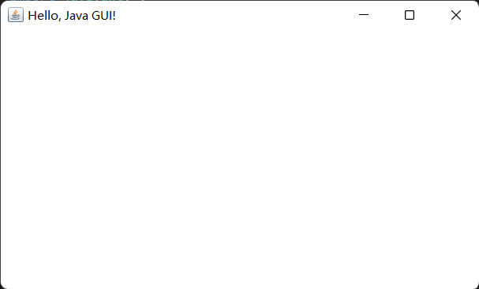

Container作为**容器根类**，提供了如下方法来访问容器中的组件。
|方法名|说明|
|-|-|
|Component add(Component comp)|向容器中添加其他组件（该组件既可以是普通组件，也可以是容器），并返回被添加的组件|
|Component getComponentAt(int x, int y)|返回指定点的组件|
|int getComponentCount()|返回该容器内组件的数量|
|Component\[] getComponents()|返回该容器内的所有组件|

于是我们可以结合 `Frame` 和 `Panel` 做一个有交互性的窗口了。

```Java {.line-numbers}
import java.awt.*;

public class Demo {
    public static void main(String[] args) {
        Frame frame = new Frame("Outlooooooook E-mail");
        frame.setBounds(100, 100, 500, 300);
        frame.setVisible(true);

        // 实例化内嵌容器
        Panel panel = new Panel();

        // 向内嵌容器添加匿名类对象文本框和按钮
        panel.add(new TextField("Input your E-mail here"));
        panel.add(new Button("Sign in"));

        // 向容器添加内嵌容器
        frame.add(panel);
    }
}
```

效果：


`Frame` 和 `ScrollPane` 结合：

```Java {.line-numbers}
import java.awt.*;

public class Demo {
    public static void main(String[] args) {
        Frame frame = new Frame("Outlooooooook E-mail");
        frame.setBounds(100, 100, 500, 300);
        frame.setVisible(true);

        // 实例化带滚动条内嵌容器，并传参使滚动条常态显示
        ScrollPane sp = new ScrollPane(ScrollPane.SCROLLBARS_ALWAYS);
        sp.add(new TextField("Input your E-mail here"));
        sp.add(new Button("Sign in"));
        frame.add(sp);
    }
}
```

效果：

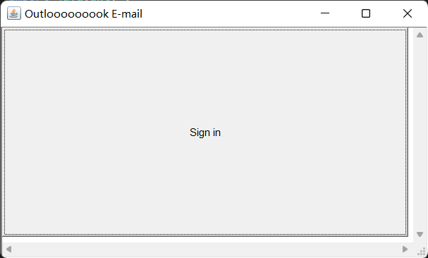

我们会发现 `TextField` 没有体现出来，而造成这种现象的罪魁祸首就是**布局管理器**（ `LayoutManager` ）—— `Window` 和 `ScrollPane` 默认使用的是 `BoaderLayout` ， `Panel` 默认使用的是 `FlowLayout` 。

### LayoutManager接口

`LayoutManager` 下包含若干个布局管理器，如网格布局（ `GridLayout` ）和流式布局（ `FlowLayout` ），以及一个二级接口 `LayoutManager2` ，它也包含了若干个布局管理器，如 `CardLayout` 、 `GridBagLayout` 和 `BorderLayout` 。==如果布局管理器是null，则意味着你必须手动指定组件在容器内的绝对坐标。==


### FlowLayout类

在 `FlowLayout` 中，组件像水流一样向某方向流动（排列），遇到障碍（边界）就折回，重头开始排列。在默认情况下， `FlowLayout` 从左向右排列所有组件，遇到边界就会折回下一行重新开始。

这里给出 `FlowLayout` 的三个构造器。
|方法名|说明|
|-|-|
|FlowLayout()|使用默认的对齐方式及默认的垂直间距、水平间距创建 FlowLayout|
|FlowLayout(int align)| 使用指定的对齐方式及默认的垂直间距、水平间距创建 FlowLayout|
|FlowLayout(int align, int hgap, int vgap)|使用指定的对齐方式及指定的垂直问距、水平间距创建FlowLayout|

`FlowLayout` 中组件的排列方向（从左向右、从右向左、从中间向两边等），该参数应该使用FlowLayout类的静态常量：*FlowLayout.LEFT*、*FlowLayout.CENTER*、*FlowLayout.RIGHT*，==默认是中心对齐==。

`FlowLayout` 中组件中间距通过整数设置，单位是像素，==默认是5个像素==。

演示：流式布局

```Java {.line-numbers}
import java.awt.*;

public class Demo {
    public static void main(String[] args) {
        Frame frame = new Frame("FlowLayout Build");

        // 通过setLayout()设置容器的布局管理器
        frame.setLayout(new FlowLayout(FlowLayout.LEFT, 20, 20));

        // 添加多个按钮到frame中
        for (int i = 0; i < 100; i++)
            frame.add(new Button("Button" + i));

        // 设置最佳大小，pack()
        frame.pack();
        frame.setVisible(true);
    }
}
```

没有设置最佳大小的效果：


设置了最佳大小的效果：

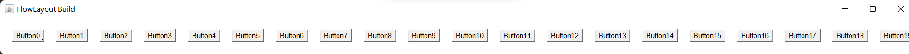

手动拉伸窗口后的效果：

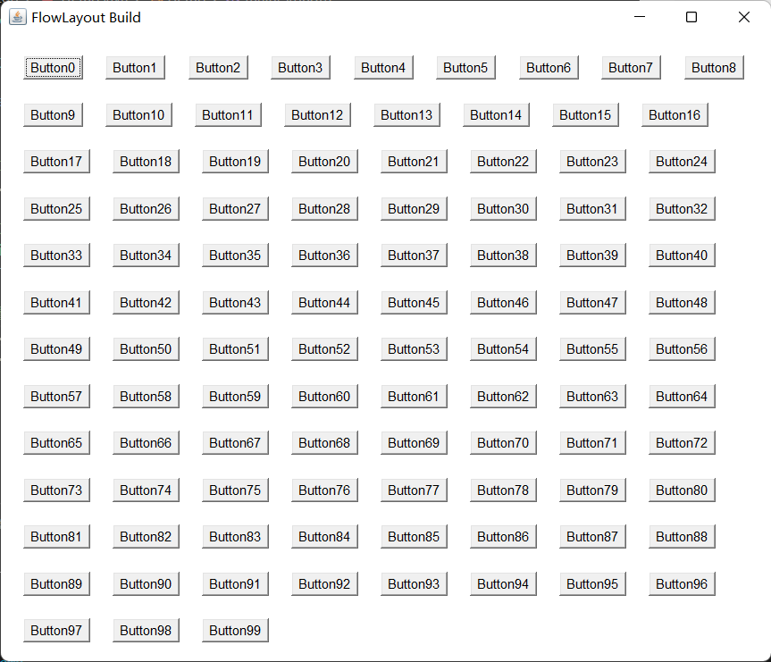

### BorderLayout类

`BorderLayout` 将容器分为 **EAST**、**SOUTH**、**WEST**、**NORTH**和**CENTER**五个区域，普通组件可以被放置在这5个区域的任意一个中。 `BorderLayout` 的布局方案如图所示：


当改变使用 `BorderLayout` 的容器大小时，NORTH、SOUTH和CENTER区域**水平调整**，而EAST、WEST和CENTER区域**垂直调整**。使用 `BorderLayout` 有如下两个注意点：

- 当向使用BorderLayout的容器中添加组件时，需要指定要添加到哪个区域中。如果没有指定添加到哪个区域中，则==默认添加到中间区域中==。
- 如果向同一个区域中添加多个组件时，==后放入的组件会覆盖先放入的组件==。

这里给出 `BorderLayout` 的三个构造器。
|方法名|说明|
|-|-|
|BorderLayout()|使用==默认的==水平间距、垂直间距创建BorderLayout|
|BorderLayout(int hgap, int vgap)|使用==指定的==水平间距、垂直间距创建BorderLayout|

演示：板式布局

```Java {.line-numbers}
import java.awt.*;

public class Demo {
    public static void main(String[] args) {
        Frame frame = new Frame("BorderLayout Build");
        frame.setLayout(new BorderLayout(30, 20));

        // 向frame的指定区域中添加组件
        frame.add(new Button("EAST"), BorderLayout.EAST);
        frame.add(new Button("WEST"), BorderLayout.WEST);
        frame.add(new Button("CENTER"), BorderLayout.CENTER);
        frame.add(new Button("SOUTH"), BorderLayout.SOUTH);
        frame.add(new Button("NORTH"), BorderLayout.NORTH);

        frame.pack();
        frame.setVisible(true);
    }
}
```

效果：

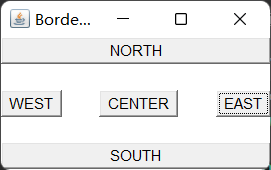

全屏化窗口的效果：（能体现各部分调整的规律）

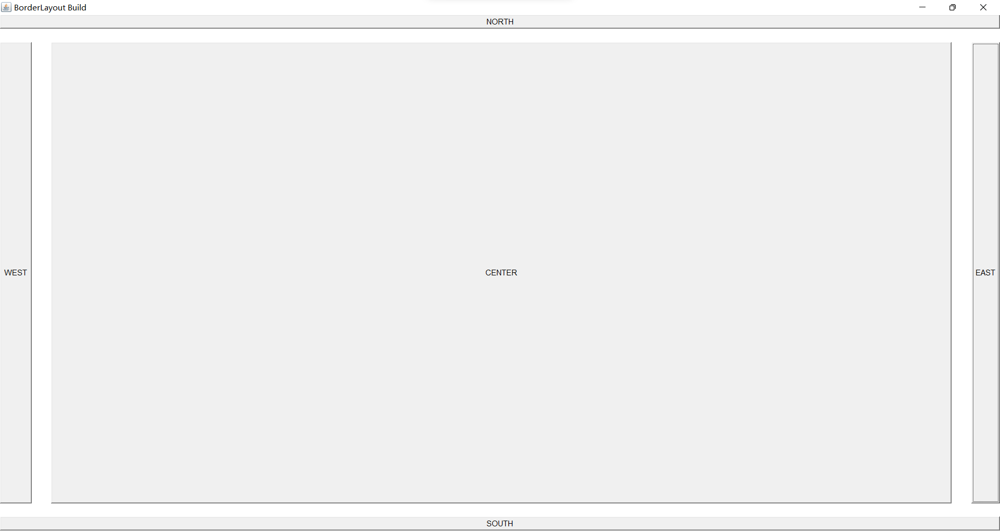

如果不往某个区域中放入组件，那么该区域不会空白出来，而是会被其他区域（CERTER）占用。

演示 2：在板式布局中嵌入流式布局

```Java {.line-numbers}
import java.awt.*;

public class Demo {
    public static void main(String[] args) {
        Frame frame = new Frame("BorderLayout Build");
        frame.setLayout(new BorderLayout(30, 20));

        frame.add(new Button("EAST"), BorderLayout.EAST);
        frame.add(new Button("WEST"), BorderLayout.WEST);
        frame.add(new Button("SOUTH"), BorderLayout.SOUTH);
        frame.add(new Button("NORTH"), BorderLayout.NORTH);

        Panel panel = new Panel();
        panel.add(new Button("CENTER"));
        panel.add(new TextField("RealCENTER"));

        frame.add(panel, BorderLayout.CENTER);
        frame.pack();
        frame.setVisible(true);
    }
}
```

效果：

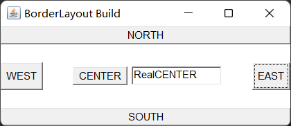

### GridLayout类

`GridLayout` 将容器分割成纵横线分隔的网格，每个网格所占的区域大小相同。当向使用 `GridLayout` 的容器中添加组件时，默认==从左向右、从上向下==依次添加到每个网格中。与 `FlowLayout` 不同的是，放置在 `GridLayout` 中的各组件的大小由组件所处的区域决定（每个组件将自动占满整个区域）。

|方法名|说明|
|-|-|
|GridLayout(int rows, int cols)|采用指定的行数、列数，以及默认的横向间距、纵向间距将容器分割成多个网格|
|GridLayout(int rows, int cols, int hgap, int vgap)|采用指定的行数、列数，以及指定的横向间距、纵向间距将容器分割成多个网格|

演示：使用 `Frame` 加 `Panel` ，配合 `FlowLayout` 和 `GridLayout` 完成一个计算器效果

```Java {.line-numbers}
import java.awt.*;

public class Demo {
    public static void main(String[] args) {
        Frame frame = new Frame("Calculator");

        // 创建一个Panel对象，并且向Panel中放置一个TextField组件
        Panel panel = new Panel();
        panel.add(new TextField(20));

        // 将上述的Panel放入到Frame的北侧区域
        frame.add(panel, BorderLayout.NORTH);

        // 再创建一个Panel对象，并且设置其布局管理器为GridLayout
        Panel panelDown = new Panel();
        panelDown.setLayout(new GridLayout(5, 4, 4, 4));

        // 向上述Panel中，放置15个按钮
        panelDown.add(new Button("AC"));
        panelDown.add(new Button("BS"));
        panelDown.add(new Button("%"));
        panelDown.add(new Button("÷"));
        for (int i = 7; i <= 9; i++)
            panelDown.add(new Button(i + ""));
        panelDown.add(new Button("×"));
        for (int i = 4; i <= 6; i++)
            panelDown.add(new Button(i + ""));
        panelDown.add(new Button("-"));
        for (int i = 1; i <= 3; i++)
            panelDown.add(new Button(i + ""));
        panelDown.add(new Button("+"));
        panelDown.add(new Button("e"));
        panelDown.add(new Button("0"));
        panelDown.add(new Button("."));
        panelDown.add(new Button("="));

        // 将上述Panel添加到Frame的中间区域
        frame.add(panelDown);

        frame.pack();
        frame.setVisible(true);
    }
}
```

效果：

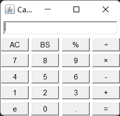

### GridBagLayout类

`GridBagLayout` 的功能最强大，但也最复杂，与 `GridLayout` 不同的是，在 `GridBagLayout` 中，一个组件可以跨越一个或多个网格，并可以设置各网格的大小互不相同，从而增加了布局的灵活性。当窗口的大小发生变化时， `GridBagLayout` 也可以准确地控制窗口各部分的拉伸。

由于在 `GridBagLayout` 中，每个组件可以占用多个网格，此时，我们往容器中添加组件的时候，就需要具体的控制每个组件占用多少个网格，java提供的 `GridBagConstaints` 类，与特定的组件绑定，可以完成具体大小和跨越性的设置。

这里给出 `GridBagConstraints` 中的成员变量：
|成员变量|说明|
| --- | --- |
|gridx|设置受该对象控制的GUI组件左上角所在网格的横向索引|
|gridy|设置受该对象控制的GUI组件左上角所在网格的纵向索引|
|gridwidth|设置受该对象控制的GUI组件横向跨越多少个网格，如果属性值为*GridBagContraints.REMAIND*，则表明当前组件是横向最后一个组件，如果属性值为*GridBagConstraints.RELATIVE*，表明当前组件是横向倒数第二个组件|
|gridheight|设置受该对象控制的GUI组件纵向跨越多少个网格，如果属性值为*GridBagContraints.REMAIND*，则表明当前组件是纵向最后一个组件，如果属性值为*GridBagConstraints.RELATIVE*，表明当前组件是纵向倒数第二个组件|
|weightx|设置受该对象控制的GUI组件占据多余空间的水平比例，假设某个容器的水平线上包括三个GUI组件，它们的水平增加比例分别是1、2、3，但容器宽度增加60像素时，则第一个组件宽度增加10像素，第二个组件宽度增加20像素，第三个组件宽度增加30像素。如果其增加比例为0，则表示不会增加|
|weighty|设置受该对象控制的GUI组件占据多余空间的垂直比例|
|anchor|设置受该对象控制的GUI组件在其显示区域中的定位方式：*GridBagConstraints.CENTER*（中间） *GridBagConstraints.NORTH*（上中） *GridBagConstraints.NORTHWEST*（左上角） *GridBagConstraints.NORTHEAST*（右上角） *GridBagConstraints.SOUTH*（下中） *GridBagConstraints.SOUTHEAST*（右下角） *GridBagConstraints.SOUTHWEST*（左下角） *GridBagConstraints.EAST*（右中） *GridBagConstraints.WEST*（左中）|
|fill|当“显示区域”大于“组件”的时候，如何调整组件：*GridBagConstraints.NONE*: GUI组件不扩大 *GridBagConstraints.HORIZONTAL*：GUI组件水平扩大以占据空白区域 *GridBagConstraints.VERTICAL*：GUI组件垂直扩大以占据空白区域 *GridBagConstraints.BOTH*：GUI组件水平、垂直同时扩大以占据空白区域|
|insets|设置受该对象控制的GUI组件的外部填充的大小，即该组件边界和显示区域边界之间的距离|
|ipadx|设置受该对象控制的GUI组件横向内部填充的大小，即在该组件最小尺寸的基础上还需要增大多少|
|ipady|设置受该对象控制的GUI组件纵向内部填充的大小，即在该组件最小尺寸的基础上还需要增大多少|

使用步骤：

1. 创建GridBagLayout对象，并给容器设置该布局管理器对象。
2. 创建GridBagConstraints对象，并设置该对象的控制属性：
    - gridx：用于指定组件在网格中所处的横向索引
    - gridy：用于执行组件在网格中所处的纵向索引
    - gridwidth：用于指定组件横向跨越多少个网格
    - gridheight：用于指定组件纵向跨越多少个网格
3. 调用GridBagLayout对象的setConstraints(Component c, GridBagConstraints gbc)方法，把即将要添加到容器中的组件c和GridBagConstraints对象关联起来。
4. 把组件添加到容器中。

### CardLayout类

`CardLayout` ==以时间而非空间==来管理它里面的组件，它将加入容器的所有组件看成一叠卡片（每个卡片其实就是一个组件），每次只有最上面的 `Component` 才可见。就好像一副扑克牌，它们叠在一起，每次只有最上面的一张扑克牌才可见。

这里给出其构造器和常用方法：
|方法名|说明|
|-|-|
|CardLayout()|创建默认的CardLayout|
|CardLayout(int hgap, int vgap)|通过指定卡片与容器左右边界的间距（hgap）、上下边界（vgap）的间距来创建CardLayout|
|void first(Container target)|显示target容器中的第一张卡片|
|void last(Container target)|显示target容器中的最后一张卡片|
|void previous(Container target)|显示target容器中的前一张卡片|
|void next(Container target)|显示target容器中的后一张卡片|
|void show(Container target, String name)|显示target容器中指定名字的卡片|

演示：使用 `Frame` 和 `Panel` 以及 `CardLayout` 完成图片查看器的效果

```Java {.line-numbers}
import java.awt.*;
import java.awt.event.*;

public class Demo {
    public static void main(String[] args) {
        Frame frame = new Frame("PicViewer");
        // 创建一个p1，储存多张卡片
        Panel p1 = new Panel();

        // CardLayout对象，并且把该对象设置给之前创建的容器
        CardLayout cardLayout = new CardLayout();
        p1.setLayout(cardLayout);

        // 往p1中储存多个组件
        String[] names = { "The 1st pic", "The 2nd pic", "The 3rd pic", "The 4th pic", "The 5th pic" };
        for (int i = 0; i < names.length; i++)
            p1.add(names[i], new Button(names[i]));

        // 把p1放在frame的中间
        frame.add(p1);

        // 创建另一个panel p2，存放多个按钮组件
        Panel p2 = new Panel();

        Button b1 = new Button("The first");
        Button b2 = new Button("Previous one");
        Button b3 = new Button("Next one");
        Button b4 = new Button("The last");
        Button b5 = new Button("The third");

        // 创建一个时间监听器，监听按钮的点击动作
        ActionListener listener = new ActionListener() {
            @Override
            public void actionPerformed(ActionEvent e) {
                String command = e.getActionCommand();
                switch (command) {
                    case "The first":
                        cardLayout.first(p1);
                        break;
                    case "Previous one":
                        cardLayout.previous(p1);
                        break;
                    case "Next one":
                        cardLayout.next(p1);
                        break;
                    case "The last":
                        cardLayout.last(p1);
                        break;
                    case "The third":
                        cardLayout.show(p1, "The 3rd pic");
                        break;
                }
            }
        };

        // 绑定监听器与按钮
        b1.addActionListener(listener);
        b2.addActionListener(listener);
        b3.addActionListener(listener);
        b4.addActionListener(listener);
        b5.addActionListener(listener);

        // 把5个按钮添加到p2中
        p2.add(b1);
        p2.add(b2);
        p2.add(b3);
        p2.add(b4);
        p2.add(b5);

        // 把p2放在frame的下部
        frame.add(p2, BorderLayout.SOUTH);

        frame.pack();
        frame.setVisible(true);
    }
}
```

效果：

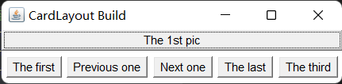

### BoxLayout类

为了简化开发， `Swing` 引入了一个新的布局管理器： `BoxLayout` 。它可以在垂直和水平两个方向上摆放GUI组件， `BoxLayout` 提供了如下一个简单的构造器：
|方法名|说明|
|-|-|
|BoxLayout(Container target, int axis)|指定创建基于target容器的BoxLayout，该布局管理器里的组件按axis方向排列。其中axis有*BoxLayout.X_AXIS*（横向）和*BoxLayout.Y_AXIS*（纵向）两个方向|

演示：使用箱式布局纵向排列组件

```Java {.line-numbers}
import java.awt.*;
import javax.swing.*;

public class Demo {
    public static void main(String[] args) {
        Frame frame = new Frame("BoxLayout Build");
        BoxLayout boxLayout = new BoxLayout(frame, BoxLayout.Y_AXIS);
        frame.setLayout(boxLayout);
        frame.add(new Button("Button 1"));
        frame.add(new Button("Button 2"));
        frame.pack();
        frame.setVisible(true);
    }
}
```

效果：

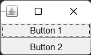

在 `javax.swing` 包中，提供了一个新的容器 `Box` ，该容器的默认布局管理器就是 `BoxLayout` ，大多数情况下，使用 `Box` 容器去容纳多个GUI组件，然后再把 `Box` 容器作为一个组件，添加到其他的容器中，从而形成整体窗口布局。

这里给出它的两个方法：
|方法名|说明|
|-|-|
|static Box createHorizontalBox()|创建一个**水平排列**组件的Box|
|static Box createVerticalBox()|创建一个**垂直排列**组件的Box|

演示2：将水平 `Box` 嵌入垂直 `Box`

```Java {.line-numbers}
import java.awt.*;
import javax.swing.*;

public class Demo {
    public static void main(String[] args) {
        // 创建Frame对象
        Frame frame = new Frame("BoxLayout Build");

        // 创建一个横向的Box，并添加两个按钮
        Box hBox = Box.createHorizontalBox();
        hBox.add(new Button("HB1"));
        hBox.add(new Button("HB2"));

        // 创建一个纵向的Box，将hBox嵌入，并再添加两个按钮
        Box vBox = Box.createVerticalBox();
        vBox.add(hBox);
        vBox.add(new Button("VB1"));
        vBox.add(new Button("VB2"));

        // 把vBox添加到frame容器中
        frame.add(vBox);

        // 设置frame最佳大小并可见
        frame.pack();
        frame.setVisible(true);
    }
}
```

效果：

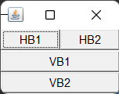

`Box` 类中提供了相关的静态方法生成间隔组件：
|方法名|说明|
|-|-|
|static Component createHorizontalGlue()|创建一条水平Glue（可在两个方向上同时拉伸的间距）|
|static Component createVerticalGlue()|创建一条垂直Glue（可在两个方向上同时拉伸的间距）|
|static Component createHorizontalStrut(int width)|创建一条指定宽度（宽度固定了，不能拉伸）的水平Strut（可在垂直方向上拉伸的间距）|
|static Component createVerticalStrut(int height)|创建一条指定高度（高度固定了，不能拉伸）的垂直Strut（可在水平方向上拉伸的间距）|

演示 3：使用 `Frame` 和 `Box` ，生成组件间具有间隔的箱式布局

```Java {.line-numbers}
import java.awt.*;
import javax.swing.*;

public class Demo {
    public static void main(String[] args) {
        // 创建Frame对象
        Frame frame = new Frame("BoxLayout Build");

        // 创建一个横向的Box,并添加两个按钮
        Box hBox = Box.createHorizontalBox();
        hBox.add(new Button("HB1"));
        hBox.add(Box.createHorizontalGlue());
        hBox.add(new Button("HB2"));
        hBox.add(Box.createHorizontalStrut(10));
        hBox.add(new Button("HB3"));

        // 创建一个纵向的Box，并添加两个按钮
        Box vBox = Box.createVerticalBox();
        vBox.add(new Button("VB1"));
        vBox.add(Box.createVerticalGlue());
        vBox.add(new Button("VB2"));
        vBox.add(Box.createVerticalStrut(10));
        vBox.add(new Button("VB3"));

        // 把box容器添加到frame容器中
        frame.add(hBox, BorderLayout.NORTH);
        frame.add(vBox);

        // 设置frame最佳大小并可见
        frame.pack();
        frame.setVisible(true);
    }
}
```

手动拉伸后的效果：

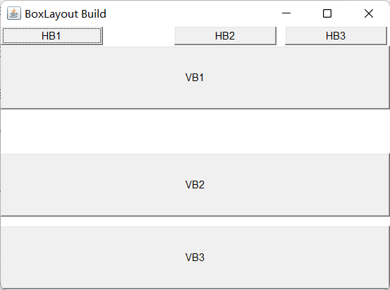

### 基本组件

|类名|说明|
|-|-|
|Button|按钮|
|Canvas|用于绘图的画布|
|Checkbox|复选框组件（也可当做单选框组件使用）|
|CheckboxGroup|用于将多个Checkbox组件组合成一组，一组Checkbox组件将只有一个可以被选中，即全部变成单选框组件|
|Choice|下拉选择框|
|Frame|窗口，在GUI程序里通过该类创建窗口|
|Label|标签类，用于放置提示性文本|
|List|表框组件，可以添加多项条目|
|Panel|不能单独存在基本容器类，必须放到其他容器中|
|Scrollbar|滑动条组件。如果需要用户输入位于某个范围的值，就可以使用滑动条组件，比如调色板中设置RGB的三个值所用的滑动条。当创建一个滑动条时，必须指定它的方向、初始值、滑块的大小、最小值和最大值|
|ScrollPane|带水平及垂直滚动条的容器组件|
|TextArea|多行文本域|
|TextField|单行文本框|

这些 `AWT` 组件的用法比较简单，可以查阅API文档来获取它们各自的构造方法、成员方法等详细信息。

演示：利用多个组件实现复合界面

*ComplexGUI.java*：

```Java {.line-numbers}
import java.awt.*;
import javax.swing.*;

public class ComplexGUI {
    Frame frame = new Frame("ComplexGUI");
    TextArea textArea = new TextArea(5, 20);
    Choice domicileChooser = new Choice();

    CheckboxGroup checkboxGroup = new CheckboxGroup();
    Checkbox male = new Checkbox("Male", checkboxGroup, true);
    Checkbox female = new Checkbox("Female", checkboxGroup, true);

    Checkbox isAdult = new Checkbox("Adult");

    TextField textField = new TextField(60);
    Button ok = new Button("OK");
    List langList = new List(6, true);

    public void init() {
        // 组装底部
        Box bBox = Box.createHorizontalBox();
        bBox.add(textField);
        bBox.add(ok);
        frame.add(bBox, BorderLayout.SOUTH);

        // 组装选择部分
        domicileChooser.add("Unknown");
        domicileChooser.add("Northerner");
        domicileChooser.add("Southerner");
        Box cBox = Box.createHorizontalBox();
        cBox.add(domicileChooser);
        cBox.add(male);
        cBox.add(female);
        cBox.add(isAdult);

        // 组装文本域和选择部分
        Box topLeft = Box.createVerticalBox();
        topLeft.add(textArea);
        topLeft.add(cBox);

        // 组装顶部左边与列表框
        langList.add("Best at Cpp");
        langList.add("Best at Java");
        langList.add("Best at Python");
        Box top = Box.createHorizontalBox();
        top.add(topLeft);
        top.add(langList);

        frame.add(top);

        frame.pack();
        frame.setVisible(true);
    }
}
```

*Demo.java*：

```Java {.line-numbers}
public class Demo {
    public static void main(String[] args) {
        new ComplexGUI().assemble();
    }
}
```

效果：

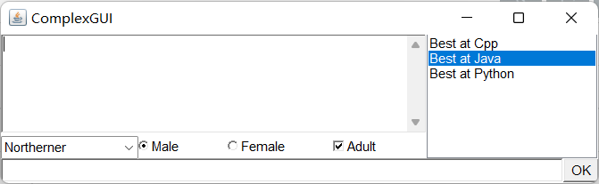

### Dialog类

`Dialog` （对话框）是 `Window` 类的子类，是一个容器类，属于特殊组件。对话框是**可以独立存在**的顶级窗口，因此用法与普通窗口的用法几乎完全一样，但是使用对话框需要注意下面两点：

- 对话框通常依赖于其他窗口，就是通常需要有一个父窗口。
- 对话框有非模态（non-modal）和模态（modal）两种，当某个模态对话框被打开后，该模态对话框总是位于它的父窗口之上，==在模态对话框被关闭之前，父窗口无法获得焦点==。

下面给出 `Dialog` 的构造器：
|方法名|说明|
|-|-|
|Dialog(Frame owner, String title, boolean modal)|创建一个对话框对象：owner：当前对话框的父窗口 title：当前对话框的标题  modal：当前对话框是否是模式对话框|

演示：设计出能弹出模态和非模态窗口的GUI

```Java {.line-numbers}
import java.awt.*;
import java.awt.event.*;
import javax.swing.*;

public class Demo {
    public static void main(String[] args) {
        Frame frame = new Frame("Dialog Build");
        frame.setLayout(new BoxLayout(frame, BoxLayout.Y_AXIS));

        Dialog d1 = new Dialog(frame, "Model Dialog", true);
        Dialog d2 = new Dialog(frame, "Non-model Dialog", false);

        // 往对话框中添加内容
        Box vBox = Box.createVerticalBox();

        vBox.add(new TextField(
                "A component based on awt can hardly support Chinese character, but the component based on swing isn't."));
        vBox.add(new JButton("确认"));
        d1.add(vBox);

        Button b1 = new Button("Start a Model Dialog");
        Button b2 = new Button("Start a Non-model Dialog");

        // 设置对话框的大小和位置
        frame.setBounds(50, 50, 200, 100);
        d1.setBounds(250, 50, 200, 100);
        d2.setBounds(450, 50, 200, 100);

        // 给b1绑定监听事件
        b1.addActionListener(new ActionListener() {
            @Override
            public void actionPerformed(ActionEvent e) {
                d1.setVisible(true);
            }
        });
        b2.addActionListener(new ActionListener() {
            @Override
            public void actionPerformed(ActionEvent e) {
                d2.setVisible(true);
            }
        });
        frame.add(b1);
        frame.add(b2);

        frame.setVisible(true);
    }
}
```

效果：

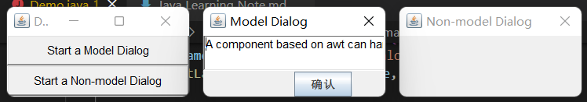

### FileDialog类

`Dialog` 类还有一个子类： `FileDialog` ，它代表一个文件对话框，用于打开或者保存文件，需要注意的是 `FileDialog` ==无法指定模态或者非模态==。这是因为 `FileDialog` 依赖于运行平台的实现，如果运行平台的文件对话框是模态的，那么 `FileDialog` 也是模态的，否则就是非模态的。

下面给出 `FileDialog` 的构造器和常用方法：
|方法名|说明|
|-|-|
|FileDialog(Frame parent, String title, int mode)|创建一个文件对话框：parent：指定父窗口 title：对话框标题 mode：文件对话框类型，如果指定为*FileDialog.LOAD*，用于打开文件；如果指定为*FileDialog.SAVE*，则用于保存文件|
|String getDirectory()|获取被打开或保存文件的绝对路径|
|String getFile()|获取被打开或保存文件的文件名|

演示：使用 `Frame` 、 `Button` 和 `FileDialog` 完成文件载入和保存的效果

```Java {.line-numbers}
import java.awt.*;
import java.awt.event.*;
import javax.swing.*;

public class Demo {
    public static void main(String[] args) {
        Frame frame = new Frame("FileDialog Build");
        frame.setLayout(new BoxLayout(frame, BoxLayout.Y_AXIS));
        frame.setSize(300, 200);

        FileDialog d1 = new FileDialog(frame, "Which to load", FileDialog.LOAD);
        FileDialog d2 = new FileDialog(frame, "Which to save", FileDialog.SAVE);

        Button b1 = new Button("Load a file");
        Button b2 = new Button("Save a file");

        // 给按钮添加事件
        b1.addActionListener(new ActionListener() {
            @Override
            public void actionPerformed(ActionEvent e) {
                d1.setVisible(true);
                // 输出用户选择的文件路径和名称
                System.out.println("You loaded " + d1.getDirectory() + d1.getFile());
            }
        });
        b2.addActionListener(new ActionListener() {
            @Override
            public void actionPerformed(ActionEvent e) {
                d2.setVisible(true);
                System.out.println("You saved " + d1.getDirectory() + d1.getFile());
            }
        });

        frame.add(b1);
        frame.add(b2);
        frame.setVisible(true);
    }
}
```

效果：

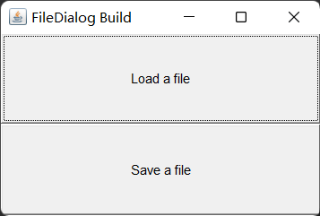

### 事件处理机制

前面介绍了如何放置各种组件，从而制造出各种GUI，但这些界面还不能响应用户的操作。窗口和组件本身并没有事件处理能力，我们需要手动为它们编写**事件处理机制**。

在进入正题前，我们需要先了解几个概念：

- **事件源**（Event Source）：操作发生的场所，通常指某个组件。
- **事件**（Event）：在事件源上发生的操作可以叫做事件。GUI会把事件都封装到一个Event对象里，如果需要知道该事件的详细信息，就可以通过这个对象来获取。
- **事件监听器**（Event Listener）：当某个事件源上发生了某个事件，事件监听器就可以对这个事件进行处理。
- **注册监听**：把某个事件监听器通过某个事件绑定到某个事件源上，那么当事件源上发生了事件后，事件监听器的代码就会自动执行。

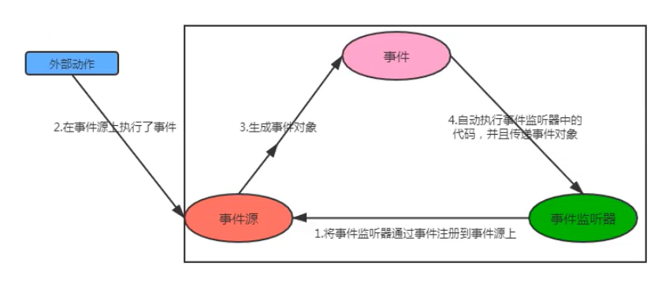

这里举一个关闭窗口的例子：

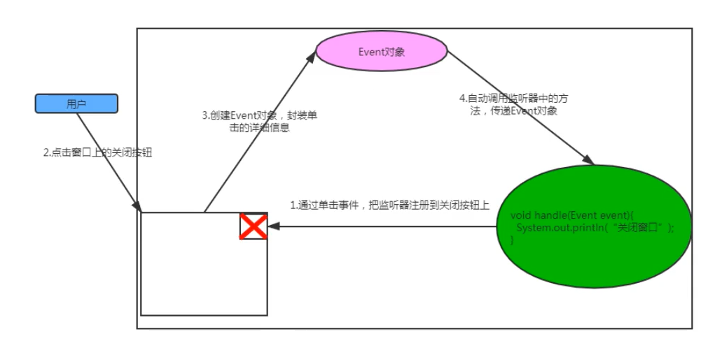

事件监听器必须实现事件监听器接口，AWT提供了大量的事件监听器接口用于实现不同类型的事件监听器，用于监听不同类型的事件。AWT中提供了丰富的事件类，用于封装不同组件上所发生的特定操作，AWT的事件类都是 `AWTEvent` 类的子类， `AWTEvent` 是 `EventObject` 的子类。

AWT把事件分为了两大类：

**低级事件**：这类事件是基于某个特定动作的事件。

|事件|触发时机|监听器|
|-|-|-|
|ComponentEvent|组件事件：当组件尺寸发生变化、位置发生移动、显隐状态发生改变的时触发该事件|ComponentListener|
|ContainerEvent|容器事件：当容器里发生添加组件、删除组件时触发该事件|ContainerListener|
|WindowEvent|窗口事件：当窗口的状态发生改变（如打开、关闭、最大化或最小化等）时触发该事件|WindowListener|
|FocusEvent|焦点事件：当组件获得焦点或失去焦点时触发该事件|FocusListener|
|KeyEvent|键盘事件：当按键被按下、松开、单击时触发该事件|KeyListener|
|MouseEvent|鼠标事件：当进行单击、按下、松开或移动鼠标时触发该事件|MouseMotionListener和MouseListener|
|PaintEvent|组件绘制事件：该事件是一个特殊的事件类型，当GUI组件调用update()或paint()来呈现自身时触发该事件，==该事件并非专用于事件处理模型==|*N/A*|

相应的，它们都有自己的XxAdapter作为XxListener的简略版。

**高级事件**：这类事件并不会基于某个特定动作，而是根据功能含义定义的事件。

|事件|触发时机|监听器|
|-|-|-|
|ActionEvent|动作事件：当按钮、菜单项被单击或在TextField中按Enter键时触发|ActionListener|
|AdjustmentEvent|调节事件：在滑动条上移动滑块以调节数值时触发该事件|AdjustmentListener|
|ItemEvent|选项事件：当用户选中或取消选中某项时触发该事件|ItemListener|
|TextEvent|文本事件：当文本框、文本域里的文本发生改变时触发该事件|TextListener|

演示：创建一个窗口，可以使用上、下、左、右键移动窗口

*DirectionKeyListener.java*：

```Java {.line-numbers}
import java.awt.*;
import java.awt.event.*;

public class DirectionKeyListener implements KeyListener {
    @Override
    public void keyPressed(KeyEvent e) {
        // getSource()能从事件中提取事件源，返回Object对象，所以需要向下强制转型
        Frame frame = (Frame) e.getSource();
        // getKeyCode()与getKeyChar()并不相同，根据方向键的作用可以猜测，我们要获取的不是char
        switch (e.getKeyCode()) {
            case KeyEvent.VK_UP:
                frame.setLocation(frame.getX(), frame.getY() - 1);
                break;
            case KeyEvent.VK_DOWN:
                frame.setLocation(frame.getX(), frame.getY() + 1);
                break;
            case KeyEvent.VK_LEFT:
                frame.setLocation(frame.getX() - 1, frame.getY());
                break;
            case KeyEvent.VK_RIGHT:
                frame.setLocation(frame.getX() + 1, frame.getY());
                break;
        }
    }

    @Override
    public void keyReleased(KeyEvent e) {
    }

    @Override
    public void keyTyped(KeyEvent e) {
    }
}
```

*Demo.java*：

```Java {.line-numbers}
import java.awt.*;

public class Demo {
    Frame frame = new Frame();

    public static void main(String[] args) {
        Demo demo = new Demo();
        demo.frame.setBounds(0, 0, 480, 320);
        demo.frame.addKeyListener(new DirectionKeyListener());
        demo.frame.setVisible(true);
    }
}
```

效果：

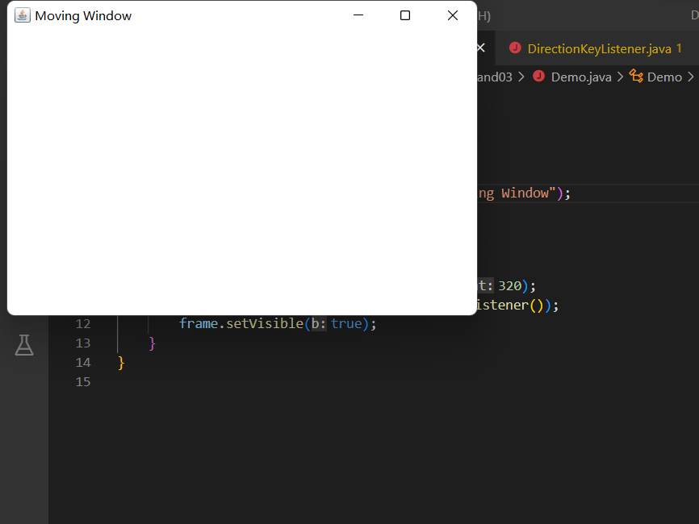

键盘操作移动后效果：

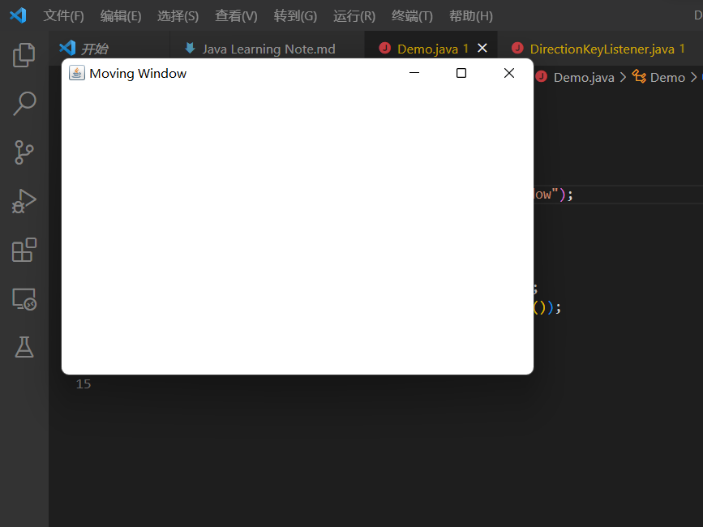

#### 精选案例：资生堂产品生产日期查询器

> 该case基于Penyo的项目[ShiseidoMFTQuery](https://github.com/penyoofficial/ShiseidoMFTQuery)编写。

*ShiseidoMFTQuery_GUI.java*：

```Java {.line-numbers}
package penyo.ShiseidoMFTQuery;

import java.awt.*;
import java.awt.event.*;

public class ShiseidoMFTQuery_GUI {
    Frame frame = new Frame("Shiseido Products Manufacturing Time Query");

    Label guide = new Label("Welcome to use ShiseidoMFTQuery! Input the 6-bit code on the package:");
    TextField infoExchange = new TextField();
    Button query = new Button("Query");

    public void boot() {
        frame.add(guide, BorderLayout.NORTH);
        frame.add(infoExchange);
        frame.add(query, BorderLayout.SOUTH);

        // 只有一个事件源使用一个事件监听器的时候，可以用匿名内部类
        query.addActionListener(new ActionListener() {
            @Override
            public void actionPerformed(ActionEvent e) {
                infoExchange.setText(
                        ShiseidoMFTQuery_Core.core(
                                infoExchange.getText()));
            }
        });

        // 在Swing中，下一句可直接用frame.setDefaultCloseOperation(EXIT_ON_CLOSE);代替
        frame.addWindowListener(new WindowAdapter() {
            // 窗体点击关闭时，关闭虚拟机
            @Override
            public void windowClosing(WindowEvent e) {
                System.exit(0);
            }
        });

        frame.pack();
        frame.setVisible(true);
    }
}
```

*ShiseidoMFTQuery_Core.java*：

```Java {.line-numbers}
package penyo.ShiseidoMFTQuery;

import java.util.Calendar;

public class ShiseidoMFTQuery_Core {
    static int MFT_YEAR, MFT_MONTH, MFT_DATE;

    public static String core(String code) {
        try {
            Integer.parseInt(String.valueOf(code.charAt(0)) +
                    String.valueOf(code.charAt(1)) +
                    String.valueOf(code.charAt(2)) +
                    String.valueOf(code.charAt(3)));
        } catch (Exception e) {
            return "您输入了错误的序列号！";
        }
        mftDate(code);
        StringBuilder result = new StringBuilder("您的产品生产于："
                + MFT_YEAR + "年" + MFT_MONTH + "月" + MFT_DATE + "日。");
        Calendar now = Calendar.getInstance(), mft = Calendar.getInstance();
        mft.set(MFT_YEAR, MFT_MONTH, MFT_DATE);
        if ((now.get(Calendar.YEAR) - mft.get(Calendar.YEAR) + 1) * 365
                + Math.abs(now.get(Calendar.DAY_OF_YEAR) - mft.get(Calendar.DAY_OF_YEAR)) < 3 * 365)
            result.append("产品保质期为3年，请尽快使用。");
        else
            result.append("产品已过期，请勿继续使用！");
        return result.toString();
    }

    public static void mftDate(String code) {
        Calendar date = Calendar.getInstance();
        int thisYear = date.get(Calendar.YEAR);
        for (int year = thisYear; year > thisYear - 10; year--)
            if (Integer.toString(year).charAt(3) == code.charAt(0)) {
                MFT_YEAR = year;
                break;
            }
        StringBuilder thisDay = new StringBuilder();
        thisDay.append(code.charAt(1)).append(code.charAt(2)).append(code.charAt(3));
        int day = Integer.valueOf(thisDay.toString());
        date.set(MFT_YEAR, 1, 1);
        date.set(Calendar.DAY_OF_YEAR, day);
        MFT_MONTH = date.get(Calendar.MONTH) + 1;
        MFT_DATE = date.get(Calendar.DATE);
    }
}
```

*Demo.java*：

```Java {.line-numbers}
package penyo.ShiseidoMFTQuery;

public class Demo {
    public static void main(String[] args) {
        ShiseidoMFTQuery_GUI gui = new ShiseidoMFTQuery_GUI();
        gui.boot();
    }
}
```

效果：

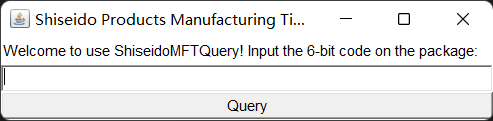

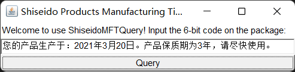

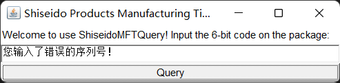

### 菜单组件

前面讲解了如果构建GUI界面，其实就是把一些GUI的组件，按照一定的布局放入到容器中展示就可以了。在实际开发中，除了主界面，还有一类比较重要的内容就是菜单相关组件，可以通过菜单相关组件很方便的使用特定的功能，在AWT中，菜单相关组件的使用和之前学习的组件是一模一样的，只需要把菜单条、菜单、菜单项组合到一起，按照一定的布局，放入到容器中即可。

下表中给出常见的菜单相关组件：
|类名|说明|
|-|-|
|MenuBar|菜单条，菜单的容器|
|Menu|菜单组件，菜单项的容器。它也是Menultem的子类，所以可作为菜单项使用|
|PopupMenu|上下文菜单组件（右键菜单组件）|
|Menultem|菜单项组件|
|CheckboxMenuItem|复选框菜单项组件|

下图是常见菜单相关组件集成体系图：


菜单相关组件使用步骤：

1. 准备菜单项组件，这些组件可以是MenuItem及其子类对象。
2. 准备菜单组件Menu或者PopupMenu（右击弹出子菜单），把第一步中准备好的菜单项组件添加进来。
3. 准备菜单条组件MenuBar，把第二步中准备好的菜单组件Menu添加进来。
4. 把第三步中准备好的菜单条组件添加到窗口对象中显示。

小技巧：

1. 如果要在某个菜单的菜单项之间添加分割线，那么只需要调用Menu的add(new MenuItem("-"))即可。
2. 如果要给某个菜单项关联快捷键功能，那么只需要在创建菜单项对象时设置即可，例如给菜单项关联 **Ctrl+Shift+Q** 快捷键，只需要new MenuItem("菜单项名字", new MenuShortcut(KeyEvent.VK_Q, true)。

演示：制作简单的带有各种菜单的界面

```Java {.line-numbers}
import java.awt.*;
import java.awt.event.*;

public class Demo {
    private Frame frame = new Frame("Menu Build");

    // 创建菜单条组件
    private MenuBar menuBar = new MenuBar();

    // 创建文件菜单组件
    private Menu m1 = new Menu("Menu 1");
    private Menu m2 = new Menu("Menu 2");
    private Menu m3 = new Menu("Menu 3");

    // 创建菜单项
    private MenuItem mi1 = new MenuItem("MenuItem 1");
    private MenuItem mi2 = new MenuItem("MenuItem 2");
    private MenuItem mi3 = new MenuItem("MenuItem 3");

    // 关联快捷键
    private MenuItem mi4 = new MenuItem("MenuItem 4 ", new MenuShortcut(KeyEvent.VK_A, true));
    private MenuItem mi5 = new MenuItem("MenuItem 5");

    // 创建一个文本域
    private TextArea ta = new TextArea(6, 40);

    // 创建PopupMenu菜单
    private PopupMenu popupMenu = new PopupMenu();

    // 创建菜单项
    private MenuItem mip1 = new MenuItem("Pop 1");
    private MenuItem mip2 = new MenuItem("Pop 2");
    private MenuItem mip3 = new MenuItem("Pop 3");
    private MenuItem mip4 = new MenuItem("Pop 4");

    public void init() {
        mi4.addActionListener(new ActionListener() {
            @Override
            public void actionPerformed(ActionEvent actionEvent) {
                ta.append("You pressed " + actionEvent.getActionCommand() + "\n");
            }
        });
        frame.addWindowListener(new WindowAdapter() {
            @Override
            public void windowClosing(WindowEvent e) {
                System.exit(0);
            }
        });

        // 把菜单项添加到PopupMenu中
        popupMenu.add(mip1);
        popupMenu.add(mip2);
        popupMenu.add(mip3);
        popupMenu.add(mip4);

        // 将弹出式菜单加入文本框
        ta.add(popupMenu);

        // 为ta注册鼠标事件
        ta.addMouseListener(new MouseAdapter() {
            @Override
            public void mouseReleased(MouseEvent e) {
                boolean flag = e.isPopupTrigger();
                // 判断当前鼠标操作是不是触发PopupMenu的操作
                if (flag) {
                    // 让PopupMenu显示在ta上，并且跟随鼠标事件发生的地方显示
                    popupMenu.show(ta, e.getX(), e.getY());
                }
            }
        });

        m3.add(mi4);
        m3.add(mi5);

        m2.add(mi1);
        m2.add(mi2);
        m2.add(mi3);
        m2.add(m3);

        menuBar.add(m1);
        menuBar.add(m2);

        frame.setMenuBar(menuBar);
        frame.add(ta);

        frame.pack();
        frame.setVisible(true);
    }

    public static void main(String[] args) {
        new Demo().init();
    }
}
```

效果：

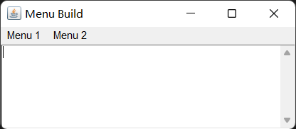

按下快捷键 `Ctrl+Shift+A` 或点击了菜单里的*MenuItem 4*选项后的效果：

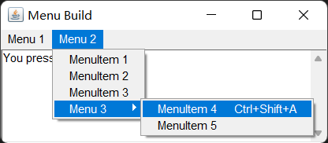

鼠标右击文本框效果：

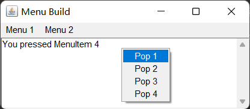

### 绘图与ImageIO类

很多程序如各种游戏都需要在窗口绘制各种图形，除此之外，即使在开发JavaEE项目时，有时候也必须“动态”的向客户端生成各种图形，图表，比如图形验证码、统计图等，这都需要利用 `AWT` 的**绘图**功能。

之前我们已经学习了很多组件，例如 `Button` 、 `Frame` 、 `Checkbox` 等，不同的组件，展示出来的图形都不一样，其实这些组件展示出来的图形，其本质就是用 `AWT` 的绘图来完成的。

在 `AWT` 中，真正提供绘图功能的是 `Graphics` 对象，那么 `Component` 组件和 `Graphics` 对象存在什么关系，才能让 `Component` 绘制自身图形呢？

在 `Component` 类中，提供了下列三个方法来完成组件图形的绘制与刷新：
|方法名|说明|
|-|-|
|void paint(Graphics g)|绘制组件的外观|
|void update(Graphics g)|内部调用paint()，刷新组件外观|
|void repaint()|调用update()，刷新组件外观|

组件绘制图形流程图：


一般情况下， `update()` 和 `paint()` 是由AWT系统负责调用，如果程序要希望系统重新绘制组件，可以调用 `repaint()` 完成。

AWT中提供了 `Canvas` 类充当画布，提供了 `Graphics` 类来充当画笔，通过调用 `Graphics` 对象的 `setColor()` 方法可以给画笔设置颜色。

画图的步骤：

1. 自定义类，继承Canvas类，重写paint(Graphics g)方法完成画图。
2. 在paint()内部，真正开始画图之前调用Graphics对象的setColor()，setFont()等方法设置画笔颜色，字体等属性。
3. 调用Graphics画笔的drawXxx()方法开始画图。

下面列出Graphics类中常用的一些方法：
|方法名|说明|
|-|-|
|void setColor(Color c)|颜色设置|
|void setFont(Font font)|字体设置|
|void drawLine()|绘制直线|
|void drawRect()|绘制矩形|
|void drawRoundRect()|绘制圆角矩形|
|void drawOval()|绘制椭圆形|
|void drawPolygon()|绘制多边形|
|void drawArc()|绘制圆弧|
|void drawPolyline()|绘制折线|
|void fillRect()|填充矩形区域|
|void fillRoundRect()|填充圆角矩形区域|
|void fillOval()|填充椭圆区域|
|void fillPolygon()|填充多边形区域|
|void fillArc()|填充圆弧对应的扇形区域|
|void drawImage()|绘制位图|

演示：使用 `AWT` 绘图API在窗口画出圆和矩形。

```Java {.line-numbers}
import java.awt.*;
import java.awt.event.*;

public class Demo {
    Frame frame = new Frame("Graphics Build");
    Button dRect = new Button("Draw a rectangle");
    Button dOval = new Button("Draw an oval");
    Panel p = new Panel();

    final String RECT_SHAPE = "rect";
    final String OVAL_SHAPE = "oval";
    String shape = "";

    class DraftCanvas extends Canvas {
        @Override
        public void paint(Graphics g) {
            if (shape.equals(RECT_SHAPE)) {
                g.setColor(Color.BLACK);
                g.drawRect(75, 30, 150, 100);
            } else if (shape.equals(OVAL_SHAPE)) {
                g.setColor(Color.BLACK);
                g.drawOval(75, 30, 150, 100);
            }
        }
    }

    DraftCanvas draft = new DraftCanvas();

    public void init() {
        dRect.addActionListener(new ActionListener() {
            @Override
            public void actionPerformed(ActionEvent e) {
                shape = RECT_SHAPE;
                draft.repaint();
            }
        });
        dOval.addActionListener(new ActionListener() {
            @Override
            public void actionPerformed(ActionEvent e) {
                shape = OVAL_SHAPE;
                draft.repaint();
            }
        });

        p.add(dRect);
        p.add(dOval);
        frame.add(p, BorderLayout.SOUTH);
        
        draft.setPreferredSize(new Dimension(300, 300));
        frame.add(draft);
        frame.addWindowListener(new WindowAdapter() {
            @Override
            public void windowClosing(WindowEvent e) {
                System.exit(0);
            }
        });
        
        frame.pack();
        frame.setVisible(true);
    }

    public static void main(String[] args) {
        new Demo().init();
    }
}
```

绘制矩形效果：

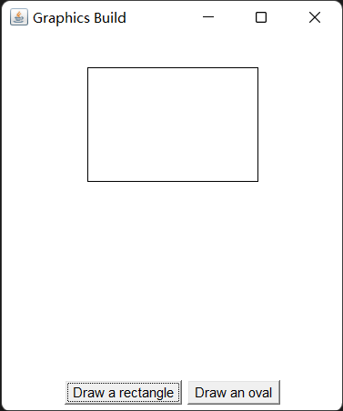

绘制椭圆效果：

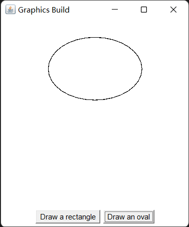

如果仅仅绘制简单的几何图形，程序的效果依旧比较单调。AWT也允许在组建上绘制**位图**， `Graphics` 提供了 `drawImage(Image image)` 方法用于绘制位图，该方法需要一个 `Image` 参数代表位图，通过该方法就可以绘制出指定的位图。

位图使用步骤：

1. 创建Image的子类对象BufferedImage(int width, int height, int ImageType)，创建时需要指定位图的宽高及类型属性，此时相当于在内存中生成了一张图片。
2. 调用BufferedImage对象的getGraphics()方法获取画笔，此时就可以往内存中的这张图片上绘图了，绘图的方法和之前学习的一模一样。
3. 调用组件paint()中提供的Graphics对象的drawImage()方法，一次性的内存中的图片BufferedImage绘制到特定的组件上。

使用位图来绘制组件，相当于实现了图的缓冲区，此时绘图时没有直接把图形绘制到组件上，而是先绘制到内存中的 `BufferedImage` 上，等全部绘制完毕，再一次性的图像显示到组件上即可。

演示：通过 `BufferedImage` 实现一个简单的手绘程序：通过鼠标可以在窗口中画图，右键鼠标可变更画笔颜色。

```Java {.line-numbers}
import java.awt.*;
import java.awt.event.*;
import java.awt.image.*;

public class Demo {
    Frame frame = new Frame("Digital Plate Lite");

    PopupMenu colorMenu = new PopupMenu();
    MenuItem blackItem = new MenuItem("Black");
    MenuItem redItem = new MenuItem("Red");
    MenuItem blueItem = new MenuItem("Blue");

    Color nowColor = Color.BLACK;
    final int AREA_WIDTH = 500;
    final int AREA_HEIGHT = 400;
    BufferedImage image = new BufferedImage(AREA_WIDTH, AREA_HEIGHT, BufferedImage.TYPE_INT_RGB);
    Graphics g = image.getGraphics();

    class MyCanvas extends Canvas {
        @Override
        public void paint(Graphics g) {
            g.drawImage(image, 0, 0, null);
        }
    }

    MyCanvas drawArea = new MyCanvas();
    int preX = -1;
    int preY = -1;

    public void init() {
        ActionListener listener = new ActionListener() {
            @Override
            public void actionPerformed(ActionEvent e) {
                String actionCommand = e.getActionCommand();
                switch (actionCommand) {
                    case "Black":
                        nowColor = Color.BLACK;
                        break;
                    case "Red":
                        nowColor = Color.RED;
                        break;
                    case "Blue":
                        nowColor = Color.BLUE;
                        break;
                }
            }
        };
        drawArea.addMouseMotionListener(new MouseMotionAdapter() {
            @Override
            public void mouseDragged(MouseEvent e) {
                if (preX > 0 && preY > 0) {
                    g.setColor(nowColor);
                    g.drawLine(preX, preY, e.getX(), e.getY());
                }
                preX = e.getX();
                preY = e.getY();
                drawArea.repaint();
            }
        });

        blackItem.addActionListener(listener);
        redItem.addActionListener(listener);
        blueItem.addActionListener(listener);
        colorMenu.add(blackItem);
        colorMenu.add(redItem);
        colorMenu.add(blueItem);

        drawArea.add(colorMenu);
        drawArea.addMouseListener(new MouseAdapter() {
            @Override
            public void mouseReleased(MouseEvent e) {
                boolean popupTrigger = e.isPopupTrigger();
                if (popupTrigger) {
                    colorMenu.show(drawArea, e.getX(), e.getY());
                }
                preX = -1;
                preY = -1;
            }
        });
        g.setColor(Color.white);
        g.fillRect(0, 0, AREA_WIDTH, AREA_HEIGHT);
        
        drawArea.setPreferredSize(new Dimension(AREA_WIDTH, AREA_HEIGHT));
        frame.add(drawArea);
        frame.addWindowListener(new WindowAdapter() {
            @Override
            public void windowClosing(WindowEvent e) {
                System.exit(0);
            }
        });

        frame.pack();
        frame.setVisible(true);
    }

    public static void main(String[] args) {
        new Demo().init();
    }
}
```

效果：

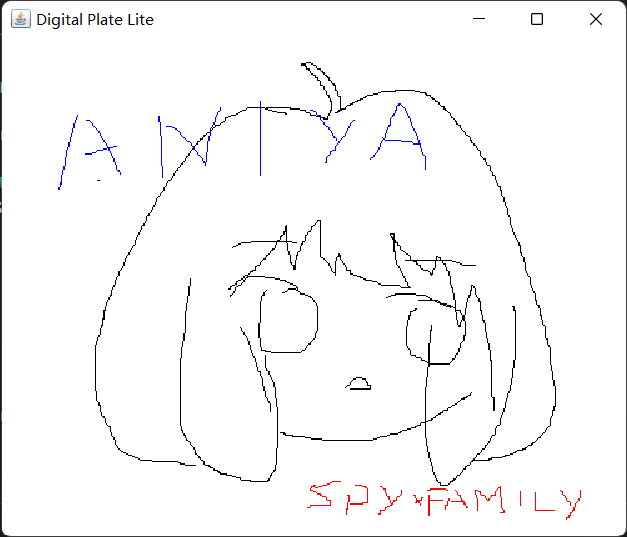

在实际生活中，很多软件都支持打开本地磁盘已经存在的图片，然后进行编辑，编辑完毕后，再重新保存到本地磁盘。如果使用 `AWT` 要完成这样的功能，那么需要使用到 `ImageIO` 这个类，可以操作本地磁盘的图片文件。
|方法名|说明|
|-|-|
|static BufferedImage read(File input)|读取本地磁盘图片文件(所传参数为一个file对象)|
|static BufferedImage read(InputStream input)|读取本地磁盘图片文件(所传参数为输入流)|
|static boolean write(RenderedImage im, String formatName, File output)|往磁盘中输出图片文件|

演示：编写图片查看程序，支持另存操作。

```Java {.line-numbers}
import java.awt.*;
import java.awt.event.*;
import java.awt.image.*;

import java.io.*;

import javax.imageio.ImageIO;

public class Demo {
    private Frame frame = new Frame("PicViewer");
    MenuBar menuBar = new MenuBar();
    Menu menu = new Menu("File");
    MenuItem open = new MenuItem("Open");
    MenuItem save = new MenuItem("Save as");
    BufferedImage image;

    private class MyCanvas extends Canvas {
        @Override
        public void paint(Graphics g) {
            g.drawImage(image, 0, 0, null);
        }
    }

    MyCanvas drawArea = new MyCanvas();

    public void init() throws Exception {
        open.addActionListener(e -> {
            FileDialog fileDialog = new FileDialog(frame, "Open the picture file", FileDialog.LOAD);
            fileDialog.setVisible(true);
            String dir = fileDialog.getDirectory();
            String fileName = fileDialog.getFile();
            try {
                image = ImageIO.read(new File(dir, fileName));
                drawArea.repaint();
            } catch (IOException ex) {
                ex.printStackTrace();
            }
        });
        save.addActionListener(e -> {
            FileDialog fileDialog = new FileDialog(frame, "Save the picture file", FileDialog.SAVE);
            fileDialog.setVisible(true);
            String dir = fileDialog.getDirectory();
            String fileName = fileDialog.getFile();
            try {
                ImageIO.write(image, "JPEG", new File(dir, fileName));
            } catch (IOException ex) {
                ex.printStackTrace();
            }
        });
        menu.add(open);
        menu.add(save);
        menuBar.add(menu);
        frame.setMenuBar(menuBar);
        frame.add(drawArea);
        frame.setBounds(200, 200, 740, 508);
        frame.setVisible(true);
        frame.addWindowListener(new WindowAdapter() {
            @Override
            public void windowClosing(WindowEvent e) {
                System.exit(0);
            }
        });
    }

    public static void main(String[] args) throws Exception {
        new Demo().init();
    }
}
```

效果：


### Java FX体系

实际上，无论是AWT还是Swing体系，它们都已经很久没有更新过了。可以说，它们已经被Oracle放弃了。

本来Java是一门跨平台、多用途的语言，但后来Oracle却认为Java只适合用于服务端开发，不适合面向消费级用户。因此，Java的GUI算是没落了，毕竟服务端要什么好看界面，性能高最重要（多线程的强大支持）。直到Java FX的出现，它拥有一个重要的特性——支持WebView，这意味着Java FX是真正现代的、强大的GUI体系。当然并不是说AWT和Swing体系不好，它们都比Java FX更接近底层，性能上还是不弱的。著名的IntelliJ IDE就是使用Swing体系编写的。

如果想要使用Java开发消费级应用，Java FX的学习是不可避免的。本文档受限于篇幅，不再展开来讲。

## 多线程

我们需要先了解几个概念。

进程：是正在运行的程序。

- 是系统进行资源分配的调用的独立单位。
- 每一个进程都有它自己的内存空间和系统资源。

线程：是进程中的单个顺序控制流，是一条执行路径。

- 单线程：一个进程如果只有一条执行路径，则称之为单线程程序。
- 多线程：一个进程如果有多条执行路径，则称之为多线程程序。

### Thread类

实现多线程有三种实现方式，这里先说第一种：
定义一个*类*继承 `Thread` 类

1. 在*类*中重写run()方法
    - 为什么要重写：run()用来封装被线程执行的代码
2. 实例化*类*
3. ==调用*类*的start()方法启动线程==
    - 为什么不调用run()方法：JVM会自动调用run()

Thread类中设置和获取线程名称的方法：
|方法名|说明|
|-|-|
|void setName(String name)|将此线程的名称改为name|
|String getName()|返回线程的名称|

如果需要获取当前线程，则使用 `Thread.currentThread()` 方法。

*WorkerThread.java*：

```Java {.line-numbers}
public class WorkerThread extends Thread {
    @Override
    public void run() {
        for (int i = 0; i < 1000; i++)
            // this也可以换成Thread.currentThread()
            System.out.println(this.getName() + ": " + i);
    }
}
```

*Demo.java*：

```Java {.line-numbers}
public class Demo {
    public static void main(String[] args) {
        new WorkerThread().start();
        new WorkerThread().start();
    }
}
```

输出切片：

```Text
Thread-1: 777
Thread-1: 778
Thread-0: 755
Thread-0: 756
Thread-1: 779
Thread-1: 780
Thread-1: 781
Thread-1: 782
Thread-0: 757
Thread-0: 758
Thread-0: 759
Thread-0: 760
```

### 线程调度模型

众所周知，CPU核心的数量才能真正地决定线程的数量。我们所谓的多线程只是模拟出来的而已，即单个/少数核心要分配给多个线程使用。那这个模拟过程到底是怎么实现的呢？

线程有两种调度模型：

- 分时调度：所有线程（高速）轮流使用CPU，平均分配每个线程占有CPU的时间片。
- 抢占调度：优先让优先级高的线程使用CPU（占有更多的时间片，或者说==提高了获得时间片的概率==），如果线程的优先级相同，==则随机选择一个==。

Java使用的是后者。也就是说，我们可以通过设置线程优先级来实现特定需求。
|方法名|说明|
|-|-|
|final int getPriority()|返回该线程的优先级|
|final void setPriority(int newPriority)|设置该线程的优先级|

如果没有特别设置，==线程优先级默认为5==；==且最低为1，最高为10。==

### 线程控制

|方法名|说明|
|-|-|
|static void sleep(long millis)|使当前正在执行的线程暂停执行指定毫秒数|
|void join()|等待当前线程死亡|
|void setDaemon(boolean on)|将此线程标记为**守护线程**，当运行的线程都是守护线程时，JVM将退出|

我们重点演示后两种方法。先演示 `join()` ：

*WorkerThread.java*：

```Java {.line-numbers}
public class WorkerThread extends Thread {
    @Override
    public void run() {
        for (int i = 0; i < 10000; i++)
            System.out.println(this.getName() + ": " + i);
    }
}
```

*Demo.java*：

```Java {.line-numbers}
public class Demo {
    public static void main(String[] args) {
        WorkerThread t1 = new WorkerThread();
        WorkerThread t2 = new WorkerThread();

        t1.setName("Notch");
        t2.setName("Jeb");

        // 迫使t2在t1完全结束后才能开始
        t1.start();
        try {
            t1.join();
        } catch (InterruptedException e) {
            e.printStackTrace();
        }

        t2.start();
    }
}
```

输出切片：

```Text
Notch: 997
Notch: 998
Notch: 999
Jeb: 0
Jeb: 1
Jeb: 2
```

演示 `setDaemon()` ：

*WorkerThread.java*：

```Java {.line-numbers}
public class WorkerThread extends Thread {
    @Override
    public void run() {
        for (int i = 0; i < 10000; i++)
            System.out.println(this.getName() + ": " + i);
    }
}
```

*Demo.java*：

```Java {.line-numbers}
public class Demo {
    public static void main(String[] args) {
        WorkerThread t1 = new WorkerThread();
        WorkerThread t2 = new WorkerThread();

        // 新世纪轴心国
        Thread.currentThread().setName("美国");
        t1.setName("日本");
        t2.setName("乌克兰");

        // 如果美爹寄了，俩小弟应该陪葬，所以设置守护线程
        t1.setDaemon(true);
        t2.setDaemon(true);
        t1.start();
        t2.start();

        // 美爹（主线程）到这基本上就玩完了，小弟直接无
        for (int i = 0; i < 10; i++)
            System.out.println(this.getName() + ": " + i);
    }
}
```

输出切片：

```Text
美国: 98
乌克兰: 213
日本: 104
乌克兰: 214
乌克兰: 215
美国: 99
乌克兰: 216
乌克兰: 217
日本: 105
```

我们发现，美国“跑”到99之后，尽管日本和乌克兰还有很多任务没有执行，但是不得不终止。这是因为所有的非守护线程（在这里就是只有主线程）都结束了。

### Runnable接口

实现多线程的第二种办法，定义一个*类*实现 `Runnable` 接口

1. 在*类*中重写run()方法
2. 实例化*类*
3. 实例化Thread类，以*类*作为其构造器参数
    - 注：Thread也有含两个参数的构造器，第二个参数是线程名
4. 调用*类*的start()方法启动线程

*WorkerThread.java*：

```Java {.line-numbers}
public class WorkerThread implements Runnable {
    @Override
    public void run() {
        for (int i = 0; i < 10000; i++)
            // 注意，getName()是Thread类中的方法，Runnable中并没有
            // 所以不可用this.getName()
            System.out.println(Thread.currentThread.getName() + ": " + i);
    }
}
```

*Demo.java*：

```Java {.line-numbers}
public class Demo {
    public static void main(String[] args) {
        WorkerThread t1 = new WorkerThread();
        WorkerThread t2 = new WorkerThread();

        Thread tt1 = new Thread(t1);
        Thread tt2 = new Thread(t2);

        tt1.start();
        tt2.start();
    }
}
```

### 线程同步与安全

多线程程序在运行的时候会发生**数据安全问题**。比如大妈们蜂拥而进超市，抢免费鸡蛋，如果有n个鸡蛋，限量赠出100（n>>100）个，那么大概率最后送出一百零几个。即使工作人员真的很认真细致。

而当发生以下至少一个情况时，数据安全问题就不可避免：

- 多线程环境
- 共享数据
- 多条语句操作共享数据

由此，我们引入**同步**（ `synchronized` ），使得线程在被同步的区域==被迫异步==：

```Java {.line-numbers}
synchronized (Object o) {
    // 操作共享数据
}
```

这可以同时破坏之前提到的三种情况，解决了多线程的数据安全问题。但弊端是每个线程都会耗费时间去准备异步进行，耗费硬件资源、降低程序运行效率。

*GetFreeEggs.java*：

```Java {.line-numbers}
public class GetFreeEggs implements Runnable {
    final int EGG_AMOUNT = 100;
    int eggAmount = 100;

    Object o = new Object();

    @Override
    public void run() {
        while (true)
            synchronized (o) {
                if (eggAmount > 0)
                    System.out.println(
                            Thread.currentThread().getName() +
                                    "抢到了第" + (EGG_AMOUNT - eggAmount-- + 1) + "个鸡蛋！");

            }
    }
    // 你也可以这样写：同步代码块变成了同步方法，同时免去了新建成员变量的麻烦
    // @Override
    // public synchronized void run() {
    //     while (true)
    //             if (eggAmount > 0)
    //                 System.out.println(
    //                         Thread.currentThread().getName() +
    //                                 "抢到了第" + (EGG_AMOUNT - eggAmount-- + 1) + "个鸡蛋！");
    // }
}
```

*Demo.java*：

```Java {.line-numbers}
public class Demo {
    public static void main(String[] args) {
        GetFreeEggs gfe = new GetFreeEggs();

        // 非常不幸，大妈一个也抢不到捏
        new Thread(gfe, "黄牛1").start();
        new Thread(gfe, "黄牛2").start();
        new Thread(gfe, "黄牛3").start();
        new Thread(gfe, "黄牛4").start();
    }
}
```

同步方法的锁指向 `this` ，即本对象。同步静态方法的锁指向*GetFreeEggs* `.class` ，即本类。

接下来了解几个线程安全的类，它们的方法都是**同步**的：

- StringBuffer
  - 从JDK 5开始，被StringBuilder替代。通常应该用StringBuilder类，因为它支持所有相同的操作，但它更快，因为不支持同步
- Vector
  - 从JDK 1.2开始，该类改进了List接口，使其成为了集合类的成员。与新的集合实现不同，Vector被同步。如果不需要线程安全的实现，应当使用ArrayList
  - **实践中一般不使用Vector，而是借助Collections类中的方法：**
    **static \<T> List\<T> synchronizedList(List\<T> list)**
- Hashtable
  - 从JDK 1.2开始，该类改进了Map接口，使其成为了集合类的成员。与新的集合实现不同，Hashtable被同步。如果不需要线程安全的实现，应当使用HashMap
  - **实践中一般不使用Hashtable，而是借助Collections类中的方法：**
    **static \<K, V> Map\<K, V> synchronizedMap(Map\<K, V> m)**

### Lock接口

为了明确线程锁作用的范围，JDK 1.5提供了一个新的锁， `Lock` 。

实例化 `Lock` 需要接口多态：

```Java
Lock l = new ReentrantLock();
```

对上文抢鸡蛋代码进行改进：

```Java {.line-numbers}
import java.util.concurrent.locks.Lock;
import java.util.concurrent.locks.ReentrantLock;

public class GetFreeEggs implements Runnable {
    final int EGG_AMOUNT = 100;
    int eggAmount = 100;

    Lock l = new ReentrantLock();

    @Override
    public void run() {
        while (true)
            try {
                // 锁定
                l.lock();
                if (eggAmount > 0)
                    System.out.println(
                            Thread.currentThread().getName() +
                                    "抢到了第" + (EGG_AMOUNT - eggAmount-- + 1) + "个鸡蛋！");
            } finally {
                // 即使抢鸡蛋中出现了故障，最终也依旧正常开锁
                l.unlock();
            }
    }
}
```

#### 案例：有求必应

用多线程模拟甲方和乙方之间的关系：甲方只要提出需求，乙方就得立即改代码，非常的折寿。

*Need.java*：

```Java {.line-numbers}
public class Need {
    boolean isSpare = true;
    int count = 1;

    public synchronized void submit() {
        if (!isSpare) {
            try {
                wait();
            } catch (Exception e) {
            }
        }
        isSpare = false;
        System.out.println("已提出第" + count++ + "个需求！");
        notifyAll();
    }

    public synchronized void fix() {
        if (isSpare) {
            try {
                wait();
            } catch (Exception e) {
            }
        }
        isSpare = true;
        System.out.println("已响应需求。");
        notifyAll();
    }
}
```

*Submit.java*：

```Java {.line-numbers}
public class Submit implements Runnable {
    Need n;

    public Submit(Need n) {
        this.n = n;
    }

    @Override
    public void run() {
        for (int i = 0; i < 114514; i++)
            n.submit();
    }
}
```

*Fix.java*：

```Java {.line-numbers}
public class Fix implements Runnable {
    Need n;

    public Fix(Need n) {
        this.n = n;
    }

    @Override
    public void run() {
        while (true)
            n.fix();
    }
}
```

*Demo.java*：

```Java {.line-numbers}
public class Demo {
    public static void main(String[] args) {
        Need n = new Need();

        Submit s = new Submit(n);
        Fix f = new Fix(n);

        Thread ts = new Thread(s);
        Thread tf = new Thread(f);

        ts.start();
        tf.start();
    }
}
```

输出切片：

```Text
已提出第1个需求！
已响应需求。
已提出第2个需求！
已响应需求。
已提出第3个需求！
已响应需求。
```

### Callable接口

相较于 `Runnable` 接口， `Callable` 接口的实现能在线程结束后==返回特定对象==。

通过 `Callable` 和 `Future` 创建线程：

1. 创建Callable接口的实现类，并实现call()方法，该call()方法将作为线程执行体，并且有返回值。
2. 创建Callable实现类的实例，使用FutureTask类来包装Callable对象，该FutureTask对象封装了该Callable对象的call()方法的返回值。
    - 为什么要进行包装：Thread构造器不接受Callable对象，但接受FutureTask对象（间接继承Runnable）。
3. 使用FutureTask对象作为Thread对象的target创建并启动新线程。
4. 调用FutureTask对象的get()方法来获得子线程执行结束后的返回值。

简单演示一下：

```Java {.line-numbers}
import java.util.concurrent.Callable;
import java.util.concurrent.ExecutionException;
import java.util.concurrent.FutureTask;

public class Demo {
    public static void main(String[] args) {
        // 若要返回长整型对象，则泛型处填写Long
        FutureTask<Long> ft = new FutureTask<>(new Callable<Long>() {
            // call()是run()的增强版
            @Override
            public Long call() throws Exception {
                long sum = -1919810;
                for (int i = 0; i < 114514; i++)
                    sum += i;
                return sum;
            }
        });
        new Thread(ft, "恶臭线程").start();

        // 按照逻辑，get()必须要在start()后出现，否则程序将无限阻塞
        try {
            System.out.println(ft.get());
        } catch (Exception e) {
            e.printStackTrace();
        }
    }
}
```

输出：

```Text
6554751031
```

创建线程的三种方式的对比：

- 采用实现Runnable、Callable接口的方式创建多线程时，线程类只是实现了Runnable接口或Callable接口，还可以继承其他类。
- 使用继承Thread类的方式创建多线程时，编写简单，如果需要访问当前线程，则无需使用Thread.currentThread()方法，直接使用this即可获得当前线程。

## 网络编程

在这一章中，我们主要研究客户端和服务端之间的通讯办法。

### 基本概念

- 计算机网络：是指将地理位置不同的具有独立功能的多台计算机及其外部设备，通过通信线路连接起来，在网络操作系统、网络管理软件及网络通信协议的管理和协调下，实现资源共享和信息传递的计算机系统。
- 网络编程：在网络通信协议下，实现网络互联的不同计算机上运行的程序间可以进行数据交换。
- 通信三要素：
  - IP——设备的标识
    - IP地址分为两类：
      - IPv4：是给每个连接在网络上的主机分配一个32bit地址。按照TCP/IP规定, IP地址用二进制来表示，每个P地址长32bit，也就是4个字节。例如一个采用二进制形式的IP地址是11000000 10101000 00000001 01000010。为了方便使用，IP地址经常被写成十进制的形式，中间使用符号 `.` 分隔不同的字节。于是，上面的IP地址可以表示为192.168.1.66。IP地址的这种表示法叫做**点分十进制表示法**，这显然比1和0容易记忆得多。
      - IPv6：由于互联网的蓬勃发展，IP地址的需求量愈来愈大，但是网络地址资源有限，使得IP的分配越发紧张。为了扩大地址空间，通过IPv6重新定义地址空间，采用128位地址长度，每16个字节一组, 分成8组十六进制数，这样就解决了网络地址资源数量不够的问题。
    - 在终端中可使用这两条与IP相关的命令：
      - ipconfig：查看本机IP地址。
      - ping *IP*：检查网络是否连通。
    - 127.0.0.1通常代表本机（*localhost*）。
  - 端口——应用程序的标识
    - 端口号：用两个字节表示的整数，它的取值范围是0~65535。其中，0~1023之间的端口号用于一些知名的网络服务和应用，普通的应用程序建议使用1024以上的端口号。如果端口号被另外一个服务或应用所占用，会导致当前程序启动失败。
  - 协议——数据传输的规则
    - [用户数据报协议（User Datagram Protocol）](#UDP通信协议)：UDP是无连接通信协议, 即在数据传输时，数据的发送端和接收端不建立逻辑连接。简单来说，当一台计算机向另外一台计算机发送数据时，发送端不会确认接收端是否存在，就会发出数据，同样接收端在收到数据时，也不会向发送端反馈是否收到数据。由于使用UDP协议消耗资源小，通信效率高，所以通常都会用于音频、视频和普通数据的传输。例如视频会议通常采用UDP协议，因为这种情况即使偶尔丢失一两个数据包，也不会对接收结果产生大影响。但是在使用UDP协议传送数据时，由于UDP的面向无连接性，不能保证数据的完整性，因此在传输重要数据时不建议使用UDP协议。
    - [传输控制协议（Transmission Control Protocol）](#TCP通信协议)：TCP协议是面向连接的通信协议，即传输数据之前，在发送端和接收端建立逻辑连接，然后再传输数据，它提供了两台计算机之间可靠无差错的数据传输。在TCP连接中必须要明确客户端与服务器端，由客户端向服务端发出连接请求，每次连接的创建都需要经过”三次握手”。
      - 三次握手: TCP协议中，在发送数据的准备阶段，客户端与服务器之间的三次交互，以保证连接的可靠。第1次握手，客户端向服务器端发出连接请求，等待服务器确认。第2次握手，服务器端向客户端回送一个响应，通知客户端收到了连接请求。第3次握手，客户端再次向服务器端发送确认信息，确认连接。完成三次握手，连接建立后，客户端和服务器就可以开始进行数据传输了。由于这种面向连接的特性，TCP协议可以保证传输数据的安全，所以应用十分广泛。例如上传文件、下载文件、浏览网页等。

### InetAddress类

为了方便我们对IP地址的获取和操作, Java提供了 `InetAddress` 类，此类表示Internet协议（IP）地址。

下列一些需要掌握的构造器和普通方法：
|方法名|说明|
|-|-|
|static InetAddress getByName(String host)|确定主机名称的IP地址。主机名称可以是机器名称，也可以是IP地址|
|String getHostName()|获取此IP地址的主机名|
|String getHostAddress()|返回文本显示中的IP地址字符串|

### UDP通信协议

UDP协议是一种==不可靠==的网络协议，它在通信的两端各建立一个**Socket**对象，但是这两个Socket只是发送、接收数据的对象，因此对于基于UDP协议的通信双方而言，没有所谓的客户端和服务器的概念。

Java提供了 `DatagramSocket` 类作为基于UDP协议的Socket。

下面演示向其他主机发送数据的过程：

```Java {.line-numbers}
import java.net.DatagramPacket;
import java.net.DatagramSocket;
import java.net.InetAddress;

public class Sender {
    public static void main(String[] args) throws Exception {
        // 建立套接字对象
        DatagramSocket ds = new DatagramSocket();

        // 打包数据，使用套接字包的构造器：
        // DatagramPacket(byte[] buf, int length, InetAddress address, int port)
        byte[] b = "你是一个一个一个......啊啊啊！".getBytes();
        DatagramPacket dp = new DatagramPacket(b, b.length, InetAddress.getByName("127.0.0.1"), 23333);

        // 发送数据包
        ds.send(dp);

        // 关闭传输（流）
        ds.close();
    }
}
```

下面演示从其他主机接收数据的过程：

```Java {.line-numbers}
import java.net.DatagramPacket;
import java.net.DatagramSocket;

public class Receiver {
    public static void main(String[] args) throws Exception {
        // 建立套接字对象但指定端口
        DatagramSocket ds = new DatagramSocket(23333);

        // 创建数据包用于接收数据
        // DatagramPacket(byte[] buf, int length)
        byte[] b = new byte[1024];
        DatagramPacket dp = new DatagramPacket(b, b.length);

        // 接收数据包
        ds.receive(dp);

        // 获取数据及其长度，并输出结果到控制台
        System.out.println(new String(dp.getData(), 0, dp.getLength()));

        // 关闭传输（流）
        ds.close();
    }
}
```

通过同时运行这两段程序（接收端需要比发送端先启动），我们在接收端的终端上能看见结果：

```Text
你是一个一个一个......啊啊啊！
```

### TCP通信协议

TCP通信协议是一种==可靠==的网络协议，它在通信的两端各建立一个 `Socket` 对象，从而在通信的两端形成网络虚拟链路。一旦建立了虚拟的网络链路，两端的程序就可以通过虚拟链路进行通信。

Java对基于TCP协议的的网络提供了良好的封装，使用 `Socket` 对象来代表两端的通信端口，并通过 `Socket` 产生IO流来进行网络通信。Java为客户端提供了 `Socket` 类，为服务器端提供了 `ServerSocket` 类。

客户端：

```Java {.line-numbers}
import java.io.IOException;
import java.io.OutputStream;
import java.net.Socket;

public class Client {
    public static void main(String[] args) throws IOException {
        // 创建客户端的Socket对象
        // Socket (InetAddress address, int port) 创建流套接字并將其连接到指定IP地址的指定端口号
        // Socket s = new Socket(InetAddress.getByName("192.168.1.66"), 10800);
        // Socket (String host, int port) 创建流套接字并将其连接到指定主机上的指定端口号
        Socket s = new Socket("192.168.1.66", 10000);

        // 获取输出流，写数据
        // OutputStream getoutputStream() 返回此套接字的輸出流
        OutputStream os = s.getOutputStream();
        os.write("hello,tcp,我来了".getBytes());

        // 释放资源
        s.close();
    }
}
```

服务端：

```Java {.line-numbers}
import java.io.IOException;
import java.io.InputStream;
import java.net.ServerSocket;
import java.net.Socket;

public class ServerDemo {
    public static void main(String[] args) throws IOException {
        // 创建服务器端的Socket对象
        // ServerSocket(int port) 创建绑定到指定端口的服务器套接字
        ServerSocket ss = new ServerSocket(10000);

        // Socket accept() 侦听要连接到此套接字并接受它
        Socket s = ss.accept();

        // 获取输入流，读数据，并把数据显示在控制台
        InputStream is = s.getInputStream();
        byte[] bys = new byte[1024];
        int len = is.read(bys);
        String data = new String(bys, 0, len);
        System.out.println("数据是: " + data);

        // 释放资源
        s.close();
        ss.close();
    }
}
```

## 附录 0：反射

**反射**（Reflection）指程序可以访问、检测和修改它本身状态或行为的一种能力。

程序集包含模块，而模块包含类型，类型又包含成员。反射则提供了封装程序集、模块和类型的对象。我们可以使用反射动态地创建类型的实例，将类型绑定到现有对象，或从现有对象中获取类型。然后，可以调用类型的方法或访问其字段和属性。

优点：

- 反射提高了程序的**灵活性**和扩展性。
- ==降低耦合性==，提高自适应能力。
- 它允许程序创建和==控制任何类的对象==，无需提前硬编码目标类。

缺点：

- 性能问题：使用反射基本上是一种解释操作，用于字段和方法接入时要远慢于直接代码。因此反射机制主要应用在对灵活性和拓展性要求很高的系统框架上，普通程序不建议使用。
- 使用反射会模糊程序内部逻辑；程序员希望在源代码中看到程序的逻辑，==反射却绕过了源代码的技术==，因而会带来维护的问题，反射代码比相应的直接代码更复杂。

反射有下列用途：

- 它允许在运行时查看特性（attribute）信息。
- 它允许审查集合中的各种类型，以及实例化这些类型。
- 它允许延迟绑定的方法和属性（property）。
- 它允许在运行时创建新类型，然后使用这些类型执行一些任务。

### 类加载与类加载器

当程序要使用某个类时，如果该类还被加载未到内存中，则系统会通过**类的加载、类的连接、类的初始化**这三个步骤来对类进行初始化。如果不出现意外情况，JVM将会连续完成这三个步骤，所以有时也把这三个步骤统称为**类加载**或者**类初始化**。

- 类的加载
  - 指将.class文件读入内存，并为之建立一个 java.lang.Class 对象。
  - 任何类被使用时，系统都会为之建立一个 java.lang.Class 对象。
- 类的连接
  - 验证阶段：用于检验被加载的类是否有正确的内部结构,并和其他类协调一致
  - 准备阶段：负责为类的类变量分配内存，并设置默认初始化值。
  - 解析阶段：将类的二进制数据中的符号引用替换为直接引用。
- 类的初始化
  - 在该阶段，主要就是对类变量进行初始化：
    - 假如类还未被加载和连接， 则程序先加载并连接该类
    - 假如该类的直接父类还未被初始化， 则先初始化其直接父类
    - 假如类中有初始化语句， 则系统依次执行这些初始化语句
        *注意：在执行第2个步骤的时候，系统对直接父类的初始化步骤也遵循初始化步骤1-3。*

类的初始化时机：

- 创建类的实例。
- 调用类的类方法。
- 访问类或者接口的类变量，或者为该类变量赋值。
- 使用反射方式来强制创建某个类或接口对应的 java.lang.Class 对象。
- 初始化某个类的子类。
- 直接使用 java.exe 命令来运行某个主类。

类加载器的作用：

- 负责将.class文件加载到内存中，并为之生成对应的 java.lang.Class 对象。
- 虽然我们不用过分关心类加载机制，但是了解这个机制我们就能更好的理解程序的运行。

JVM的类加载机制：

- 全盘负责：就是当一个类加载器负责加载某个Class时，该Class所依赖的和引用的其他Class也将由该类加载器负责载入，除非显示使用另外一个类加载器来载入。
- 父类委托：就是当一个类加载器负责加载某个Class时，先让父类加载器试图加载该Class，只有在父类加载器无法加载该类时才尝试从自己的类路径中加载该类。
- 缓存机制：保证所有加载过的Class都会被缓存，当程序需要使用某个Class对象时，类加载器先从缓存区中搜索该Class，只有当缓存区中不存在该Class对象时，系统才会读取该类对应的二进制数据，并将其转换成Class对象，存储到缓存区。

`ClassLoader` 是负责加载类的对象。

Java运行时具有以下内置类加载器：

- Bootstrap class loader：它是虚拟机的内置类加载器，通常表示为null，并且没有父null。
- Platform class loader：平台类加载器可以看到所有平台类，平台类包括由平台类加载器或其祖先定义的Java SE平台API，其实现类和JDK特定的运行时类。
- System class loader：它也被称为应用程序类加载器，与平台类加载器不同。系统类加载器通常用于定义应用程序类路径，模块路径和JDK特定工具上的类。

类加载器的继承关系：`System` 的父加载器为 `Platform` ，而 `Platform` 的父加载器为 `Bootstrap` 。

`ClassLoader` 中的两个方法：
|方法名|说明|
|-|-|
|static ClassLoader getSystemClassLoader()|返回用于委派的系统类加载器|
|ClassLoader getParent()|返回父类加载器进行委派|

### 获取构造器

我们要想通过反射去使用一个类，首先我们要获取到该类的字节码文件对象，也就是类型为 `Class` 类型的对象，这里我们提供三种方式获取Class类型的对象：

- 使用类的class属性来获取该类对应的Class对象。举例: Student.class将会返回Student类对应的Class对象。
- 调用对象的 getClass() 方法，返回该对象所属类对应的Class对象。该方法是Object类中的方法，所有的Java对象都可以调用该方法。
- 使用Class类中的静态方法 forName(String className) ，该方法需要传入字符串参数，该字符串参数的值是某个类的全路径，也就是完整包名的路径。

`Class` 类中用于获取构造方法的方法：
|方法名|说明|
|-|-|
|Constructor<?> [] getConstructors()|返回所有公共构造方法对象的数组|
|Constructor<?> [] getDeclaredConstructors()|返回所有构造方法对象的数组|
|Constructor\<T> getConstructor(Class<?>... parameterTypes)|返回单个公共构造方法对象|
|Constructor\<T> getDeclaredConstructor(Class<?>... parameterTypes)|返回单个构造方法对象|

`Constructor` 类中用于创建对象的方法：
|方法名|说明|
|-|-|
|T newInstance(Object... initargs)|根据指定的构造方法创建对象|

### 获取成员

`Class` 类中用于获取成员变量的方法：
|方法名|说明|
|-|-|
|Field[] getFields()|返回所有公共成员变量对象的数组|
|Field[] getDeclaredFields()|返回所有成员变量对象的数组|
|Field getField(String name)|返回单个公共成员变量对象|
|Field getDeclaredField(String name)|返回单个成员变量对象|

`Field` 类中用于给成员变量赋值的方法：
|方法名|说明|
|-|-|
|void set(Object obj, Object value)|给obj对象的成员变量赋值为value|

`Class` 类中用于获取成员方法的方法：
|方法名|说明|
|-|-|
|Method[] getMethods()|返回所有公共成员方法对象的数组，包括继承的|
|Method[] getDeclaredMethods()|返回所有成员方法对象的数组，不包括继承的|
|Method getMethod(String name, Class<?>... parameterTypes)|返回单个公共成员方法对象|
|Method getDeclaredMethod(String name, Class <?>... parameterTypes)|返回单个成员方法对象|

`Method` 类中用于调用成员方法的方法：
|方法名|说明|
|-|-|
|Object invoke(Object obj, Object... args)|调用obj对象的成员方法，参数是args，返回值是Object类型|

## 附录 1：LambdaEx

> *函数式编程是最优雅的终极解决方案。*

Lambda 表达式，也可称为**闭包**，它是推动 Java 8 发布的最重要新特性。Lambda 允许把函数作为一个方法的参数（函数作为参数传递进方法中）。

使用 Lambda 表达式可以使代码变的更加简洁紧凑。

Lambda 表达式的语法格式如下：

```Java {.line-numbers}
(parameters) -> expression

(parameters) ->{ statements; }
```

以下是 Lambda 表达式的重要特征:

- 可选类型声明：不需要声明参数类型，编译器可以统一识别参数值（==来选择对应的方法==）。
- 可选的参数圆括号：一个参数无需定义圆括号，但==零个或多个==参数需要定义圆括号。
- 可选的大括号：如果主体包含了==一个==语句，就不需要使用大括号。
- 可选的返回关键字：如果主体只有一个表达式返回值则编译器会自动返回值，大括号需要指定表达式==返回==（ `return` ）了一个数值。

使用 Lambda 表达式需要注意以下两点：

- Lambda 表达式主要用来定义行内执行的方法类型接口。
- Lambda 表达式==免去了使用匿名方法的麻烦==，并且给予 Java 简单但是强大的函数化的编程能力。

Lambda 表达式只能引用标记了 `final` 的外层局部变量，这就是说不能在 LambdaEx 内部修改定义在域外的局部变量，否则会编译错误。Lambda 表达式的局部变量可以不用声明为 `final`，但是必须不可被后面的代码修改（即隐性的具有 `final` 的语义）。在 Lambda 表达式当中不允许声明一个与局部变量同名的参数或者局部变量。

## 附录 2：Javadoc

> *一个不会写注释和文档的程序员是失败的，就像他的人生一样，卡在那里，上不去下不来。*

Java 支持三种注释方式。前两种分别是 `//` 和 `/*` `*/` ，第三种被称作说明注释，它以 `/**` 开始，以 `*/` 结束。

说明注释允许你在程序中嵌入关于程序的信息。你可以使用 javadoc 工具软件来生成信息，并输出到HTML文件中。说明注释，使你更加方便的记录你的程序信息。

Javadoc 工具软件识别以下标签：
|标签|描述|示例|
|-|-|-|
|@author|标识一个类的作者|@author description|
|@deprecated|指名一个过期的类或成员|@deprecated description|
|{@docRoot}|指明当前文档根目录的路径||
|@exception|标志一个类抛出的异常|@exception exception-name explanation|
|{@inheritDoc}|从直接父类继承的注释||
|{@link}|插入一个到另一个主题的链接|{@link name text}|
|{@linkplain}|插入一个到另一个主题的链接，但是该链接显示纯文本字体||
|@param|说明一个方法的参数|@param parameter-name explanation|
|@return|说明返回值类型|@return explanation|
|@see|指定一个到另一个主题的链接|@see anchor|
|@serial|说明一个序列化属性|@serial description|
|@serialData|说明通过 writeObject() 和 writeExternal() 方法写的数据|@serialData description|
|@serialField|说明一个ObjectStreamField组件|@serialField name type description|
|@since|标记当引入一个特定的变化时|@since release|
|@throws|和 @exception 标签一样||
|{@value}|显示常量的值，该常量必须是static属性||
|@version|指定类的版本|@version info|

在开始的 `/**` 之后，第一行或几行是关于类、变量和方法的主要描述。之后，你可以包含一个或多个各种各样的标签。每一个标签必须在一个新行的开始或者在一行的开始紧跟星号 `*` 。多个相同类型的标签应该放成一组。例如，如果你有三个 `@see` 标签，可以将它们一个接一个的放在一起。

在命令行中键入以下命令生成文档：

```Text
javadoc Demo.java
```

## 结语

首先恭喜！能撑到结尾，毅力不错。是时候说点实际的了。

Java语言是一门很实用的语言，在互联网的应用十分广泛，目前采用Java语言开发的网站也越来越多，所以对Java开发人才的需求量也是倍增。虽然说现在新的开发语言在市场上越来越多，但是根据有关数据表明，在所有程序员中，Java开发程序员就占据20%的比例。这说明Java开发仍然是一个热潮。

从人才需求方面看，软件开发是当下的发展趋势，而我国的软件开发人才极为缺乏，其中Java人才缺口最大，对Java软件工程师的需求达到全部需求量的60%-70%，如今互联网的趋势是移动端，Java又是Android开发的基础，所以人才的需求又增加一大波。尽管谷歌力推Kotlin，但万变不离其宗。

Java软件工程师就业前景的好坏，主要从Java的应用领域来看，Java语言的应用方向主要表现在以下三个方面：

- 首先是大中型的商业应用，包括我们常说的企业级应用(主要指复杂的大企业的软件系统)、各种类型的网站，Java的安全机制以及它的跨平台的优势，使它在分布式系统领域开发中有广泛应用；
- 其次是桌面应用，就是常说的C/S应用，主要用来开发运行于不同的操作系统上的桌面应用程序；
- 再次是移动领域应用，主要表现在消费和嵌入式领域，是指在各种小型设备上的应用，包括手机、PDA、机顶盒、汽车通信设备等。

从薪资水平看，Java软件工程师的薪资相比其他开发工程师高出许多，具备3-5年工作经验的开发人员年薪都可以达到20到30万元。

==但==要使用Java语言胜任企业工作并不容易。比如要成为一名Java架构师，必须精通设计、需求分析、各种开源工具、JavaEE的底层技术；熟悉工作流程、权限框架、门户框架等。而要成为一名Java普通程序员，必须具备基本的J2EE技术（JSP、Servlet、Java语言），SSH（Struts、Spring、Hibernate）框架开发，一定的数据库设计能力和数据库使用经验，熟悉Web开发技术（比如Html + CSS + Javascript，会ajax更好）。

所以一般来说，你下一步需要学习**Java Web Dev**相关的知识。我们后会有期！
