# 计算机网络技术 笔记

> *未经授权，禁止转载！[Penyo](https://github.com/penyoofficial)对本文档保留所有权利。*

我特么也没听清楚老师上课的时候说的啥子，草。

---

## 计算机网络概述

### 认识计算机网络

随着互联网技术的发展，计算机网络已经成为生活中不可或缺的重要工具，要想更好地利用计算机网络，首先必须了解什么是计算机网络，熟悉网络系统组成等知识。

计算机网络定义的主要观点：

- 从应用的观点：以相互共享资源方式连接起来，且==各自具有独立功能==的==计算机系统的集合==；
- 从物理的观点：在网络协议的控制下，由==若干台计算机和数据传输设备==组成的==系统==；
- 观点3：利用各种通信手段，==把地理分散的计算机互联起来==，能够互相通信且共享资源的==系统==。

计算机网络就是相互连接的**自治**计算机的集合。

- 自治：能独立运行，不依赖其他计算机；
- 互连：以任何可能的**通信连接方式**。
  - 有线方式：铜线、光纤等；
  - 无线方式：红外、无线电（微波）、卫星等。

最简单的网络就是两台计算机互连，形成**简单双机互联网络**。双机互联网络是世界上最小的网络，一般出现在家庭或办公室环境中，达到==资源共享==的目的。而随着无线局域网网络以及无线通讯技术（如Wi-Fi）的发展，使用无线局域网技术把家庭所有的智能化终端设备连接一起，形成智能化的**家庭无线局域网系统**。稍微复杂点的办公室网络可以实现多台计算机之间的相互连接。这种网络场景一般出现在办公室环境中，通过一台**网络互联设备**（**交换机**）把多台计算机互相连接在一起，组建一个简单网路系统，实现资源共享（如共享打印机）和互相之间通讯的目的。

计算机网络具有以下功能：

- **数据通信**（Communication Medium）
  - 如文件传输、IP电话、email、视频会议、信息发布、交互式娱乐、音乐等。
- **资源共享**（Resource Sharing）

由计算机网络的功能可知它能提供各种各样的应用服务，目前主要有以下几类：

- 共享资源访问
  - 如 Web，FTP等。
- 远程用户通信
  - 如E-mail，IP电话，网络会议等。
- 网上事务处理
  - 如电子商务，电子政务，网上储蓄等。

计算机网络的工作模式主要有两种，**对等网络模式**和**客户/服务器模式**。

- 对等网络模式（分布式）
  - 在对等网络模式中，==相连的机器之间彼此处于同等地位==，没有主从之分故又称为对等网络。它们能够相互共享资源，每台计算机都能以同样方式作用于对方。
- 客户机/服务器模式（中心化式）
  - 客户机/服务器（C/S）网络是一种基于服务器的网络，与对等网络相比，==基于服务器的网络提供了更好的运行性能并且可靠性也有所提高==。在基于服务器的网络中，不必将工作站计算机的硬盘与他人共享。实际上，如果想与某个人共享一份文件，就必须先将文件拷贝到服务器的硬盘上（或者一开始就在服务器上生成该文件），这样别人才能访问这份文件。共享数据全部都集中存放在服务器上。

### 计算机网络的形成和发展

==1946年世界上第一台电子数字计算机ENIAC诞生==时，计算机技术与通信技术并没有直接的联系；20世纪50年代初，由于美国军方的需要，美国半自动地面防空系统（SAGE）的研究开始了计算机技术与通信技术相结合的尝试；随着计算机应用的发展，出现了多台计算机互连的需求，用户希望通过网络实现计算机资源共享的目的；典型的研究成果是ARPAnet（阿帕网，即因特网的前身）。

计算机网络是计算机技术和通信技术紧密结合的产物，它涉及到通信与计算机两个领域。它的诞生使计算机体系结构发生了巨大变化，在当今社会经济中起着非常重要的作用，它对人类社会的进步做出了巨大贡献。从某种意义上讲，计算机网络的发展水平不仅反映了一个国家的计算机科学和通信技术水平，而且已经成为衡量其国力及现代化程度的重要标志之一。

早期的计算机应用模式为**单机**。大、中、小型机庞大，昂贵，资源无法共享，计算机构成了一个个的信息“孤岛”。

计算机网络产生始于1950年，产生的原因：

- 资源共享的需求（计算能力、外设、软件、数据）
- 大型项目的合作（进行工程项目协作）
- 人与人之间的信息沟通（数据通信）

从体系结构来观察，计算机网络的发展可分为三个阶段（三个代际）：

1. ==以主机为中心==的联机终端系统：“计算机－终端”系统
    - 特征：**终端**（Terminal）共享**主机**（Host）的软硬件资源。
        - 单台主机：执行计算和通信任务
        - 多台终端：执行用户交互（终端集中器/终端服务器）
    - 连接方式：本地或远程。
    - 缺点：
        - 主机负荷重——数据处理＋通信；
        - 线路利用率低（每个终端与主机之间都有一条单独的线路）；
        - 集中控制方式，可靠性低。
    - 改进：
        - 终端集中器
        - 前端处理机（Front End Processor, FEP），通信任务分离
2. ==以通信子网为中心==的==主机互连==：“计算机－计算机”网络
    - 特征：
        - 多个终端联机系统互联，形成了多主机互联网络；
        - 网络结构从“主机－终端”转变为“主机－主机”。
    - 演变阶段1：
        - 通信任务从主机中分离，由**通信控制处理机**（CCP）完成。由CCP组成的传输网络——**通信子网**，提供信息传输服务；建立在通信子网基础上的主机集合——**资源子网**，提供计算资源。==在通信子网上可有多个资源子网==，共享通信子网的服务。
        - CCP：处理主机之间通信任务的专用计算机
    - 演变阶段2：
        - 通信子网规模逐渐扩大（私有→社会公用）
        - 公用数据通信网：
            - PSTN
            - X.25
        - 优点：
            - 降低用户系统建设成本
            - 提高通信线路利用率
            - 兼容性好
3. 体系结构标准化网络：层次化结构，并对每层进行了精确定义
    - 这里以阿帕网为例进行分析：
        - 美苏冷战时期由美国军方建立的实验性网络；
        - 最初4个节点→70年代的60多个节点；
        - 地域跨越美洲、欧洲；
        - 具有现代网络的许多特征，例如：
            - 分组交换
            - 分层次的网络体系
            - 较为完善的通信协议

为什么需要标准化？

- 不同网络设备之间的兼容性是推动网络体系结构标准化的原动力；
- 标准化的目的是为网络硬件、软件、协议、存取控制和拓扑提供统一的标准；
- 各厂商、研究机构、大学在网络技术、方法、理论等方面的研究日趋成熟是体系结构标准化的基础。

为了实现各类网络的互联、适应更大范围的资源共享、促进网络的开放性及标准化程度，国际标准化组织（ISO）于20世纪70年代后期开始制定一系列国际标准，并于1981年正式公布了**开放系统互连参考模型** （OSI—Open System Interconnection Basic Reference Model) ，从而确立了计算机网络的体系结构。==按照标准化的体系结构建立的计算机网络称为第三代网络。==

网络体系结构标准化过程的演变：

- 厂商标准 IBM-SNA、DEC-DNA 等
  - 缺点：适用范围窄（兼容性差）；技术垄断（恶性竞争）；标准不统一。
- 国际标准 ISO OSI/RM
  - OSI参考模型是一种概念上的网络模型，规定了网络体系结构的框架：7个层次。但它只说明了做什么（What to do）而未规定怎样做（How to do）。并且构造太复杂，几乎没有与之完全符合的网络。
- 事实上的标准 TCP/IP
  - 从体系结构上看，它是OSI参考模型的简化（只含OSI参考模型中的4层）。

20世纪90年代，随着美国**信息高速公路计划**的执行，全球网络技术进入宽带综合业务数字网阶段。宽带网络技术发展成为主流，人们更加注重网络通讯质量和网络带宽，注重网络的交互性，Internet技术成为连接全球计算机之间的网络系统。==因特网的出现标志着现代网络时代的到来。==

> 一句话总结发展过程：终端网络→局域网→广域网→因特网

### 计算机网络的分类

计算机网络的分类方法主要有以下几种：

- 根据网络所使用的传输技术分类；
  - 通信信道的类型有两类：**广播通信信道**和**点－点通信信道**，相应的计算机网络也可以分为两类：**广播式网络**（Broadcast networks）和**点－点式网络**（Point-to-point networks）。局域网络通常使用广播方式，广域网络通常使用点对点方式。
  - 广播式网络：一台计算机发送的信息可被网络上所有的计算机接收。
  - 点－点式网络：由一对对机器间的多条传输链路构成。信源与信宿之间的通信需经过一台和多台中间设备进行传输。
- 根据网络的覆盖范围与规模分类；
  - **局域网**（Local Area Network，LAN）
    - 范围：小，＜10kM
    - 传输技术：[基带](https://blog.csdn.net/xmulynn/article/details/4360691)，10-1000Mbps，延迟低，出错率低（10^-11^失误率）
    - 拓扑结构：总线，环
  - **城域网**（Metropolitan Area Network，MAN）
    - 范围：中等，介于10kM-100kM
    - 传输技术：宽带/基带
    - 拓扑结构：总线
        *IEEE专门为MAN定义了一个标准 IEEE 802.6，称为**分布式队列双总线**（DQDB），但并未得到预期的应用。*
  - **广域网**（Wide Area Network，WAN）
    - 范围：大，＞100KM
    - 传输技术：宽带，延迟高，出错率高
    - 拓扑结构：不规则，点到点
        *广域网只是连接范围很大的计算机网路，单单是说连接起来可以通信而已。广域网常常使用电信运营商提供的通讯设备，作为信息传输平台，达到资源共享的目的。*
- 按拓扑结构分类；
  - 星形：有一个中心节点，其它节点与其构成点到点连接；
  - 树形：一个根结点、多个中间分支节点和叶子节点构成；
  - 总线：所有节点挂接到一条总线上，广播式信道。==需要有介质访问控制规程以防止冲突==；
  - 环形：所有节点连接成一个闭合的环，结点之间为点到点连接；
  - 全连接：点到点全连接，连接数随节点数的增长迅速增长，使建造成本大大提高，==只适用于节点数很少的广域网中==；
  - 不规则（网状）：点到点部分连接，多用于广域网，由于连接的不完全性，==需要有交换节点==。
- 按其他的方法分类。
  - 按局域网的标准协议分类；
    - 根据网络所使用的局域网标准协议分类，可以把计算机网络分为**以太网**（IEEE 802.3）、**快速以太网**（IEEE 802.3u）、**千兆以太网**（IEEE 802.3z和IEEE 802.3ab）、**万兆以太网**（IEEE 802.3ae）和**令牌环网**（IEEE 802.5）等。
  - 按使用的传输介质分类；
    - 传输介质是指数据传输系统中发送装置和接收装置间的物理媒体，按其物理形态可以划分为==有线和无线==两大类。
  - 按网络应用领域分类。
    - 计算机网络按照应用领域的不同可以将分为**公用网**和**专用网**。其中公用网一般由国家机关或行政部门组建，它的应用领域是对全社会公众开放。专用网一般由某个单位或公司组建，专门为自己服务的网络，这类网络可以只是一个局域网的规模，也可以是一个城域网乃至广域网的规模。它通常不对社会公众开放，即使开放也有很大的限度。

互联网是由若干个物理网络，包括 LAN、MAN和WAN等由路由器（或称网关）的网络设备连接在一起的，互联网是互连在一起的物理网络的集合，==是网络的网络==。对互联网，现在则多理解为不单单是连接，还有各种应用。

### 计算机网络的组成

计算机网络主要由计算机系统（包括计算机和终端）、网络节点（通信处理机）和通信链路（通信线路和网络
设备）等网络单元组成。从功能上可以将计算机网络分为**资源子网**和**通信子网**。

- 资源子网：负责数据处理的主计算机与终端等；
- 通信子网：负责数据通信处理的通信控制处理机与通信线路等。

资源子网的概念：

- 资源子网的组成
  - 主机、终端、终端控制器
  - 外设、软件资源、信息资源
- 主机（Host）
  - 大型机、中型机、小型机、工作站或微机
- 终端（Terminal）
  - 用户访问网络的界面;
  - 终端可以是简单的输入、输出终端，也可以是带有微处理机的智能终端;
  - 终端可以通过主机连入网内，也可以通过通信控制处理机连入网内。

通信子网的概念：

- 早期的ARPAnet中，承担通信控制处理机功能的设备是**接口报文处理机**（IMP），也就是现在广泛使用的路由器；IMP将主机和终端连入网内；IMP完成分组接收、校验、存储、转发功能。

现代网络结构的变化：

- 随着微型计算机的广泛应用，大量的微型计算机是通过局域网连入广域网，而局域网与广域网、广域网与广域网的互连是通过路由器实现的；在Internet中，用户计算机需要通过校园网、企业网或[ISP](https://baike.baidu.com/item/%E7%BD%91%E7%BB%9C%E4%B8%9A%E5%8A%A1%E6%8F%90%E4%BE%9B%E5%95%86/5938989)联入地区主干网，地区主干网通过国家主干网联入国家间的高速主干网，这样就形成一种由路由器互联的大型、层次结构的网际网的Internet网络结构。

从软件和硬件的角度描述计算机网络系统的组成是：

- 硬件
  - 网络节点
    - 端节点：计算机
    - 中间节点：交换机、集中器、复用器、路由器、中继器
  - 通信链路：信息传输的通道
    - 物理：传输介质
    - 逻辑：信道
        *两者类比——电视信号电缆和电视频道之间的关系*
- 软件
  - 通信软件（网络协议软件）
  - 网络操作系统
  - 网络管理/安全控制软件、网络应用软件

### 计算机网络领域发展新技术

#### 物联网

**物联网**概念最早出现于比尔·盖茨1995年出版的《未来之路》一书。2005年，ITU正式提出了物联网（IOT, Internet Of Things）的概念。ITU指出：无所不在的“物联网”时代即将来临，世界上所有物体，都可以通过互联网进行交换。随着物联网的发展，RFID（射频识别）技术、传感器技术、纳米技术、智能嵌入技术等，将得到更加广泛的应用。

目前国内对物联网还没有一个统一的定义，早期（1999年）物联网的定义是：==将物品通过射频识别设备、传感设备与互联网连接起来，实现物品的智能化识别和管理。==

物联网的三个基本特征：

- ==互联网==特征，联网的物品能够实现互联互通；
- ==识别与通信==特征，物体具备自动识别与物物通信功能；
- ==智能化==特征，网络系统具有自动化，自我反馈与智能控制的特点。

物联网中的“物”要满足以下条件：

- 有相应信息的接收器；
- 有数据传输通路；
- 有一定的存储功能；
- 有专门的应用程序；
- 有数据发送器；
- 遵循物联网的通信协议；
- 在网络中有被识别的唯一编码等。

==物联网就是物物相连的互联网。==其整体结构可以分为3个层次：

- **感知层**
  - 包括传感器等数据采集设备，以及数据接入到网关之前的传感器网络。感知层的主要任务是对各种信息进行标记，并通过传感等手段，将这些标记的信息和现实世界的物理信息进行采集，将其转化为可供处理的数字化信息。信息采集层涉及的典型技术包括RFID（射频识别）、各种传感器等。感知层一般包括数据采集和数据短距离传输两部分，即首先通过传感器、摄像头等设备采集外部物理世界的数据，通过蓝牙、红外、Zig Bee、工业现场总线等短距离有线或无线传输技术进行协同工作或者传递数据到网关设备。
- **传送层**（网络层）
  - 通过各种电信网络与互联网的融合，将物体的信息实时准确地传递。
- **应用层**
  - 利用经过分析处理的感知数据，为用户提供丰富的特定服务。物联网的应用可分为：监控型（物流监控、污染监控等）应用、查询型（智能检索、远程抄表等）应用、控制型（智能交通、智能家居等）应用、扫描型（手机钱包、不停车收费等）应用。==应用层的发展，将会推动物联网的普及，也将给整个物联网产业带来利润。==

物联网目前可分为下面4种:

- 私有物联网（Private IOT）
- 公有物联网（Public IOT）
- 社区物联网（Community IOT）
- 混合物联网（Hybrid IOT）

物联网面对消费级用户存在的问题：

- 安全问题
  - 传感器植入在芯片中，可能被任何人感知。如何做到信息为用户所用，不被别人所用，这需要建立一套强大的安全体系。
- 隐私问题
  - 在日常生活物品中，物品的拥有者不一定觉察该物品已预先嵌入了电子标签，这可能会导致人们自身不受控制地被扫描，定位和追踪。

技术标准问题：

- 互联网的成功是因全球都采用了标准化的TCP/IP协议，使每一台计算机连接到互联网中。物联网发展过程中，传感、传输、应用各个层面会有大量的技术出现，可能会采用不同的技术方案。如果企业各行其是，相互无法互连，就不能形成规模经济，也不能形成整合的商业模式。

#### 云计算

全球IT产业正经历着一场声势浩大的云计算浪潮，人类已经进入==以服务为中心==的时代，“云”成为IT业界关注的焦点。云计算是一种计算模式。这种计算模式中，所有服务器、网络、应用程序以及与数据中心有关的其他部分，都通过网络提供给IT部门和最终用户，IT部门只需购买所需特定类型和数量的计算服务。云计算最核心本质，是==把一切都作为服务==来交付和使用。

云计算通过**虚拟化技术**将资源进行整合，将网络上分布的计算、存储、服务构件、网络软件等资源集中起来，形成庞大的计算与存储网络，以基于资源虚拟化的方式，为用户提供方便快捷的服务。==虚拟化最主要的意义是用更少的资源做更多的事。==用户只需要用一台接入网络的终端，即可用相对低廉的价格获得所需资源和服务，无需考虑来源。未来发展趋势，一切事物均以一种“服务”形态展现在人们面前，一切都可以作为服务交付给客户使用。

把“云”视为一个虚拟化的存储与计算资源池，则云计算是这个资源池基于网络平台为用户提供的数据存储和网络计算服务。==Internet是最大的一片“云”==，其上各种计算机资源共同组成若干个庞大的数据中心及计算中心。狭义的云计算是一种资源交付和使用模式，指通过网络获得应用所需的资源（硬件、平台、软件）。提供资源的网络称为“云”。“云”中的资源在使用者看来可以无限扩展，可以随时获取。广义的云计算是指服务的交付和使用模式，即用户通过网络以按需、易扩展的方式获得所需的IT基础设施或服务等。

无论狭义、广义，云计算的核心理念是“按需服务”，就像使用水、电、天然气等资源的方式一样，按需购买和使用。云计算是一种商业计算模型，将计算任务分布在大量计算机构成的资源池，使各种应用能够根据需要获取计算、存储空间和各种软件服务。

根据使用范围，云计算分为**私有云和公有云**两种。

- 私有云是所有企业或机构内部使用的云；
- 公有云是对外部企业、社会及公共用户提供服务的云。

从提供服务的类型看，云计算分为三个层次：**IaaS、PaaS和SaaS**。

- IaaS：“基础设施即服务”，消费者通过Internet从完善的计算机基础设施获得服务；（如：亚马逊、VMware和华为云等是提供IaaS服务商）
- PaaS：“平台即服务”，实际指将软件研发平台作为一种服务，以SaaS的模式提交给用户；
- SaaS：“软件即服务”，通过Internet提供软件的模式，用户无需购买软件，而是向提供商租用基于Web的软件管理企业经营活动。

==物联网与云计算结合是必然趋势。==物联网与云计算结合存在多种模式。目前建设的和物联网相关的云计算中心、云计算平台，主要是IaaS模式在物联网领域的应用。实际上，PaaS模式、SaaS模式也可以与物联网很好地结合起来。

==云计算助力移动互联网发展。==移动互联网是指以宽带IP为技术核心，可同时提供语音、数据、多媒体等业务服务的开放式基础电信网络。云计算的出现，加速了移动互联网的发展，带来更多新的机遇，也将催生新型的项目。

==云安全从“云计算”演变而来。==策略构想：使用者越多，每个使用者越安全。庞大的用户群足以覆盖网络的每个角落，只要某个网站被挂马或某个新木马病毒出现，立刻被截获。“云安全”通过网状的大量客户端对网络中软件行为的异常进行监测，获取网络中木马、恶意程序的最新信息，推送到服务端进行自动分析和处理，再把病毒和木马的解决方案分发到每一个客户端。

==云计算在当下最广泛的运用就是云存储。==云计算概念上延伸和发展的新概念，指通过集群应用、网格技术或分布式文件系统等，将网络中大量不同类型的存储设备通过应用软件集合起来协同工作，共同对外提供数据存储和业务访问功能的系统。云计算系统运算和处理核心是大量数据的存储和管理，系统中需要配置大量存储设备，云计算系统转变为云存储系统。云存储是一个以数据存储和管理为核心的云计算系统。

==云游戏产业也基于云计算快速发展。==以云计算为基础，所有游戏都在服务器端运行，并将渲染后的游戏画面压缩后通过网络传送给用户。用户游戏设备不需要任何高端处理器和显卡，只需要基本的视频解压能力即可以了。

云计算将逐渐获得企业用户的认同，未来几年保持较快的增长速度。可以预期，在现有的SaaS、PaaS和IaaS基础上还将不断产生新的云计算商业模式。技术创新将使云计算更安全、更可靠、更高效。云计算以统一化的IT基础资源为用户提供个性化的服务，是标准化与差异化的完美结合。市场预测，未来几年云计算将保持较高的增长速度，市场规模不断扩大。

## 数据通信基础知识

### 数据通信基本概念

**数据通信系统**由**信源、发送器、信道、接收器和信宿**构成。其中，信源和发送器合称为**源系统**，接收器和信宿合称为**目的系统**。信道会受到**噪声**（或其他类型的干扰源）的**干扰**。

- 源系统
  - 源点：源点设备产生通信网络要传输的数据。
  - 发送器：通常源点生成的数据要通过发送器编码后才能够在传输系统中进行传输。
- 目的系统
  - 接收器：接收传输系统传送过来的信号，并将其转换为能够被目的设备处理的信息。
  - 终点：终点设备从接收器获取传送来的信息。
- 传输系统

数据通信的基本过程分为五个阶段，包含两项内容：

- 建立物理连接
- 建立逻辑连接（握手）
- **数据传输**
- 断开逻辑连接（握手）
- 断开物理连接
*并不是所有的数据通信都需要全部5个阶段。*

接下来来了解一些专业名词：

- 数据（Data）
  - 传递（携带）信息的实体。数据是定义为有意义的实体，是表征事物的形式；如文字、声音和图像等。
- 信息（Information）
  - 数据的内容或解释。
- 信号（Signal）
  - 数据的物理量编码（通常为电编码）。数据以信号的形式在介质中传播。
- 模拟信号
  - ==时间上连续==，包含无穷多个信号值。
- 数字信号
  - ==时间上离散==，仅包含有限数目的信号值。最常见的是二值信号。
- 周期信号
  - 信号由不断重复的固定模式组成（如正弦波）。
- 非周期信号
  - 信号没有固定的模式和波形循环（如语音的音波信号）。
- 信道（Channel）
  - 传送信息的线路（或通路）。
- 数字信道
  - 以==数字脉冲形式==（离散信号）传输数据的信道。计算机网络中主要采用数字信道进行数据传输，如ADSL、ISDN、DDN、ATM、局域网等。
- 模拟信道
  - 以==连续模拟信号形式==传输数据的信道。如CATV、无线电广播、电话拨号线路等。
- 信道带宽
  - 指信道中传输的信号在不失真的情况下所占用的频率范围，单位用**赫兹**（Hz）表示。通常，带宽越大，信道容量越大，数据传输速率越高。
- 信道容量
  - 一个数字通信系统最大的信息速率，即单位时间可能传送的最大比特数，它代表一个信道传输数字信号的能力，单位为bit/s。
- 信号带宽
  - 信号变化的变动范围。
- 线路带宽
  - 线路传输最大速率。
- 信息编码
  - 将信息用二进制数表示的方法。例如：ASCII编码、BCD编码等。
- 数据编码
  - 将数据用物理量表示的方法。例如字符“A”的编码为*01000001*，其数据编码可为：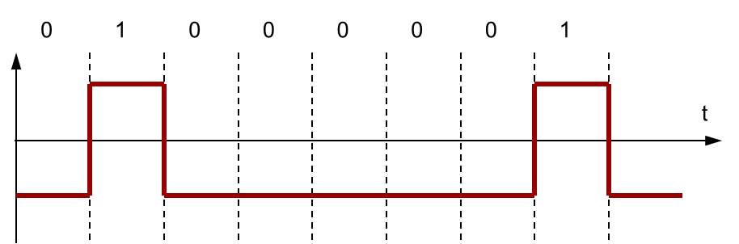。

信息通过数据通信系统进行传输，但==信息不能直接在信道上传输==，而是需要经过以下四个步骤：

1. 编码（信息转为二进制数据、二进制数据转为信号）：数据→适合传输的数字信号——便于同步、识别、纠错
2. 调制（信号发射到信道）：数字信号→适合传输的形式——按频率、幅度、相位
3. 解调：接收波形→数字信号
4. 解码：数字信号→原始数据

编码：数据到信号的转换办法如下表：
|从\到|模拟信号|数字信号|
|-|-|-|
|**模拟数据**|移频、调制|PCM编码|
|**数字数据**|调制|数字编码|

- 数字通信
  - 在数字信道上实现模拟信息或数字信息的传输。其具有抗噪声（干扰）能力强；可以控制差错，提高了传输质量；便于用计算机进行处理；易于加密、保密性强；可以传输语音、数据、影像，通用、灵活等优点。
- 模拟通信
  - 在模拟信道上实现模拟信息或数字信息的传输。

计算机通信==仅在不得已的情况下，才会采用模拟通信==，如通过电话线拨号上网。

描述数据传输速率的大小和传输质量的好坏，往往需要运用**比特率、波特率、出错率和信道容量**等技术指标。

- 数据传输率 $C$
  - 数据传输率又称**比特率**，是一种数字信号的传输速率，它表示单位时间内所传送的二进制代码的有效**位**（bit）数，单位用**比特/每秒**（b/s）表示。
- 波特率 $B$
  - 波特率是一种调制速率，也称**波形速率或码元速率**。是数字数据经编码后的传输信号在信道上的传输速率；指每秒传输的码元数，单位为**波特**（baud）。

一般情况下，如果码元状态数为 $M$（$M$ 为2的整数次幂），则 $C$ 和 $B$ 的关系为：$C=B\log_2M$（b/s）。
> 例：NRZ编码一个码元表示一个比特的信息，因此 $C=B$；四进制码有4种码元状态（00、01、10、11），每个码元带2比特数据，所以 $C=2B$。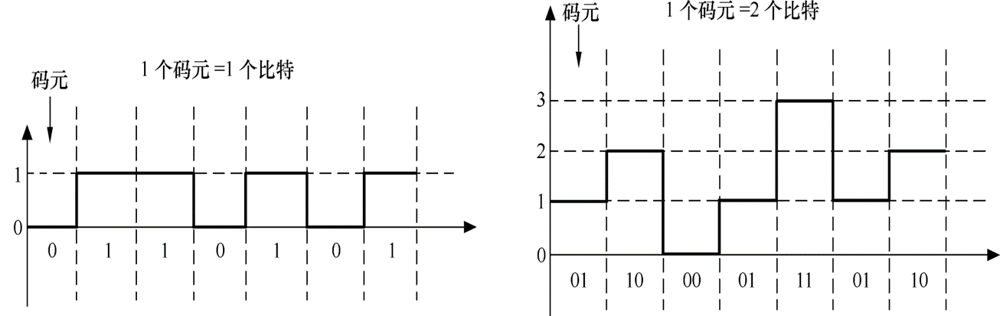

二进制比特在数据传输系统中被传错的概率，它在数值上近似等于：
$$
P_e = \dfrac{N_e}N
$$
其中，$N$ 为传输的二进制比特总数，$N_e$ 为被传错的比特数。

**奈奎斯特准则**：在一个通信信道带宽为 $W$（==单位赫兹==）的无噪声低通信道上，最高的码元传输速率 $B_{max}$ 为 $2W$ 即 $B_{max} = 2W（baud）$；最大数据传输速率 $C_{max} = 2W·\log_2M\ (b/s)$。

**香农定理**：在有随机热噪声的信道上传输数据信号时，数据传输速率 $C_{max}$ 与信道带宽 $W$、信噪比 $S/N$ 的关系为$C_{max} = W·\log_2(1+S/N)$。

> 问：计算机的屏幕图象包含640×480个像素点，每个像素占24个比特，现每秒传输30幅屏幕图象，如果采用四进制编码，求正常传输信号最低所需的信息传输速率（单位比特每秒）。能否用一条[Cat.5](https://baike.baidu.com/item/%E4%BA%94%E7%B1%BB%E7%BA%BF/7769144)（无噪声，带宽为100MHz）非屏蔽双绞线传输？
> 答：根据奈奎斯特准则，在一个带宽为 $W$（单位Hz）的无噪声低通信道上，最高的码元传输速率$B_{max} = 2W（baud）$；如果编码方式的码元状态数为 $M$，那么信道容量即最大数据传输速率$C_{max} = W·\log_2(1+S/N)$；由于5类非屏蔽双绞线的带宽为100MHz；当 $M = 4$ 时，则：$C_{max} = 2W\log_2M = 400Mb/s$。当计算机的屏幕图象包含640×480个像素点时，所需的信息传输速率为：640×480×24×30 = 221Mb/s；故5类非屏蔽双绞线能够传输。

### 传输介质

常见的传输介质有以下几种：

- 磁介质
  - 高带宽、低费用、==高延时（小时级别）——在通信中很少使用==
- 金属导体
  - 双绞线、同轴电缆（分粗、细）
- 光纤
- 无线介质
  - 无线电、微波、卫星、红外线

本课题中主要介绍后三者。

#### 金属导体

- 双绞线：
  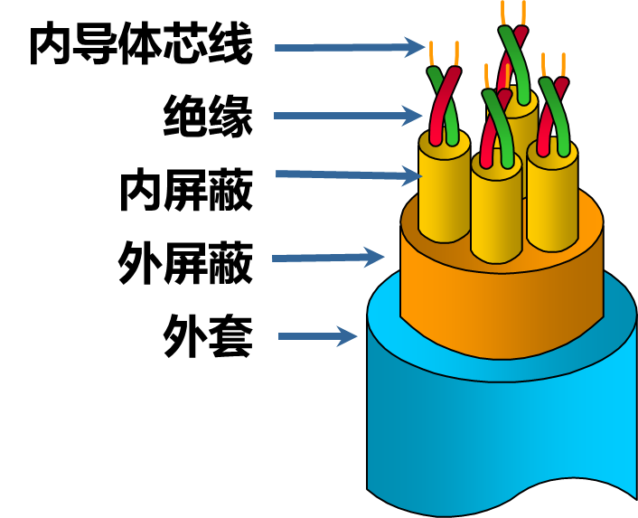
  - 特点：
    - 螺旋绞合的双导线
    - 每根4对、25对、1800对
    - 典型连接距离100m（LAN）
    - RJ45插座、插头
  - 优缺点：
    - 成本低
    - 组装密度高、节省空间
    - 安装容易（综合布线系统）
    - 平衡传输（高速率）
    - 抗干扰性一般
    - 连接距离短

应用的双绞线还分为屏蔽式和非屏蔽式：

- 屏蔽双绞线（STP）：以铝箔屏蔽以减少干扰和串音，应用较少。
    
- 非屏蔽双绞线（UTP）：双绞线外无任何屏蔽层，应用广泛。
    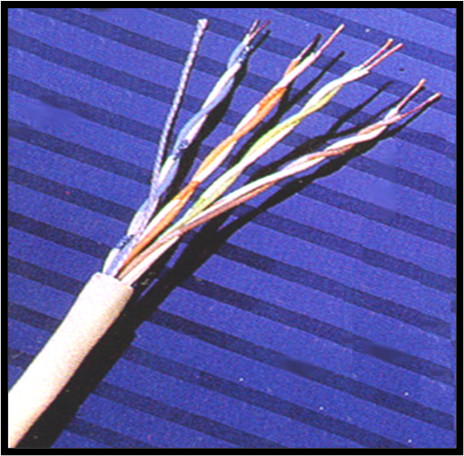

双绞线内部线对的连接标准：
|线对|色彩码|
|-|-|
|1|白蓝，蓝|
|2|白橙，橙|
|3|白绿，绿|
|4|白棕，棕|

混接白绿线对（交叉线）的标准为EIA-568B，用于**标准端口**；同色直接相连（直连线）的标准为EIA-568A，用于**级联端口**。

#### 光纤

**光纤**（Optical Fiber，OF）依靠光波承载数据，光脉冲在玻璃纤维中传播。

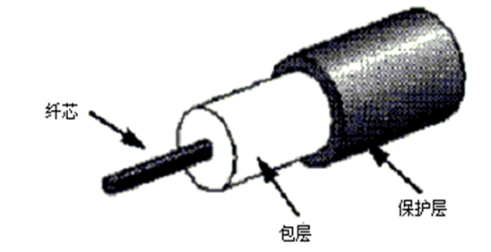

- 优缺点：
  - 传输带宽高，仅受光电转换器件的限制（＞100Gb/s）
  - 传输损耗小，适合长距离传输
  - 抗干扰性能极好、误码率低、保密性好
  - 轻便
  - 价格较高
  - 需要**光电转换**
- 纤芯材料：
  - 塑料
  - 二氧化硅（高纯玻璃）

光纤传输原理——光的反射：

- 光从折射率高的介质入射到折射率低的介质时会产生**折射**。折射量取决于两种介质的**折射率**。当入射角≥临界值时产生**全反射**，不会泄漏。（纤芯——折射率高，玻璃包层——折射率低）
- 亮度调制：有光脉冲为1，无光脉冲为0
- 光传输系统：光源、介质、光检测
  - 光源：波长850nm/1300nm/1500nm的发光二极管/激光二极管
  - 光检测器：光电二极管PIN/雪崩二极管APD
- 单向传输，双向需两根光纤
- 应用领域：局域网主干、电信网络、服务器连接

光纤可分为**单模光纤和多模光纤**。

- 多模光纤（MMF）：由二极管发光，==低速短距离==，2千米以内。多模光纤的芯线粗，传输速度低、距离短，整体的传输性能差，但其成本比较低，一般用于建筑物内或地理位置相邻的建筑物间的布线环境下，
    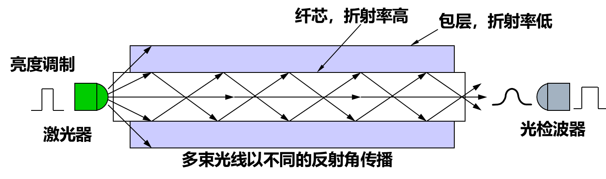
- 单模光纤（SMF）：由激光作光源，仅有一条光通路，==传输距离长==，2千米以上。单模光纤是当前计算机网络中研究和应用的重点，也是光纤通信与光波技术发展的必然趋势。
    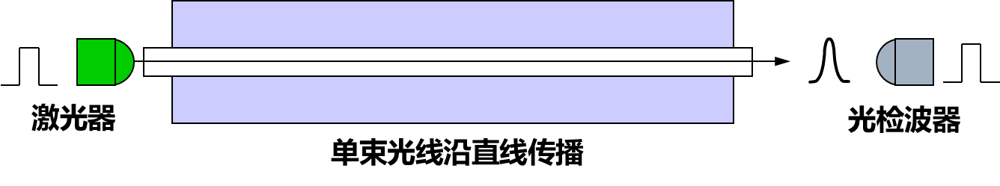

为了保护光纤，我们需要为其外包保护层，形成**光缆**。光缆可分为**单芯光缆和多芯光缆**，构造分别如下图。

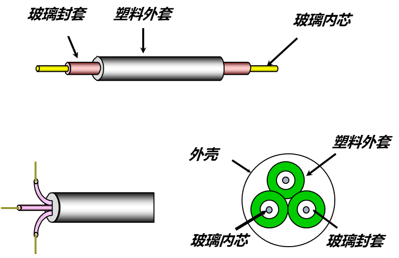

常见规格：

- 纤芯
  - 50um缓变型-MMF
  - 62.5um缓变型/增强型-MMF
  - 8.3um突变型-SMF  
- 包层
  - 125um

#### 无线介质

**无线介质**（信号在大气或外层空间自由传播）使用电磁波或光波携带信息。

- 优缺点：
  - 无需物理连接
  - 适用于长距离或不便布线的场合
  - 易受干扰
  - 反射，为障碍物所阻隔
- 主要类型：
  - 无线电、地面微波、通信卫星、红外线

**无线通信**是近年来信息通信领域中，发展最快、应用最广的，深入到人们生活的各个方面。其中WLAN（Wireless Local Area Network，无线局域网）、5G、UWB（Ultra Wideband，超宽带无线技术）、蓝牙等都是热门的无线通信技术应用。

无线传输所使用电磁波频段很广，国际电信联合会ITU（International Telecommunication Union）规定了波段正式名称，如低频（LF，长波，波长从1km-10km，对应于30kHz-300kHz）、中频（MF，中波，波长从100m-1000m，对应于300kHz-3000kHz）、高频（HF，短波，波长从10m-100m，对应于3MHz-30MHz），更高频段还有甚高频、特高频、超高频、极高频等。

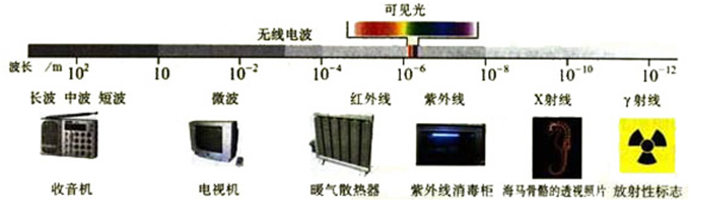

**无线电波**是指在自由空间（包括空气和真空）传播的射频频段的电磁波。无线电技术是通过无线电波，传播声音或其他信号的技术。

- 微波通信
  - 通过地面站之间接力传送
  - 接力站之间距离：50-100km
  - 速率：每信道45Mb/s
    *日本NHK就是利用地面微波通信向公众免费传播电视信号。*
- 地球同步卫星
  - 与地面站相对固定位置
  - 使用三颗卫星即可覆盖全球
  - 传输延迟时间长（≈270ms）
  - 广播式传输
  - 应用领域：电视传输、长途电话、专用网络、广域网
- 激光
  - 将激光束调制成光脉冲传输数据
  - 频率更高，可获得更高的带宽
  - 激光束的方向性好，不受电磁干扰的影响，不怕偷听
  - 受天气影响
  - 只能在短距离通信中使用
- 红外线
  - 红外传输系统利用墙壁或屋顶反射红外线从而形成整个房间内的广播通信系统
  - 红外通信的设备相对便宜，可获得较高的带宽
  - 传输距离有限，而且==易受室内空气状态（例如有烟雾等）的影响==
- 短波无线电
  - 基站与终端之间通信采用无线链路
  - 应用领域：移动通信、无线局域网（WLAN）

我们来比较一下常用的几种通信介质的特性：
|传输介质|传输方式|速率/工作频带|传输距离|性能|价格|应用|
|-|-|-|-|-|-|-|
|双绞线|宽带/基带|不小于1GBb/s|模拟：10kM 数字：500M|较好|低|模拟/数字信号传输|
|50欧姆同轴电缆|基带|10Mb/s|不小于3kM|较好|较低|基带数字信号|
|75欧姆同轴电缆|宽带|不小于450MHz|100kM|较好|较低|模拟电视、数据及音频|
|光纤|基带|40Gb/s|不小于20kM|很好|较高|远距离高速数据传输|
|微波|宽带|4-6GHz|几百千米|好|中等|远程通信|
|卫星|宽带|1-10GHz|18000kM|很好|高|远程通信|

### 数据传输方式

数据传输以信号传输为基础，==在理想情况下，接收信号的幅度和波形应与发送信号完全一样==。数据传输方式可以从不同的角度划分，其传输方式有很多。常见的有：

- 单工、半双工和全双工；
  - 单工传输：信息发送只能是单方向的；即发送端只能发送，接收端只能接收；只有一个单向通道。如：电视机、收音机等。
  - 半双工传输：两设备之间有两个通道，但在任一段时间中，只能有一端发送数据，另一端接收数据，不能双向同时进行。如常见的无线对讲机等。
  - 全双工传输：两设备之间有两个通道，他们可以同时在两个方向上传输数据。如计算机之间的数据通信等。
    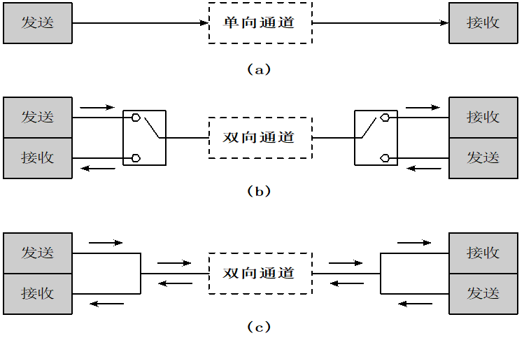
- 基带传输和频带传输；
  - 基带信号固有频带称做基本频带，简称为**基带**。
  - 基带信号：信源发出的没有经过调制（进行频谱搬移和变换）的原始电信号，其特点是==频率较低==。通俗一点，基带信号就是发出的直接表达了要传输的信息的信号，比如我们说话的声波就是基带信号。由于在近距离范围内基带信号的衰减不大，从而信号内容不会发生变化。因此在传输距离较近时，计算机网络都采用基带传输方式。如从计算机到监视器等外设的信号就是基带传输的。==大多数的局域网使用基带传输。==
    *在计算机等数字设备中，二进制数字序列最方便的电信号形式为方波（即矩形脉冲信号），即1或0分别用高（或低）电平或低（或高）电平表示，通常人们把方波固有的频带称为基带，方波电信号称为基带信号。*
  - 在发送端基带传输的数据要经过编码器变换变为直接传输的基带信号，如**曼彻斯特编码**等；在接收端由解码器恢复成与发送端相同的矩形脉冲信号。
  - 将数字数据转换成模拟信号，利用模拟信道进行传输的方法称为频带传输；频带传输借助于模拟的正弦载波信号，用数字数据（0或1）调制载波，将数字数据寄生在载波的某个参数上（振幅、频率和相位），借助于模拟信道进行传输。它需要利用调制解调技术对数据进行转换。频带传输可以利用**频分多路复用**（FDM）实现多路复用，提高传输信道的利用率。
    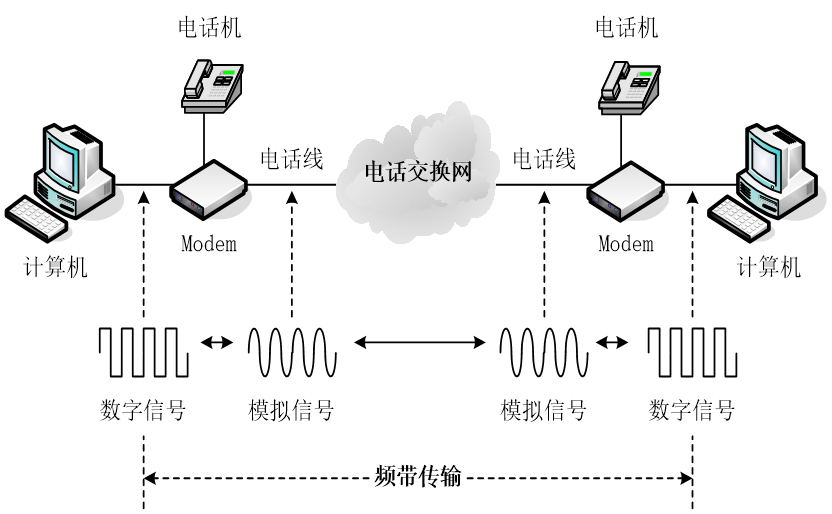
  - 调制（D/A）：将数字数据寄生在正弦载波的某个参数上，把数字数据转换成连续的模拟信号。
  - 解调（A/D）：将已调制信号还原为原来的数字数据。
  - 通过借助频带传输，==将信道分成多个子信道==，分别传送音频、视频和数字信号，称为**宽带传输**。宽带是指比音频带宽更宽的频带，它包括大部分电磁波频谱。使用这种宽频带传输的系统，称为宽带传输系统。即==把信号调制成频带为几十MHz到几百MHz的模拟信号==后再传送，接收方需要解调。宽带传输中的所有信道都可以同时发送信号。如CATV、ISDN等。
    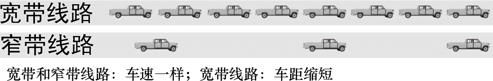
    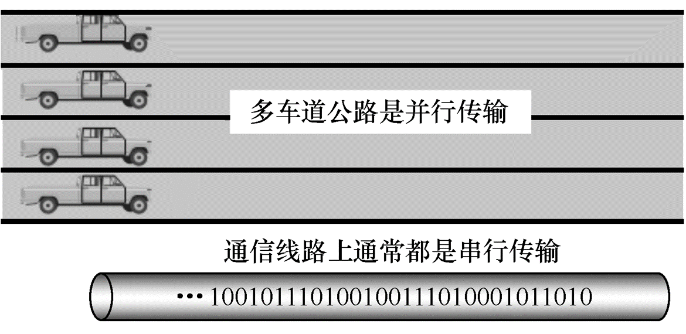
- 同步传输和异步传输等。

数据从发送端到接收端必须保持双方步调一致，这被称为**同步**。

同步的因素：

- 同步脉冲频率
- 数据从什么时候开始，什么时候结束
- 位边界
- 数据块边界

数据通信中需要在二个层次上实现同步：

- 位——位同步
  - 目的：使接收端与发送端在时间基准上一致
  - **外同步**——发送端发送数据之前发送同步脉冲信号，接收方用接收到的同步信号来锁定自己的**时钟脉冲频率**。
    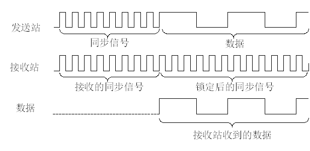
  - **自同步**——通过特殊编码（如曼彻斯特编码），==使数据编码信号中包含同步信号==，接收方从数据编码信号提取同步信号来锁定自己的时钟脉冲频率。
- 字符——字符同步或**帧**（Frame）——帧同步
  - 字符同步的目的：找到正确的字符边界
  - 采用这种同步方式的通信也称**异步通信或异步传输**
  - 帧同步的目的：识别一个帧的起始和结束
  - 帧：数据链路中的传输单位——包含数据和控制信息的数据块

解决同步问题的方法有**同步传输和异步传输**。

- 同步传输方式中以==称为帧的数据块为单位==进行传送。同步传输使用特殊的标志位进行帧同步，界定一个帧的始末。由于一个信息帧可以包含的位数很多，==同步传输还必须进行严格的位同步==，要求通信双方使用同一时钟信号进行发送与接收。
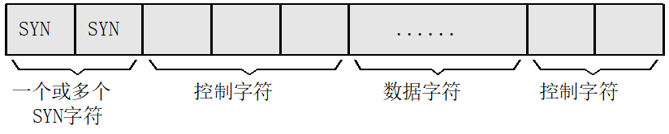
- 异步传输以字符为单位进行数据传输。每个字符前后通过加起始位和停止位来实现字符同步，通信的双方各自使用独立的基准定位时钟，但==要约定同样的传输速率==，以实现位同步。
    异步传输每个字符由四部组成：
    1. 1位起始位，以逻辑"0"表示；
    2. 5～8位数据位，即要传输的字符内容；
    3. 1位**奇偶校验**位，用于检错；
    4. 1～2位停止位，以逻辑"1"表示，用作字符间的间隔。
    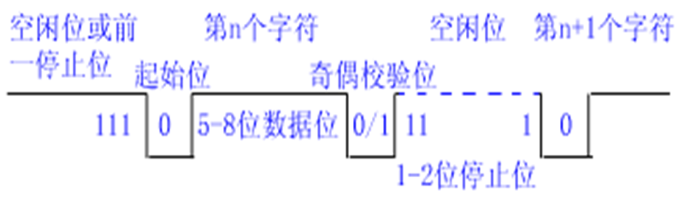

> 问：A、B两台设备进行异步数据传输，设定字符位数8位，传输速率9.6kb/s。如果双方的时钟相差0.1%，试问传输1个字符最大能造成多少微秒的累积错位？如果设计要求最大累积错位不超过位宽度的5%，是否达到了设计要求？如果双方的时钟相差1%，结果又如何？
答：在异步传输中，传输速率9.6kb/s，则每位时间为：1b÷9.6kb/s=104.17$\mu$s，如果字符位数8位，加上起始位、奇偶校验位和停止位可以有12位，当双方的时钟相差0.1%，最大的累积错位为：104.17$\mu$s×12×0.1%=1.25$\mu$s，占1.2%（1.25÷104.17）的位宽度，达到了设计要求。如果双方的时钟相差1%，最大的累积错位为：104.17$\mu$s×12×1%=12.5$\mu$s，占12%（12.5÷104.17）的位宽度，超出了设计要求。

**串行传输和并行传输**的效果示意图如下：
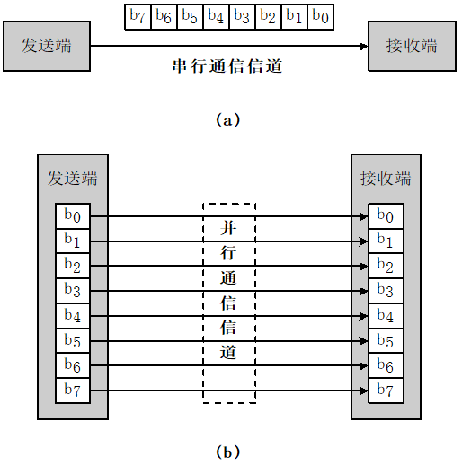

|串行转为并行|并行转为串行|
|-|-|
|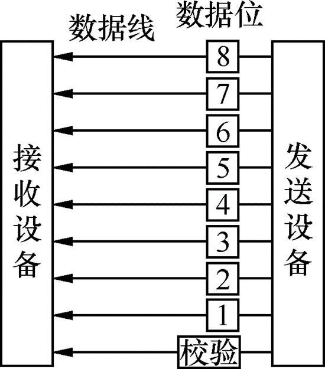|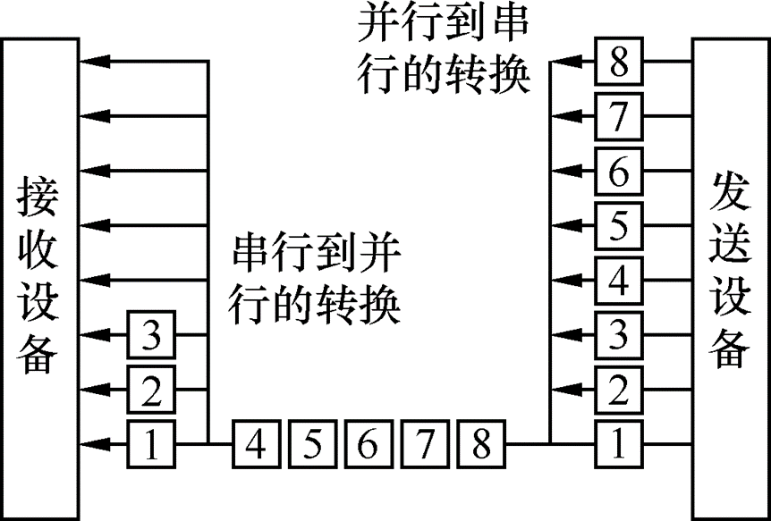|

### 数据编码技术

数据编码类型总览：
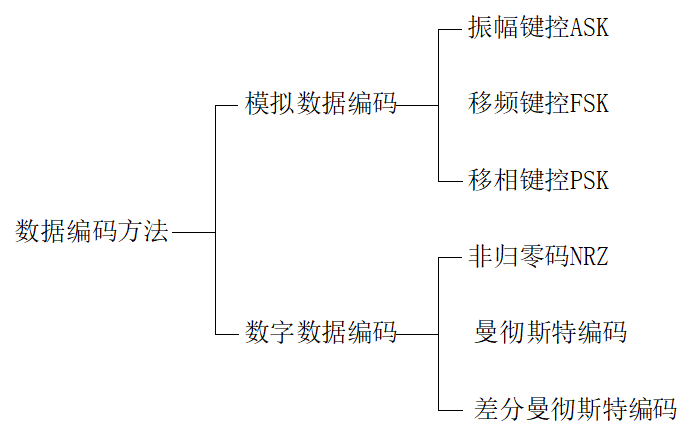

模拟数据编码即**频带传输的调制解调技术**等：
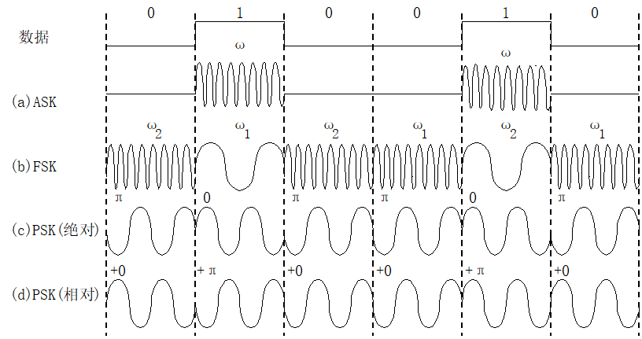

- 幅度调制
  - 幅度调制又称**移幅键控**（ASK），**频率**和**相位**都是常数，**振幅**为变量；即载波的幅度随发送的信号而变化，表示为：
$$
\begin{cases}\omega(t) = \omega_0\\\varphi(t) = \varphi_0\\A(t) = A_1, A_2, ..., A_n\end{cases}
$$
- 频率调制
  - 频率调制又称**移频键控**（FSK），振幅和相位为常量，频率为变量，表示为：
$$
\begin{cases}A(t) = A_0\\\varphi(t) = \varphi_0\\\omega(t) = \omega_1, \omega_2, ..., \omega_n\end{cases}
$$
- 相位调制
  - 相位调制又称**移相键控**（PSK），振幅、频率为常量，相位为变量，其函数表达式为：（相对相位调制：为0时相位相对前一个不变，为1时相位相对前一个变化）
$$
\begin{cases}A(t) = A_0\\\omega(t) = \omega_0\\\varphi(t) = \varphi_1, \varphi_2, ..., \varphi\end{cases}
$$

数字数据编码方法：

- 基带传输在基本不改变数字数据信号频带（即波形）的情况下==直接传输==数字信号，可以达到很高的数据传输速率与系统效率；但数据在发送前要进行编码。
- 基带传输数字数据信号的编码方式主要有：
  - 非归零码（NRZ）
    - 用1表示高电位，0表示低电位；
    - NRZ码的缺点是无法判断一位的开始与结束，收发双方不能保持同步；
    - 为保证收发双方的同步，==必须在发送NRZ码的同时，用另一个信道同时传送同步信号==。
  - 曼彻斯特（Manchester）编码
    - 曼彻斯特编码是目前广泛使用的编码方法之一；
    - 0 = 由高电位转到低电位；
    - 1 = 由低电位转到高电位；
    - 且在每位期间中央处变换电位状态；
    - 利用电平跳变可以产生收发双方的同步信号；
    - 曼彻斯特编码信号又称做**自含钟编码**信号，发送曼彻斯特编码信号时无需另发同步信号；
    - 10-BASE-T网络常采用这种传输方式。
  - 差分曼彻斯特（Difference Manchester）编码（**相变式编码**）
    - 差分曼彻斯特编码是对曼彻斯特编码的改进；
    - 0 = 颠倒上一位的电位状态变化方式；
    - 1 = 沿用上一位的电位状态变化方式；
        差分曼彻斯特编码与曼彻斯特编码不同点主要是：
    - 每比特的中间跳变仅做同步之用；
    - 每比特的值根据其开始边界是否发生跳变来决定;
    - 一个比特开始处出现电平跳变表示传输二进制0，不发生跳变表示传输二进制1；
    - Token Ring网络采用这种传输方式。

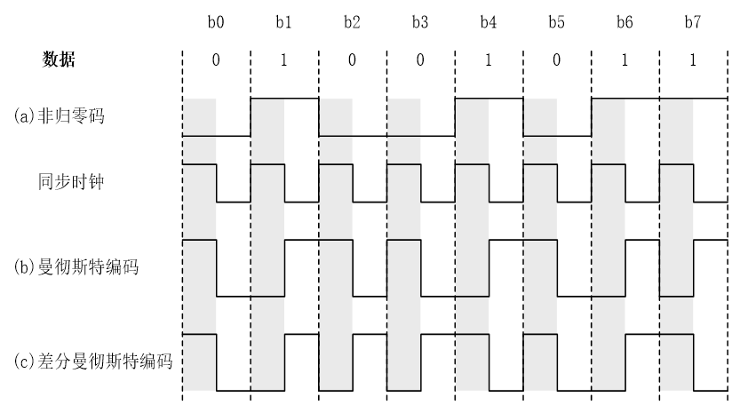

### 多路复用技术

把两个以上的单独的信号合并起来，同时在一个通信线路上进行传输。这被称为**多路复用**。
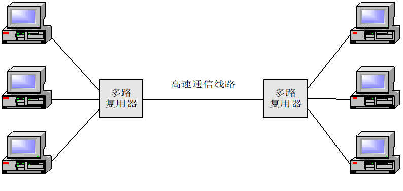

多路复用技术的分类：

- 频分多路复用，FDM
  - 在物理信道的可用带宽超过单个原始信号所需带宽情况下，可将该物理信道的总带宽分割成若干个与传输单个信号带宽相同（或略宽）的子信道，每个子信道传输一路信号，这就是频分多路复用。
  - 在一条通信线路设计多路通信信道；
  - 每路信道的信号以不同的载波频率进行调制；
  - 各个载波频率是不重叠的，那么一条通信线路就可以同时独立地传输多路信号。
  - FDM主要用于模拟通信。
    *以下展示了FDM的一个应用实例*

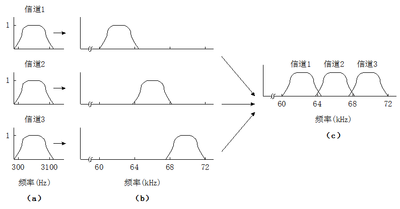

- 时分多路复用，TDM
  - 利用每个信号在时间上交叉，可以在一个传输通路上传输多个数字信号。常用于传输数字信号。时分多路复用不只局限于传输数字信号，模拟信号也可以同时交叉传输。另外，==对于模拟信号，时分多路复用和频分多路复用结合起来使用也是可能的==。一个传输系统可以频分许多条通道，每条通道再用时分多路复用来细分。
  - TDM 是将信道用于传输的时间划分为若干个时间片（时隙）；
  - TDM 将传输信号分成固定长度的帧，每个帧又划分若干个时间片；
  - 每个信号源分得一个时间片；
  - ==在每个信号源占有的时间片内，它使用通信信道的全部带宽。==
    时分多路复用可分类：
  - 同步时分复用（STDM）
    - 将一帧中的各时隙以固定的方式预先分配给各路信号；主要缺点时隙的利用率低。
  - 异步（统计）时分复用技术（ATDM/STDM）
    - 异步时分复用技术又被称为**统计时分复用或智能时分复用**（ITDM）技术，它能动态地按需分配时隙，时间片位置与信号源没有固定的对应关系，突发数据的用户等可以利用其它信号源的时间片，以避免每帧中出现空闲时隙；能提高时隙的利用率。

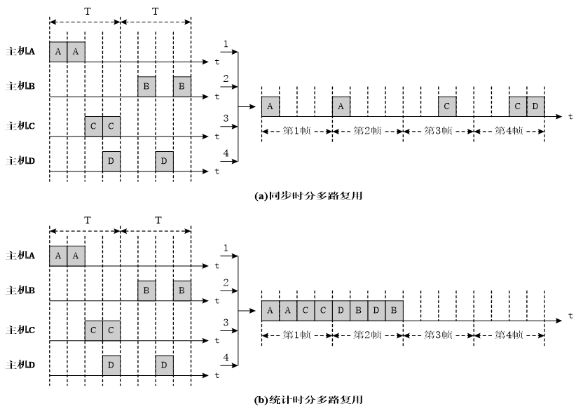

- 波分多路复用，WDM
  - 光纤通道（Fiber Optic Channel）技术采用了波长分隔多路复用方法，简称为**波分复用**；
  - 光信号的一个波长即一种频率；
  - 从概念上讲WDM和FDM是相同的，但WDM是对光信号的复合和分离；而FDM是对电信号的复合和分离；
  - 在一根光纤上复用80路或更多路的光载波信号称为**密集波分复用**（DWDM）；
  - 目前一根单模光纤的数据传输速率最高可以达到20Gb/s。

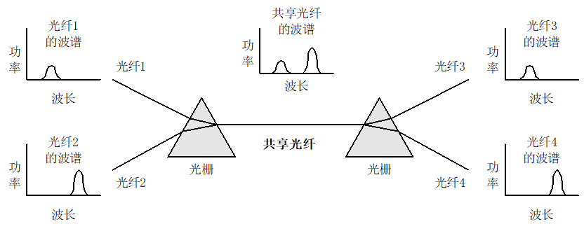

- 码分多路复用，CDM
  - 码分多路复用（Code Division Multiplexing）是指利用各路信号码型**结构正交性**而实现多路复用的通信方式，简称CDM。
  - 码分多路复用也是一种共享信道的方法，每个用户可在同一时间使用同样的频带进行通信，但使用的是基于码型的分割信道的方法，即每个用户分配一个地址码，各个码型互不重叠，通信各方之间不会相互干扰，抗干扰能力强。
  - ==码分多路复用技术主要用于无线通信系统，特别是移动通信系统。==

### 数据交换技术

交换也称为**转接**。是在多结点网络中实现数据传输的技术，两结点要通信时，在双方之间建立一条物理的或逻辑的通道，称为**链路**。

常用的交换技术主要有：

- 线路交换
  - 线路交换是==面向连接==的服务；
  - 两台计算机通过通信子网进行数据交换之前，首先要在通信子网中建立一个实际的物理线路连接；
  - 线路交换在数据传输过程中要经过==建立连接、数据传输与释放连接==的三个阶段；
  - 线路交换方式的优点是：通信==实时性强==，适用于交互式会话类通信；
  - 线路交换方式的缺点是：==对突发性通信不适应==，系统效率低，==系统不具有存储数据的能力==。

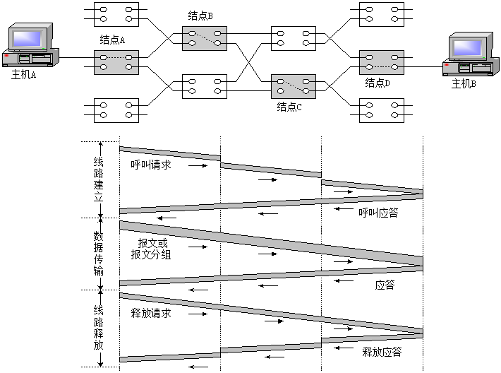

- 报文交换
  - 报文是网络中一次传输的信息块，它可以是一个程序、一个文件等。
  - ==每个节点（交换设备）都对报文进行存储/转发==（缓存报文并根据目的地址转发）；
  - 报文传输不管发送数据的长度是多少，都把它当作一个逻辑单元发送；直到终点。
  - 适合于长报文、==无实时要求的通信==、不适合会话式通信。

    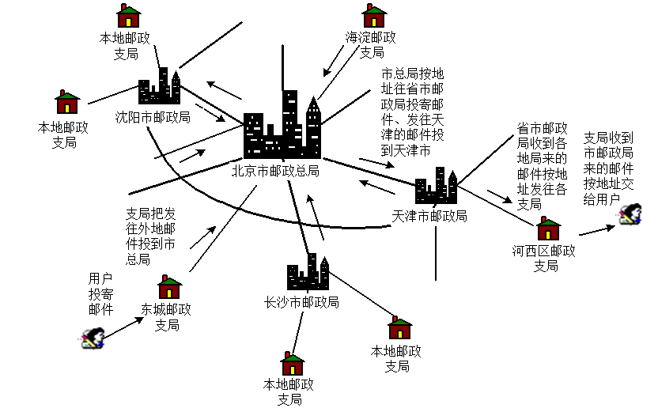

- 分组交换
  - 分组（Packet）是传输的信息单位，长的报文可以分割成短的分组。
  - 分组交换又可分为**数据报分组交换和虚电路分组交换**两种。

    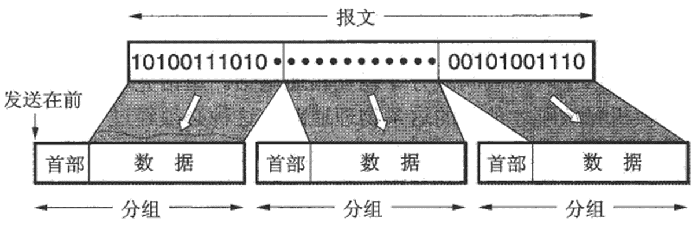

数据报方式是通信子网将进入子网的分组当作“小报文”处理，==每个分组独立寻径，分组通常称**数据报**==。

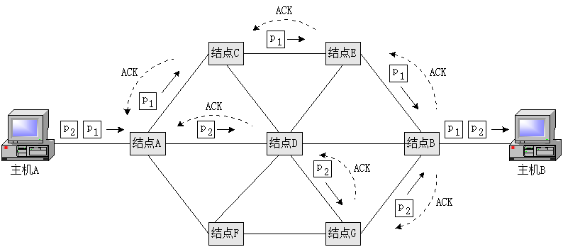

- 同一报文的不同分组可以由不同的传输路径通过通信子网；
- ==同一报文的不同分组到达目的结点时可能出现乱序、重复与丢失现象；==
- 每个分组在传输过程中都必须带有目的地址与源地址；
- 数据报方式报文传输延迟较大，==适用于突发性通信==，不适用于长报文、会话式通信。

虚电路方式在每次分组发送之前，==必须在发送方与接收方之间建立一条逻辑连接==。因为不需要真正去建立一条物理链路，连接发送方与接收方的物理链路已经存在。

- 一次通信的所有分组都通过这条虚电路顺序传送，因此报文分组不必带目的地址、源地址等辅助信息。分组到达目的结点时不会出现丢失、重复与乱序的现象。
- 每个分组传输都使用同一条路径传输。
- 虚电路方式与线路交换方式相同，整个通信过程分为==虚电路建立、数据传输和虚电路释放==。
- 虚电路是在传输分组时建立起的逻辑连接，称为“虚电路”是因为这种电路不是专用的。每个结点到其它结点间可能有无数条虚电路存在。
- 一个结点可以同时与多个结点之间具有虚电路。
- 由于虚电路方式具有分组交换与线路交换两种方式的优点，因此在计算机网络中得到了广泛的应用。

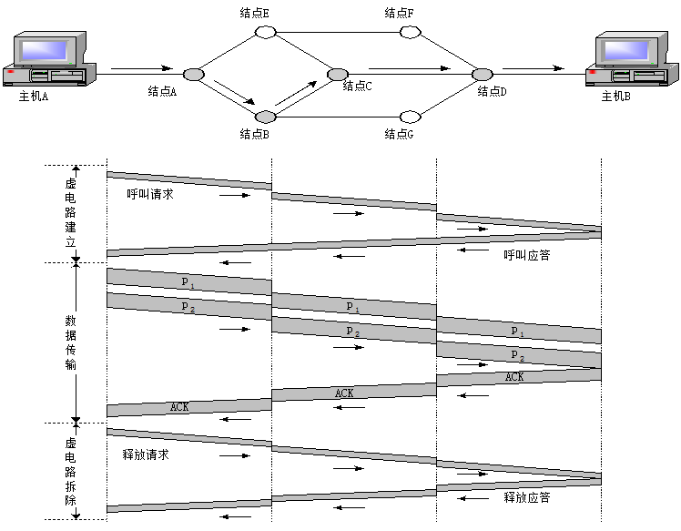

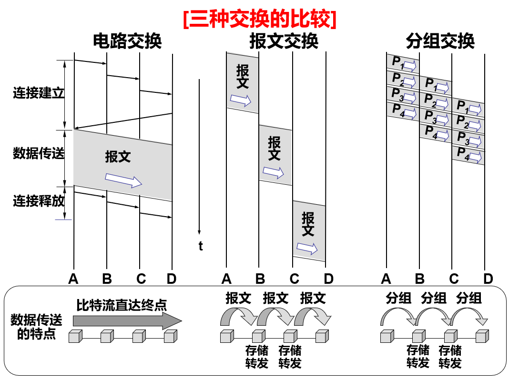

### 数据交换中的差错控制

数据在通信线上传输时，由于传输线路上的噪声或其他干扰信号的影响，使发送端发送的数据不能正确地被接收端接收，这就产生了**差错**。

差错可用误码率$P_e$来度量。常用的提高传输质量的方法主要有：

- 一是选择好的通信线路，即改善通信线路的电气性能，使误差的出现概率降低到系统的要求。
- 二是在通信线路上，设法检查错误，采取措施对错误进行差错控制；即**检错与纠错**。

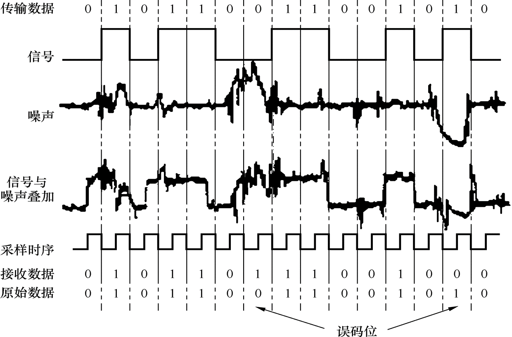

目前常用的差错控制方法有下面三种：

- 前向纠错
  - 发送端根据一定的编码规则对信息进行编码，然后通过信道传输；接收端接收到信息后，如果检测到接收信息有错，则通过一定的算法，确定差错的具体位置，并自动加以纠正。
- 反馈检验法
  - 接收端将收到的信息码原封不动地发回发送端，与原发信息码比较。如果发现错误，则发送端重发。反馈检验的方法、原理和设备都比较简单，但需系统提供双向信道。
- 自动重发请求
  - 接收端检测到接收信息有错后，通过反馈信道要求发送端重发原信息，直到接收端认可为止，从而实现纠错。

差错控制编码的基本思想是在被传输信息中增加一些**冗余码**，利用附加的冗余码元和信息码元之间的约束关系加以校验，以检测和纠正错误。目前广泛用于差错检测的检错码有**奇偶校验码**和**循环冗余码**（CRC），用于纠错的纠错码有**海明码**和**BCH码**。

差错控制用得最广泛的方法还是发**检错码**，即分组仅包含足以使接收端发现差错的冗余信息，接收端发现错误后反馈给发送端，发送端重发信息，直至正确接收为止，这种方式称反馈重发纠错。如下图:

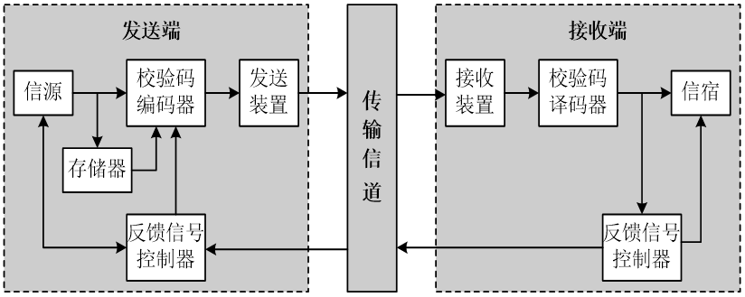

==CRC是目前应用最广的检错码编码方法之一。==

#### 奇偶校验和循环冗余校验

奇偶校验中，偶校验要在每一个字符上增加一个附加位，使该字符串中“1”的个数为偶数；在奇校验时，要在每一个字符上增加一个附加位，使该字符串中“1”的个数为奇数。接收端检测位数的奇偶性以确定是否有差错发生。

==奇偶校验并不是一种十分安全可靠的检错方法==，如果有偶数个数据位在传输中同时出错，接收端无法检测出差错的数据，所以其检错概率为50%。但对于低速传输来说，奇偶校验是一种令人满意的检错法。

循环冗余校验码是基于==将位串看成是系数为0或1的多项式==，一个k位帧可看成是从 $x^{k-1}$ 到 $x^0$ 的k次多项式的系数序列，这个多项式的阶数为 $k-1$。高位（最左边）是 $x^{k-1}$ 项系数，下一位是 $x^{k-2}$ 的系数，以此类推。例如，*110001*有6位，它的6个多项式系数分别是1、1、0、0、0、1，表示成多项式是 $x^5 + x^4 + x^0$。如果采用多项式编码的方法，发送方和接收方必须事先商定一个生成多项式 $G(x)$，==生成多项式的最高位和最低位必须是1==。  

对于CRC码 $(n,k)$，信息码对应一个 $(k - 1)$ 次多项式 $K(x)$，校验码对应一个 $(r - 1)$ 次多项式 $R(x)$，由 $k$ 位信息码和 $r$ 位校验码组成 $n = k + r$ 位的码 $(n,k)$ 对应一个 $(n - 1)$ 次的多项式，设为 $C(x)$，则：$C(x) = x^rK(x) + R(x)$（ $x^rK(x)$ 相当于在 $K(x)$ 后加 $r$ 个零）。

由信息码产生校验码的过程，即由已知的 $K(x)$ 求 $R(x)$，其方法是用一个特定的多项式 $G(x)$（$G(x) = x^r +...+ 1$）去除 $x^rK(x)$，所得的 $r$ 位余数作为校验码，即为 $x^rK(x)/G(x)$ 的余数，其中 $G(x)$ 称为**生成多项式**，这里的除法用==无借为减==来实现（相当于做**异或运算**）。如果有余数，则认为传输出错。

对此有疑问，可以观看[CRC校验的可视化过程](https://www.bilibili.com/video/BV1V4411Z7VA/)。

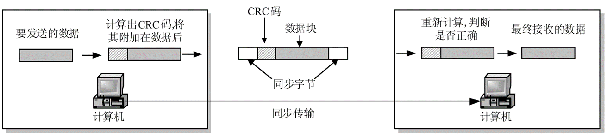

> 问：位流*10011101*使用标准的CRC发送。生成多项式是 $x^3+1$。请说明实际发送的位串。假定左起第3位在传输期间变反了，说明该差错在接收方是怎样被检测到的。
答：位流是*10011101*，生成多项式是*1001*，（$r$ 为3）在位流后面附加3个0变成*10011101000*，用*1001*去除*10011101000*的余数是*100*。因此实际发送的位串是*10011101100*。收到的第3位变反了的位流是*10111101100*。用*1001*去除这个位串产生余数*100*，由于余数不是0，接收方就知道传输过程中发生了差错，可以请求重传。

**纠错码**是指在发送每一组信息时发送足够的附加位。接收端通过这些附加位在接收译码器的控制下不仅可以发现错误，而且还能自动地纠正错误。要求附加的冗余码较多，这将会降低传输的效率。

目前常见的纠错码有：

- 海明纠错码
- 正反纠错码
- BCH纠错码

## 计算机网络体系结构

### 认识计算机网络体系结构

网络体系结构提出的背景为计算机网络的复杂性、异质性。

- 不同的通信介质——有线、无线......
- 不同种类的设备——主机、路由器、交换机、复用设备......
- 不同的操作系统——Unix、Windows......
- 不同的软/硬件、接口和通信约定（协议）
- 不同的应用环境——固定、移动......
- 不同种类业务——分时、交互、实时......
- 宝贵的投资和积累——有形、无形......
- 用户业务的延续性——不允许出现大的跌宕起伏

对于复杂的网络系统，==分而治之==能合理地组织网络的结构，以达到：

- 结构清晰
- 简化设计与实现
- 便于更新与维护
- 较强的独立性和适应性

**层次**的观点：每层实现一种特定的服务

- 通过自己内部的功能
- 依赖自己的下层提供的服务

计算机网络中也采用了分层方法。把复杂的问题划分为若干个较小的、单一的局部问题，在不同层上予以解决。
网络的层次结构方法要解决的问题：

- 网络应该具有哪些层次？每一层的功能是什么？（==分层与功能==）
- 各层之间的关系是怎样的？它们如何进行交互？（==服务与接口==）
- 通信双方的数据传输要遵循哪些规则？（==协议==）

计算机网络中，**层、协议和层间接口**的集合被称为**计算机网络体系结构**。换句话说：体系结构包括三个内容：**分层结构与每层的功能，服务与层间接口，协议**。最早的网络体系结构源于IBM的SNA；其它的网络体系结构还有DEC的DNA等由国际化标准组织ISO制定的网络体系结构国际标准是OSI/RM；实际中应用最广泛的是TCP/IP体系结构。

层次结构方法的优点：

- 独立性强
  - 上层只需了解下层通过层间接口提供什么服务。
- 适应性强
  - 只要服务和接口不变，每层的实现方法可任意改变。
- 易于设计、实现和维护
  - 把复杂的系统分解成若干个涉及范围小、功能简单的子单元：
    - 使系统的结构清晰，实现、调试和维护变得简单和容易。
    - 使设计人员能专心设计和开发所关心的功能模块。

网络体系结构相关的基本概念：

- 实体：每一层中实现该层功能的软件或硬件。（可以是进程、硬件设备，也可能是人）
- 对等层：两个不同系统的同级层次。
- 对等实体：分别位于不同系统对等层中的两个实体
- 接口：相邻两层之间交互的界面，定义相邻两层之间的操作及下层对上层的服务。
- 服务：某一层及其以下各层的一种能力，通过接口提供给其相邻上层（即提供一组原语操作）。
- 服务访问点：同一结点中，相邻两层的实体相互作用的地方。是上下层实体之间信息交换的接口。（简称SAP）
- 协议：通信双方在通信中必须遵守的规则。

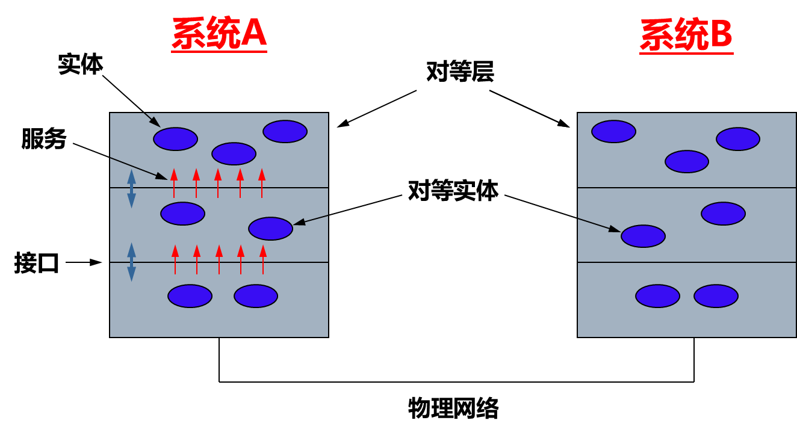

- 网络中的任何一个系统都是按照层次结构来组织的。
- 同一网络中，==任意两个端系统必须具有相同的层次==。
- 每层使用其下层提供的服务，并向其上层提供服务。
- 通信只在对等层间进行（==间接的、逻辑的、虚拟的==），非对等层之间不能互相通信。
- 实际的物理通信只在最底层完成。

源进程传送消息到目标进程的过程：

- 消息送到源系统的最高层；
- 从最高层开始，自上而下逐层==封装==；
- 经物理线路传输到目标系统；
- 目标系统将收到的信息自下而上逐层处理并==拆封==；
- 由最高层将消息提交给目标进程。

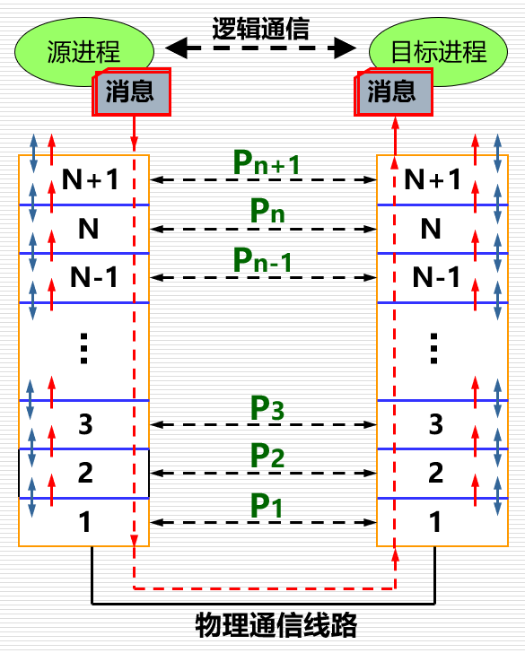

在各层中实现的主要功能：

- 差错控制
  - 使对等层的通信更加可靠
- 流量控制
  - 控制发送端的速率，使接收端能来得及接收
- 分段和重装
  - 发送端将数据块分成更小的单位，并在接收端重新组合
- 复用和分用
  - 多个高层的对等层通信会话复用一条低层连接
- 建立连接和释放连接

通信协议的三要素：

- 语义
  - 对协议中各协议元素的含义的解释，例如：在HDLC协议中，标志*Flag(7EH)*表示报文的开始和结束。
- 语法
  - 协议元素与数据的组合格式，即报文格式。
- 时序
  - 通信过程中，通信双方操作的执行顺序和规则。==也称同步，即实体通信实现顺序的详细说明。==

网络体系结构中，每层可能会有若干个协议，一个协议只属于一个层次。协议可以由软件或硬件来实现：如网络通信协议软件、网络驱动程序和网络硬件。常用协议组：TCP/IP（Windows、Unix、Linux）、NetBEUI（Windows）、IPX/SPX（NetWare、Windows）。

网络体系结构中，对等层之间交换的信息报文统称为**协议数据单元**（Protocol Data Unit，PDU）。

传输层及以下各层的PDU另外还有各自特定的名称：

- 传输层——段（Segment）
- 网络层——分组/包（Packet）
- 数据链路层——帧（Frame）
- 物理层——比特（Bit）

PDU由**协议控制信息**（协议头）和数据（SDU）组成。协议头部中含有完成数据传输所需的控制信息，如地址、序号、长度、分段标志、差错控制信息等。

下层把上层的PDU作为本层的数据加以**封装**，然后加入本层的协议头部（和尾部）形成本层的PDU。

- 封装：就是在数据前面加上特定的协议头部。

因此，数据在源站自上而下递交的过程实际上就是不断封装的过程。到达目的地后自下而上递交的过程就是不断拆封的过程。

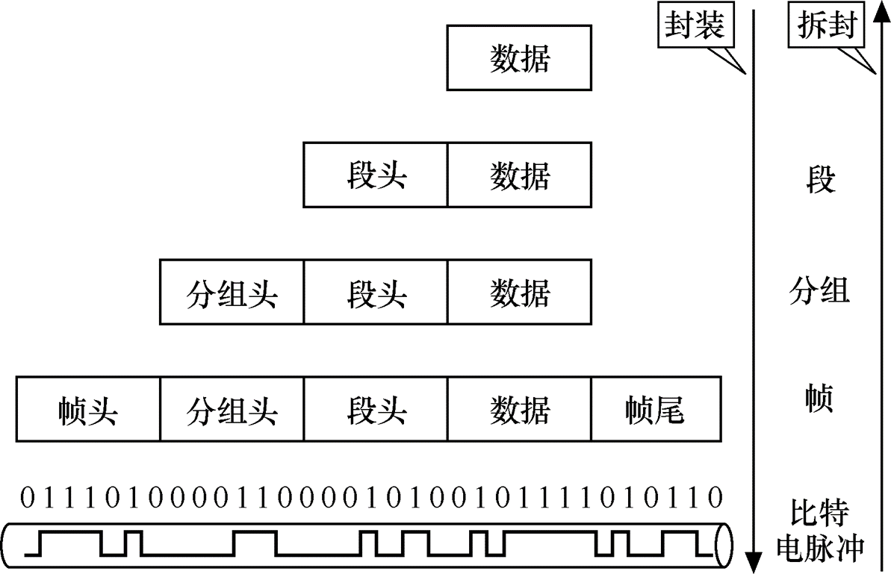

在目的站，某一层只能识别由源站对等层封装的“信封”，而对于被封装在“信封”内部的“数据”仅仅是拆封后将其提交给上层，本层不作任何处理。即==每一层只处理本层的协议头部==！

### 开放系统互联参考模型（OSI/RM）

在制定计算机网络标准方面，起着很大作用的两大国际组织是：

- 国际电报与电话咨询委员会（CCITT）
- 国际标准化组织（ISO）

CCITT与ISO的工作领域不同：

- CCITT主要是考虑通信标准的制定；
- ISO主要是考虑信息处理与网络体系结构。

在OSI中的“开放”是指只要遵循OSI标准，一个系统就可以与位于世界上任何地方、同样遵循同一标准的其它任何系统进行通信。

==OSI/RM 参考模型的结构分为7层：==

- 应用层 Application：为网络应用提供服务
- 表示层 Presentation：数据表示（加密、压缩等）
- 会话层 Session：在用户间建立会话关系
- 传输层 Transport：不同主机进程间的通信
- 网络层 Network：在主机间传输分组
- 数据链路层 Data Link：在节点间可靠地传输帧
- 物理层 Physical：位流的传输

在网络体系结构中讨论的服务可以分为==通信子网对网络中数据传输所提供的服务==，与==整个网络系统为用户提供的服务==；通信子网的服务是指通信子网对主机间数据传输的效率和可靠性所提供的保证机制；通信服务可以分为两大类：

- 面向连接服务（Connect-oriented Service）
  - 面向连接服务的数据传输过程必须经过==连接建立、连接维护与释放连接==的三个过程；
  - 面向连接服务的在数据传输过程中，各分组可以不携带目的结点的地址；
  - 面向连接服务的传输连接类似一个通信管道，发送者在一端放入数据，接收者从另一端取出数据；
  - 面向连接数据传输的收发数据顺序不变，传输可靠性好，但是==协议复杂，通信效率不高==。
- 无连接服务（Connectless Service）
  - 无连接服务的每个分组都携带完整的目的结点地址，各分组在系统中是独立传送的；
  - 无连接服务中的数据传输过程不需要经过连接建立、连接维护与释放连接的三个过程；
  - 数据分组传输过程中，目的结点接收的数据分组可能出现乱序、重复与丢失的现象；
  - 无连接服务的可靠性不好，但是==协议相对简单，通信效率较高==。

网络数据传输的可靠性一般通过**确认和重传机制**保证.

- 确认是指数据分组的接收结点在正确地接收到每个分组后，要求向发送结点发回接收分组的确认信息；
- 在规定的时间内，如果发送结点没有接收到接收结点的确认信息，就认为该数据分组发送失败，发送结点重新发送该数据分组；
- 确认和重传机制可以提高数据传输的可靠性，但是它需要制定较为复杂的确认和重传协议，并且需要增加网络额外的通信负荷，占用网络带宽。

通信协议存在四种类型：

- 面向连接与确认服务；
- 面向连接与不确认服务；
- 无连接与确认服务；
- 无连接与不确认服务；

设计者可以根据不同的通信要求，决定选择不同的服务类型。

> 你知道吗：OSI模型的缺陷
>
> - OSI 模型协议制定的时机较晚，OSI协议出现时，TCP/IP协议已大量应用在大学和科研机构。人们不会轻易改动协议。
> - OSI 模型设计亦有一定缺陷。首先会话层对大多数应用没有用，表示层几乎是空的；而数据链路层和网络层功能太多。
> - OSI模型以及与其相关的服务定义和协议极其复杂，实现起来困难且操作效率不高。

### TCP/IP体系结构

TCP/IP参考模型的发展：

- 在TCP/IP协议研究时，并没有提出参考模型；
- 1974年Kahn定义了最早的TCP/IP参考模型；
- 80年代Leiner、Clark等人对TCP/IP参考模型进一步的研究；
- TCP/IP协议一共出现了6个版本，后3个版本是版本4、版本5与版本6；
- 目前我们使用的是版本4，一般被称为**IPv4**；
- ==**IPv6**被称为下一代的IP协议。==

TCP/IP体系结构分为4层：

- 应用层
- 传输层
- 网际层
- 网络接口层（数据链路层+物理层）
*TCP/IP体系结构有时也采用5层表示方法，即用数据链路层和物理层代替网络接口层。*

TCP/IP协议的特点：

- 开放的协议标准;
- 独立于特定的计算机硬件与操作系统；
- 独立于特定的网络硬件，可以运行在局域网、广域网，更适用于互连网中；
- 统一的网络地址分配方案，使得整个TCP/IP设备在网中都具有唯一的地址；
- 标准化的高层协议，可以提供多种可靠的用户服务。

- TCP/IP不是一个单个的协议，而是由数十个具有层次结构的协议组成的一个==协议集==。
  - TCP和IP是该协议集中的两个最重要的核心协议。
- TCP/IP是Internet上的标准通信协议集。
- TCP/IP以**请求注释**（RFC）文档发布：
  - TCP（[RFC 793](https://www.rfc-editor.org/rfc/rfc793)）, UDP（[RFC 768](https://www.rfc-editor.org/rfc/rfc768)）
  - IP [RFC 791]
  - DNS [RFC 1034, 1035], FTP [RFC 959, 1635]
    *RFC（Request For Comments）包含了关于Internet的几乎所有重要的文字资料，制定于1969年（当时 Internet还是指ARPANET）。RFC文档主要涉及计算处理和计算机通信方面的网络技术协议、过程、程序和理论概念。这种Internet协议组规范文档，由Internet工程任务组（IETF）及Internet工程指导小组（IESG）共同制定，命名为RFC。*

### OSI和TCP/IP的主要层概述

## TCP/IP协议

### TCP/IP协议概述

### 网络接口层

### 网际层协议

### 传送层协议

### 应用层协议

## Internet及其应用

### Internet概述

### 中国互联网基本情况

### Internet服务

### Internet电子商务

### 移动互联网

## 局域网

## 广域网

## 常用网络设备与网络互连

## 网络操作系统

## 网络安全
